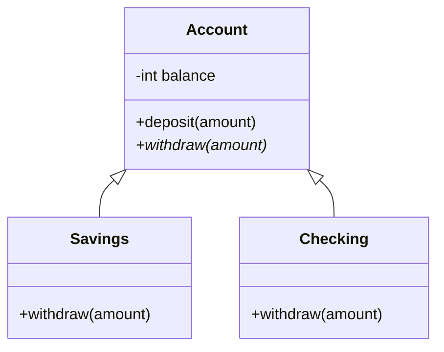

import { ConceptTemplate } from '@/features/kb/components/templates/ConceptTemplate'
import { Callout } from '@/features/kb/components/mdx/Callout'
import { ComparisonTable } from '@/features/kb/components/mdx/ComparisonTable'

export default function Layout({ children }) {
  return (
    <ConceptTemplate title="Object-Oriented Programming">
      {children}
    </ConceptTemplate>
  )
}

**Object-oriented programming (OOP)** organises software around **objects**: runtime entities that keep private state and expose a message interface. A `BankAccount` does not let the world poke `balance`. It answers `deposit` and `withdraw`.

Smalltalk invented the culture (everything is an object, everything is a message). C++, Java, C#, and Python industrialised it. JavaScript grew into it via prototypes, then `class` syntax.

<Callout icon="info" title="Modeling a boundary, not the planet">
A good object hides an invariant ("balance is never negative") behind a small API. A bad object graph is a tax form: twenty getters, no invariant, and a jungle of subclasses you inherited just to reuse one method.
</Callout>

## 1. Deep Dive and Mechanics

The usual four pillars are a teaching device. The machine cares about two mechanisms.

**Encapsulation.** Fields live in an object; methods are the only legal mutators. In C++/Java this is `private` plus calling conventions. In Python it is culture (`_balance`) plus `@property`. Encapsulation is how you keep a representation you can change later.

**Dynamic dispatch (polymorphism).** The callee is chosen from the *runtime* type of the receiver. `shape.draw()` looks up `draw` in the vtable (or proto chain) of *this* shape. The caller is compiled against an interface; new subclasses do not require editing the caller. That is the Open/Closed idea in one instruction: an indirect call.

**Inheritance** is optional reuse of implementation. It is also the sharpest edge. Implementation inheritance couples you to a parent you do not control ("fragile base class"). Composition plus interfaces is the usual adult recommendation.

**Abstraction** is the design act of choosing that interface. It is not a keyword.

Identity matters. Two objects with equal field values can still be distinct (`==` vs `equals` in Java). FP values usually do not have that distinction.

## 2. Mathematical / Theoretical Foundation

Objects can be modelled as records of functions closing over hidden state — existential types. An interface is a specification of those functions. Subtyping (Liskov) says a `Duck` may be used wherever a `Bird` is expected if it preserves the `Bird` contract.

Virtual dispatch is a function pointer table:

`object.method(args)` becomes `object.vptr[slot](object, args)`

Cost: an indirect branch (the predictor usually wins) and scattered object layouts (pointer chasing hurts caches). Multiple inheritance and interface tables (Java itables, C++ thunks) add more indirection.

The "expression problem" is the dual of OOP vs FP: OOP makes *adding new types* easy (new class) and *adding new operations* hard (edit every class). FP algebraic data types reverse that.

<ComparisonTable
  headers={['Need', 'OOP move', 'FP move']}
  rows={[
    ['New variant', 'New subclass', 'Edit every match'],
    ['New operation', 'Edit every class', 'New function'],
    ['Hidden state', 'Private fields', 'Closure or IO'],
    ['Sharing behavior', 'Inheritance or mixin', 'Type class / trait'],
  ]}
/>

## 3. Real-World Implementation

```java
public abstract class Account {
    private int balance;

    public final void deposit(int amount) {
        if (amount <= 0) throw new IllegalArgumentException();
        balance += amount;
    }

    public abstract int withdraw(int amount);

    protected int getBalance() { return balance; }
    protected void setBalance(int b) { balance = b; }
}

public final class Savings extends Account {
    @Override
    public int withdraw(int amount) {
        if (amount > getBalance()) throw new IllegalStateException("insufficient");
        setBalance(getBalance() - amount);
        return amount;
    }
}
```

The superclass owns the invariant on `deposit`. The subclass plugs in a policy for `withdraw`. Callers keep an `Account` and do not switch on a type tag.

## 4. Visualizations



## 5. Interview Prep

**Q: Composition vs inheritance?**
**A:** Inheritance is a static "is-a" plus reuse of protected guts. Composition is "has-a": you hold a strategy object and delegate. Prefer composition when you only wanted the banana and got the gorilla and the jungle (Joe Armstrong's joke).

**Q: What is the fragile base class problem?**
**A:** A parent method changes its self-calls. Subclasses that overrode one of those methods now run in a different order and break. You did not touch the subclass. Interfaces plus composition shrink that blast radius.

**Q: Are objects required for OOP?**
**A:** The useful core is *late-bound messages over encapsulated state*. You can get that with function tables in C (`struct file_ops` in the Linux kernel). `class` syntax is optional.

## 6. Production Use Cases

- **GUI widgets and game entities:** each node answers `draw` / `update`.
- **Plugin architectures:** load a `PaymentProcessor` implementation, call the interface.
- **Domain models in enterprise services:** accounts, orders, tickets with invariants.
- **Device drivers:** vtables of operations for every filesystem or NIC.

<Callout icon="warning" title="Getters for every field are not encapsulation">
If callers can read and write everything, you have a struct with extra punctuation. Hide representation. Expose operations that keep invariants true.
</Callout>
