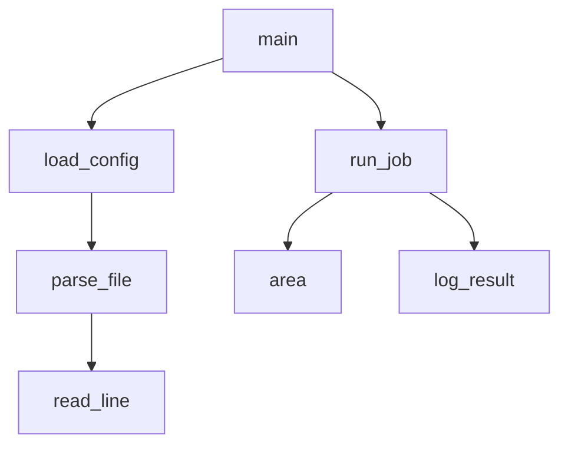

import { ConceptTemplate } from '@/features/kb/components/templates/ConceptTemplate'
import { Callout } from '@/features/kb/components/mdx/Callout'
import { ComparisonTable } from '@/features/kb/components/mdx/ComparisonTable'

export default function Layout({ children }) {
  return (
    <ConceptTemplate title="Procedural Programming">
      {children}
    </ConceptTemplate>
  )
}

**Procedural programming** is imperative programming after it discovered functions. Instead of one 4,000-line `main` full of `GOTO`, you name a **procedure** (routine, subroutine, function): a stack frame, parameters, a local scope, a return.

C is the canonical procedural language. Go, Fortran, Pascal, and large parts of Python and JavaScript daily work are procedural even when the file also contains a class.

<Callout icon="info" title="The first real architecture">
Procedures gave us modularity and lexical scope. A variable can live for one call instead of for the whole process. That was the step from "script the machine" to "engineer a program."
</Callout>

## 1. Deep Dive and Mechanics

A procedure call does mechanical work:

1. Evaluate arguments.
2. Push a stack frame (return address, saved registers, locals).
3. Jump to the procedure body.
4. Run imperative statements that may mutate locals, pointed-to memory, or globals.
5. Pop the frame and resume the caller with a return value.

**Data and logic are separate.** A rectangle struct with width and height fields does not "know" how to compute area. `int area(struct Rectangle r)` lives somewhere else. That is the opposite of OOP, where `r.area()` is looked up on the value.

**Modularity** is a call tree. `main` calls `load_config`, which calls `parse_file`, which calls `read_line`. Each name is a seam you can test or replace.

**Recursion** is a procedure calling itself. The stack *is* the loop state. Tail-call elimination, when the compiler has it, reuses the frame; C does not guarantee that.

## 2. Mathematical / Theoretical Foundation

Structured programming (Dijkstra) said any computable control flow can be written with sequence, selection, and iteration — no arbitrary `GOTO`. Procedures add **abstraction over commands**: a name stands for a derived command with a precondition/postcondition contract.

The stack discipline is last-in, first-out activation records. It matches block-structured scope. Heap allocation appears when a value must outlive the frame (C `malloc`, escaping closures in other languages).

Compared with OOP, procedural code uses **ad-hoc polymorphism** (you pass a function pointer) or **_Generic**/macros, not vtables, unless you build them by hand.

<ComparisonTable
  headers={['Axis', 'Procedural', 'Object-oriented']}
  rows={[
    ['Unit of reuse', 'Function + struct', 'Class / object'],
    ['Where methods live', 'Free functions', 'Attached to the type'],
    ['Extending behavior', 'New function', 'New subclass or strategy'],
    ['Famous home', 'C, Linux kernel', 'Java, Smalltalk'],
  ]}
/>

## 3. Real-World Implementation

```c
struct Rectangle {
    int width;
    int height;
};

int area(struct Rectangle rect) {
    return rect.width * rect.height;
}

int main(void) {
    struct Rectangle door = {90, 210};
    return area(door);
}
```

The Linux kernel is still this style at scale: `struct file` plus a table of function pointers (`file_operations`). That is procedural code implementing late binding without a class keyword.

## 4. Visualizations



## 5. Interview Prep

**Q: Is procedural the same as imperative?**
**A:** All procedural code is imperative. Not all imperative code is procedural: a BASIC listing of numbered lines with `GOTO` is imperative without procedures.

**Q: Why did OOP win business apps but not kernels?**
**A:** Business apps wanted evolving taxonomies and plugin vendors. Kernels wanted predictable layout, no hidden allocation in a constructor, and the ability to grep for `area(`. Both camps still steal each other's tricks.

**Q: What is a higher-order procedure?**
**A:** A function that takes or returns a function (`qsort`'s comparator, `signal` handlers). Closures make this nicer; C uses raw function pointers plus a `void *userdata`.

## 6. Production Use Cases

- **Operating systems, databases, compilers in C.**
- **Numerical and scientific Fortran.**
- **Network services in Go:** structs and functions, interfaces only where needed.
- **Scripts and CLIs:** parse args, call a pipeline of functions, exit.

<Callout icon="tip" title="When a file turns into a class">
If you have `User` data and twenty `user_*` functions that all take `User*`, you are one rename away from a class. That is fine. Do it when the invariant is easier to protect as methods, not because a blog post said so.
</Callout>
