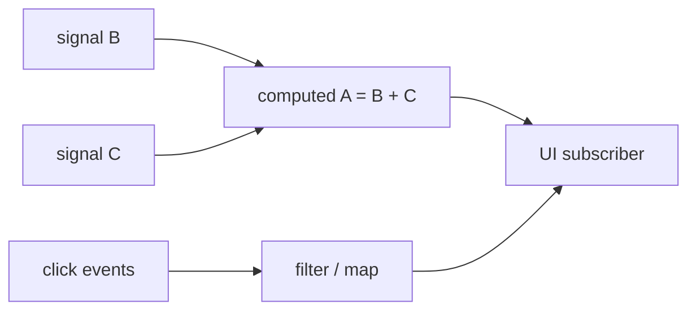

import { ConceptTemplate } from '@/features/kb/components/templates/ConceptTemplate'
import { Callout } from '@/features/kb/components/mdx/Callout'
import { ComparisonTable } from '@/features/kb/components/mdx/ComparisonTable'

export default function Layout({ children }) {
  return (
    <ConceptTemplate title="Reactive Programming">
      {children}
    </ConceptTemplate>
  )
}

In an ordinary language, `A = B + C` runs once. If `B` changes later, `A` is stale. In a spreadsheet, `A` is a formula. Change `B` and `A` updates. **Reactive programming** is that idea as an architectural style: values are **behaviours** (continuous over time) or **event streams** (discrete firings), and the runtime **propagates** changes through a dependency graph.

Excel is the most deployed reactive system on earth. RxJS, ReactiveX, Elm, Solid, React (with a scheduler), Swift Combine, and Kotlin Flow are the programmer-facing versions.

## 1. Deep Dive and Mechanics

Two vocabularies got mashed together.

**FRP (functional reactive programming).** `Behavior a` is a value of type `a` at every time `t`. `Event a` is a sequence of occurrences. Combinators (`map`, `filter`, `switch`) build a graph. Implementations must avoid **glitches**: a node seeing a mix of old and new inputs in one turn.

**Observable / iterator dual.** An Iterator is pull: you ask for the next item. An Observable is push: the source calls `onNext` / `onError` / `onCompleted` on subscribers. Backpressure (Reactive Streams, Kotlin Flow) reintroduces pull so a slow consumer is not flooded.

UI frameworks build a dependency graph while rendering. Solid and Vue track which signals a component read. When a signal writes, only those nodes re-run. Classic React re-runs the component function and diffs the result (reactive *scheduling*, coarser graph).

<Callout icon="warning" title="Push without backpressure">
A hot stream of market ticks into a UI that paints at 60 Hz will melt a laptop. Buffer, sample, or switch to a pull protocol. Infinite `map` chains are not free.
</Callout>

## 2. Mathematical / Theoretical Foundation

A reactive program is a directed graph `G = (N, E)` where an edge `u -> v` means "`v` reads `u`." A write to `u` invalidates descendants. Correct propagation is a **topological update**: every node runs after its dependencies in that turn.

Denotationally, a behaviour is a function `Time -> A`. Composition is pointwise: `(b + c)(t) = b(t) + c(t)`. Discrete events are lists of `(Time, A)`. Higher-order FRP (`Event of Behavior`) needs a `switch` combinator: start listening to a new inner stream and unsubscribe from the old one, or you leak.

Rx marble diagrams are just pictures of those timed sequences. Operators are stream homomorphisms: `map(f)` applies `f` to each occurrence without inventing or dropping times (unless you use `filter` / `debounce`).

<ComparisonTable
  headers={['Model', 'Who pulls', 'Typical home']}
  rows={[
    ['Iterator / async iter', 'Consumer', 'Files, paginated APIs'],
    ['Observable push', 'Producer', 'Clicks, WebSockets'],
    ['Reactive Streams', 'Consumer credits', 'JVM services'],
    ['Spreadsheet / signals', 'Runtime graph', 'Excel, Solid, Vue'],
  ]}
/>

## 3. Real-World Implementation

Rx-style stream of clicks, filtered and mapped:

```javascript
fromEvent(button, 'click')
  .pipe(
    filter((e) => e.button === 2),
    map((e) => ({ x: e.clientX, y: e.clientY })),
    debounceTime(50)
  )
  .subscribe((pt) => draw(pt))
```

Signal-style (the spreadsheet):

```javascript
const b = signal(1)
const c = signal(2)
const a = computed(() => b() + c())
// a() === 3
b.set(5)
// a() === 7  — no manual a = ...
```

The computed node recorded that it read `b` and `c`. The write to `b` marks `a` dirty.

## 4. Visualizations



## 5. Interview Prep

**Q: How is this different from event-driven programming?**
**A:** Event-driven is the *transport* (queue, handlers). Reactive is the *algebra* over streams and the automatic graph. You can write event-driven code that is not reactive (a giant switch on message type that forgets to update a dependent field).

**Q: What is a glitch?**
**A:** Node `C` depends on `A` and `B`. `A` updates, `C` runs, still seeing old `B`, then `B` updates and `C` runs again. For one instant `C` was inconsistent. Topological or transactional batching prevents it.

**Q: Why did React not use fine-grained signals originally?**
**A:** Virtual DOM made any state change a coarse re-render plus diff. It is simpler to reason about and compatible with the web's DOM. Signals need careful ownership of who subscribed. Both are reactive; the grain size differs.

## 6. Production Use Cases

- **UIs:** every modern front-end stack.
- **Market data and IoT:** fan-in streams, sample, window, alert.
- **Backend pipelines:** Kafka Streams, Akka Streams, Project Reactor.
- **Build systems and spreadsheets:** dirty flags on a DAG of cells or targets.

<Callout icon="tip" title="Unsubscribe is a feature">
A leftover subscription is a memory leak and a ghost update. Structured scopes (React effects, Kotlin `coroutineScope`, Rust `Drop`) should own the subscription lifetime.
</Callout>
