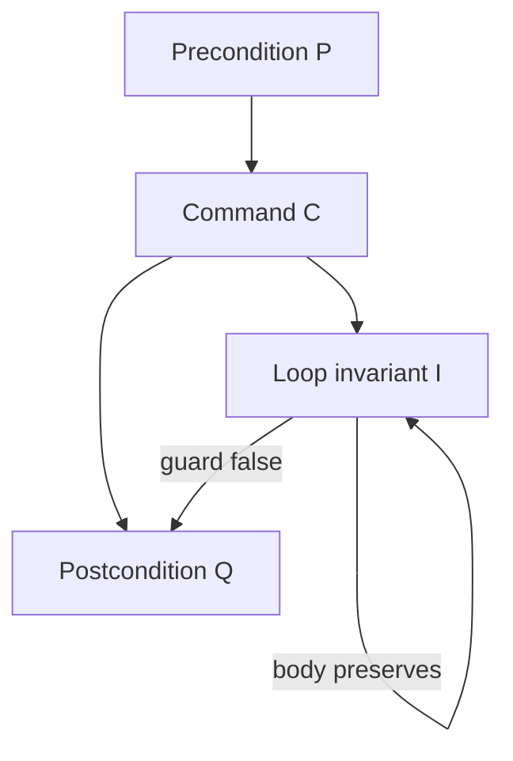

import { ConceptTemplate } from '@/features/kb/components/templates/ConceptTemplate'
import { Callout } from '@/features/kb/components/mdx/Callout'
import { ComparisonTable } from '@/features/kb/components/mdx/ComparisonTable'

export default function Layout({ children }) {
  return (
    <ConceptTemplate title="Axiomatic Semantics">
      {children}
    </ConceptTemplate>
  )
}

Tests show that *this* input failed. They never show that *no* input can fail. **Axiomatic semantics** treats a program as a logical claim: if the world satisfies a precondition, then after this command the world satisfies a postcondition.

Tony Hoare's 1969 paper made that claim a calculus. CompCert, seL4, SPARK Ada, and the flight-control culture that refuses "it worked in QA" all sit on this idea.

<Callout icon="info" title="Testing vs proof">
Dijkstra: testing can show the presence of bugs, never their absence. Axiomatic semantics is the attempt to *prove* absence for a stated specification. The spec can still be wrong. The proof is only as good as P and Q.
</Callout>

## 1. Deep Dive and Mechanics

A **Hoare triple** is three pieces: precondition P, command C, postcondition Q. Read it as: "if P is true, and C runs and terminates, then Q is true."

Example: P is `x > 0`, C is `y = x * 2`, Q is `y > 0`. The assignment rule of Hoare logic says you substitute: to establish Q after `y = E`, you need Q with `y` replaced by `E` to hold beforehand.

Rules compose.

- **Skip** does nothing: P must already be Q.
- **Sequence:** prove an intermediate R that the first command establishes and the second assumes.
- **Conditional:** prove both branches; the guard (or its negation) is added to P.
- **Loop:** invent an **invariant** I that is true before the loop, preserved by the body, and together with "guard is false" implies Q. Finding I is the human art.

**Partial correctness** assumes C terminates. **Total correctness** also proves a variant (a non-negative measure that decreases each iteration) so the loop cannot run forever.

Dijkstra's **weakest precondition** wp(C, Q) is the most liberal P that still makes the triple valid. You compute wp backwards from the goal. That is how many verifiers work: start from the asserted postcondition, push it through each statement, and ask the SMT solver if the actual precondition implies the computed one.

## 2. Mathematical / Theoretical Foundation

Hoare logic is a proof system whose judgments are triples. Soundness: if you derive a triple, every terminating run from a P-state ends in a Q-state. Completeness (Cook) needs an expressive assertion language; in practice you work in first-order arithmetic plus array theories and accept that some true triples are not found automatically.

Separation logic (Reynolds, O'Hearn) extends the assertion language with a *separating conjunction* so you can talk about heap chunks that do not alias. That is how you prove a `free` does not leave a dangling use, and how Infer/Pulse hunt resource bugs at Facebook scale.

<ComparisonTable
  headers={['Style', 'What a program means', 'Best at']}
  rows={[
    ['Operational', 'Machine steps', 'Interpreters, races'],
    ['Denotational', 'A mathematical function', 'Equivalence, compilers'],
    ['Axiomatic', 'A Hoare triple / contract', 'Correctness proofs'],
  ]}
/>

## 3. Real-World Implementation

A tiny annotated fragment a verifier can check:

```c
// @ requires n >= 0
// @ ensures \result == n * (n + 1) / 2
int sum_to(int n) {
    int s = 0;
    int i = 1;
    // @ loop invariant s == i * (i - 1) / 2 && i <= n + 1
    while (i <= n) {
        s = s + i;
        i = i + 1;
    }
    return s;
}
```

Frama-C/WP, Dafny, Why3, and SPARK generate verification conditions from comments like these and hand them to Z3 or CVC5. If the solver says unsat on the *negation*, the triple holds.

## 4. Visualizations



## 5. Interview Prep

**Q: Why do we need a loop invariant if we already have tests?**
**A:** A test exercises one path length. An invariant is a claim that holds for *every* iteration count. Without it, Hoare logic cannot step over a `while`.

**Q: Partial vs total correctness?**
**A:** Partial: if it finishes, Q holds. An infinite loop is "correct" under partial correctness. Total adds a well-founded variant so you also prove termination.

**Q: Can this replace unit tests?**
**A:** No. Proofs check the spec you wrote. Tests still catch wrong specs, missing environment assumptions, and performance. They complement each other.

## 6. Production Use Cases

- **seL4:** kernel syscalls proved against an abstract spec.
- **CompCert:** C compiler passes proved not to change observable behaviour.
- **Avionics and rail (SPARK, SCADE):** contracts on control software.
- **Cloud-scale static analysis:** Infer uses separation-logic ideas to flag use-after-free.

<Callout icon="warning" title="The spec is the remaining bug">
A proved program that implements the wrong Q is a proved disaster. Write P and Q as if a hostile reviewer will implement exactly those predicates and nothing else.
</Callout>
