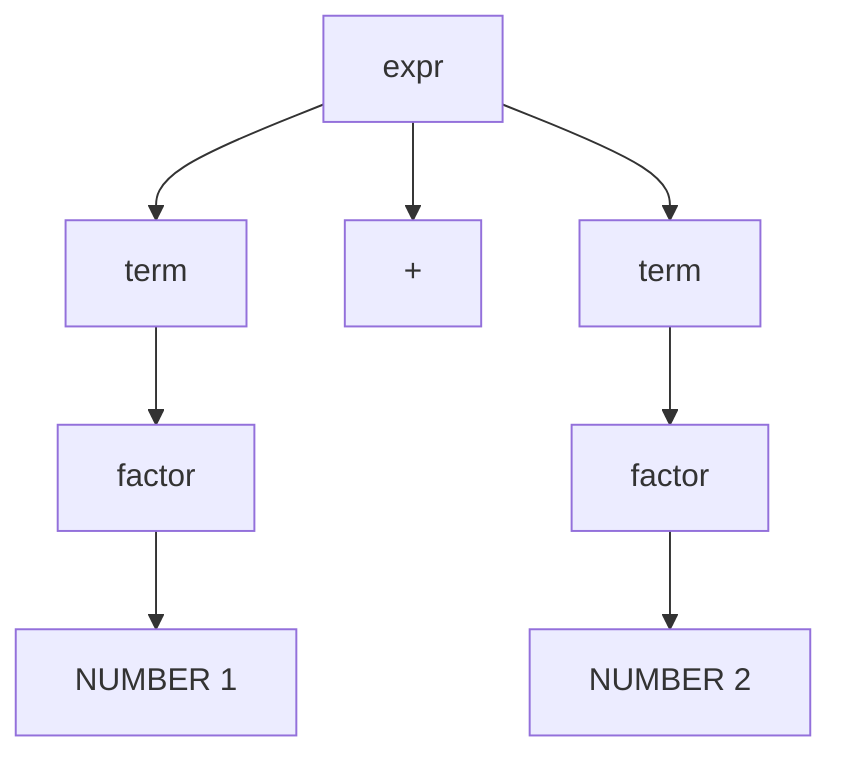

import { ConceptTemplate } from '@/features/kb/components/templates/ConceptTemplate'
import { Callout } from '@/features/kb/components/mdx/Callout'
import { ComparisonTable } from '@/features/kb/components/mdx/ComparisonTable'

export default function Layout({ children }) {
  return (
    <ConceptTemplate title="BNF and EBNF">
      {children}
    </ConceptTemplate>
  )
}

A compiler does not "just know" what an `if` statement looks like. Someone wrote a **grammar**. **Backus–Naur Form (BNF)** and **Extended BNF (EBNF)** are the usual notations for that grammar: a finite list of production rules that generate an infinite language.

John Backus and Peter Naur used BNF for Algol 60. Every language spec since (C, Java, ECMAScript, Protocol Buffers) still ships something in this family.

## 1. Deep Dive and Mechanics

A production says: "this name may be rewritten as that sequence."

- **Terminals** are tokens the lexer already produced: the keyword `if`, the symbol `+`, the integer `7`.
- **Nonterminals** are phrases: `expr`, `stmt`, `program`. They appear on the left of a rule.

Classic BNF:

```bnf
<digit> ::= "0" | "1" | "2" | "3" | "4"
          | "5" | "6" | "7" | "8" | "9"
<expr>  ::= <digit>
          | <expr> "+" <expr>
```

The second rule is **recursive**. One definition licenses `1+2+3+4`. That is why programming languages are not regular expressions: they nest.

**EBNF** adds sugar so you do not invent a new nonterminal for every list:

- square brackets around X — X is optional
- curly braces around X, or `X*` — zero or more X
- `X+` — one or more
- parentheses for grouping alternatives

Those curly braces mean repetition, not a Hoare triple. Parser generators (ANTLR, yacc, tree-sitter) accept EBNF-ish input and emit a recursive-descent or table-driven parser.

Ambiguity is the enemy. The classic `if-if-else` dangling-else grammar has two parse trees. Specs add a disambiguation rule ("else binds to the nearest if") or rewrite the grammar so only one tree exists.

<Callout icon="tip" title="Lexer vs parser">
BNF usually starts *after* lexing. Regex is fine for `identifier` and `number`. Nesting (`()`, blocks, expressions) belongs in BNF. Mixing them is how you get "I parsed HTML with regex" disasters.
</Callout>

## 2. Mathematical / Theoretical Foundation

A BNF grammar is a **context-free grammar** (Chomsky type 2): every production is `A -> string of terminals and nonterminals`. The language is the set of terminal strings derivable from a start symbol.

Parsing is the inverse of derivation: given a string, recover a **parse tree** (or reject). LL and LR families are restricted CFGs plus a deterministic algorithm. If your grammar is not in the class your tool implements, you get shift/reduce conflicts, not a philosophical debate.

Left recursion (`expr ::= expr "+" digit`) is natural in BNF and death for naive recursive descent. You left-factor or use an LR/PEG tool.

<ComparisonTable
  headers={['Notation', 'You write', 'Tooling']}
  rows={[
    ['BNF', 'One alternative per line, recursion for lists', 'Language specs'],
    ['EBNF', 'Optional and repetition marks', 'ISO specs, many books'],
    ['Parser DSL', 'ANTLR / tree-sitter grammar', 'Generated parsers'],
  ]}
/>

## 3. Real-World Implementation

A tiny expression grammar a student parser can implement:

```ebnf
expr   = term { ("+" | "-") term } ;
term   = factor { ("*" | "/") factor } ;
factor = NUMBER | "(" expr ")" ;
```

Precedence lives in the *layering* (`term` vs `expr`), not in a special BNF keyword. That is why textbooks stack `expr`, `term`, `factor`, `atom`.

## 4. Visualizations



## 5. Interview Prep

**Q: Why not describe Java with regex?**
**A:** Regular languages cannot count unbounded nesting. Braces nested to arbitrary depth need a stack. That is the CFG / pushdown line in the Chomsky hierarchy.

**Q: BNF vs EBNF vs ABNF?**
**A:** Same power. EBNF is nicer to read. ABNF (RFC 5234) is the IETF dialect used in HTTP and email specs: `%x` hex terminals, explicit repetition `*`.

**Q: What does a shift/reduce conflict mean?**
**A:** The LR parser saw a prefix that could either grow (shift) or finish a production (reduce). Your grammar is ambiguous or too hard for that algorithm. Rewrite or add a precedence declaration.

## 6. Production Use Cases

- **Language standards:** the Java Language Specification's grammar chapters.
- **Protocol RFCs:** HTTP, URI, IMAP written in ABNF.
- **IDEs:** tree-sitter grammars power syntax highlighting and structural edits.
- **Config and IDL:** protobuf, GraphQL SDL, Terraform HCL all start as a grammar file.

<Callout icon="warning" title="Pretty grammars lie">
A grammar in an appendix is often ambiguous "for readability" and then patched in prose. The *implemented* grammar in the compiler is the one that matters. Diff those when a parser rejects code the spec seems to allow.
</Callout>
