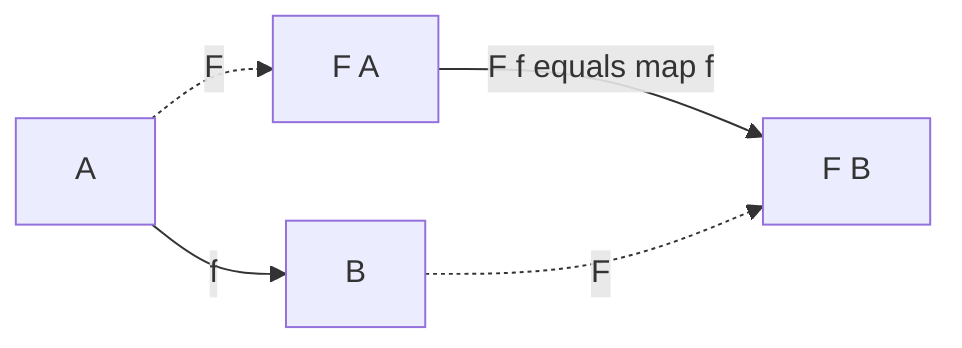

import { ConceptTemplate } from '@/features/kb/components/templates/ConceptTemplate'
import { Callout } from '@/features/kb/components/mdx/Callout'
import { ComparisonTable } from '@/features/kb/components/mdx/ComparisonTable'

export default function Layout({ children }) {
  return (
    <ConceptTemplate title="Category Theory (Functors)">
      {children}
    </ConceptTemplate>
  )
}

Category theory is sometimes sold as "the mathematics of mathematics." For language design you need a smaller kit: **objects**, **arrows**, **composition**, and **functors**. Haskell, Scala, and Rust's `Iterator::map` are this kit with different syntax.

The sibling page on **monoids** covers combining values. This page covers **mapping over a shape**.

## 1. Deep Dive and Mechanics

A **category** has:

- Objects (think types: `Int`, `String`, `User`)
- Morphisms (think functions: `Int -> String`)
- Composition: if `f: A -> B` and `g: B -> C`, there is `g after f: A -> C`
- Identities: every object A has `id_A` that composes neutrally

Programmers already live here. The category is often called **Hask** or **Set** depending on how strict you are about bottom and nontermination.

A **functor** F sends objects to objects and arrows to arrows, and **preserves** the structure:

- `F(id_A) = id_F(A)`
- `F(g after f) = F(g) after F(f)`

In code, F is a type constructor (`Maybe`, `List`, `Promise`) and `F(f)` is `map(f)`. If you have `show: Int -> String` and a `List of Int`, you cannot pass the list to `show`. `map(show)` **lifts** `show` through the list shape and returns a `List of String`. Length and order stay put. That is "preserves structure."

If your `map` drops elements, reorders them, or runs `f` twice, it is not a functor. The laws are tests you can write.

<Callout icon="tip" title="Functor is not a burrito">
It is not a container metaphor first. It is a *lawful* `map`. `Promise` is a functor (`then` on the success path). So is `Function from R` (`map` is compose). Some functors do not "hold a value" in any bag sense.
</Callout>

## 2. Mathematical / Theoretical Foundation

Functors are the morphisms *of the category of categories*. Endofunctors (F: C -> C) are the ones programmers use: they send types in your language to types in your language.

Covariance vs contravariance is which way arrows flip. `List` is covariant: `map` goes `A -> B` to `List A -> List B`. A consumer `Predicate` is contravariant: you map by precomposing. Java's `? extends` / `? super` (PECS) is this distinction with wildcards.

Natural transformations are maps between functors (`List -> Maybe` via `headOption`) that commute with `map`. Libraries like Cats and fp-ts are catalogues of these maps with names.

<ComparisonTable
  headers={['Idea', 'Math name', 'In code']}
  rows={[
    ['Type', 'Object', 'Int, User'],
    ['Function', 'Morphism', 'f: A -> B'],
    ['map', 'Functor action', 'list.map(f)'],
    ['then / bind', 'Monad (later)', 'flatMap'],
  ]}
/>

## 3. Real-World Implementation

```typescript
function map<A, B>(xs: A[], f: (a: A) => B): B[] {
  const out: B[] = []
  for (const x of xs) out.push(f(x))
  return out
}

const show = (n: number) => String(n)
map([1, 2, 3], show) // ['1', '2', '3']
```

Law checks (property tests):

- identity: `map(xs, x => x)` equals `xs`
- composition: `map(xs, x => g(f(x)))` equals `map(map(xs, f), g)`

## 4. Visualizations



## 5. Interview Prep

**Q: Is every type with a map method a functor?**
**A:** Only if the laws hold. A `map` that logs, mutates the input, or filters "invalid" items is a convenient method, not a functor.

**Q: Functor vs monad?**
**A:** Functor: `map`, one layer, no flatten. Monad: `flatMap` / `bind`, sequences computations that themselves return a layer. Every monad is a functor; the reverse is false.

**Q: Why do language designers care?**
**A:** Once `map` is lawful, whole programs rewrite (`map f after map g` = `map (f after g)`). Compilers and stream engines use that to fuse loops.

## 6. Production Use Cases

- **Collections and streams:** one `map` implementation, many element types.
- **Optional / Result:** map over success, skip the empty/error case.
- **UI:** map a model into a view tree; React children are a functor-ish shape.
- **Big data:** Spark `map` is the same law at cluster scale.

<Callout icon="info" title="Next stop">
Monoids tell you how to *reduce*. Functors tell you how to *transform in place of shape*. Monads tell you how to *sequence effects*. Learn them in that order.
</Callout>
