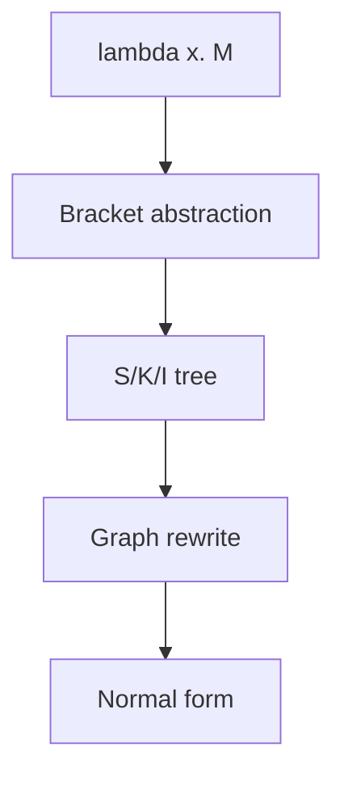

import { ConceptTemplate } from '@/features/kb/components/templates/ConceptTemplate'
import { Callout } from '@/features/kb/components/mdx/Callout'
import { ComparisonTable } from '@/features/kb/components/mdx/ComparisonTable'

export default function Layout({ children }) {
  return (
    <ConceptTemplate title="Combinatory Logic">
      {children}
    </ConceptTemplate>
  )
}

Lambda calculus needs names: `λx. x`. Those names force capture-avoiding substitution, the messiest part of a lambda interpreter. **Combinatory logic** (Schönfinkel, Curry) deletes bound variables. You keep a handful of primitive **combinators** — functions with fixed rewrite rules — and build everything by application.

The SKI calculus is Turing-complete with two letters and parentheses. Nobody ships SKI to production. Compilers and theorem provers use the *idea* when they supercombinator-compile or when they explain why `const` and `id` are not just library trivia.

## 1. Deep Dive and Mechanics

A combinator is a closed lambda: no free variables. The famous trio:

- **I** (identity): `I x` reduces to `x`
- **K** (constant / discard): `K x y` reduces to `x`
- **S** (substitution / share): `S x y z` reduces to `x z (y z)`

`I` is optional. `I = S K K`. So **S** and **K** alone suffice.

Translation from lambda terms is mechanical (bracket abstraction):

- `[x] x` becomes `I`
- `[x] y` becomes `K y` when y is not x
- `[x] (M N)` becomes `S ([x] M) ([x] N)`

So `λx. λy. x` becomes `K`. `λx. x` becomes `I`. A real program becomes a huge tree of S and K. Graph reduction machines (Miranda, early Haskell) evaluated that tree by rewriting, sharing the `z` in `S` so work is not duplicated.

<Callout icon="info" title="Why bother">
Substitution in lambda calculus must rename (`α-convert`) to avoid capture. Combinators have no binders, so reduction is pattern match plus graft. That is simpler hardware and a cleaner metatheory.
</Callout>

## 2. Mathematical / Theoretical Foundation

Combinatory logic is a rewrite system on applicative terms. Weak reduction only fires combinators at the root of a redex; it corresponds to weak-head evaluation. Stronger notions recover full beta.

Schönfinkel wanted to eliminate bound variables from predicate logic. Curry connected the types of S and K to the axioms of intuitionistic implication. That is a door into **Curry–Howard**: `K` has type `a -> b -> a` (weaken), `S` has type `(a -> b -> c) -> (a -> b) -> a -> c` (the S axiom of Hilbert-style logic).

Turing completeness: you can encode numbers and recursion (the Y combinator is expressible, with care about evaluation order). SKI is a universal language the same way the lambda calculus and Turing machines are.

<ComparisonTable
  headers={['System', 'Binders', 'Reduction pain']}
  rows={[
    ['Lambda calculus', 'Yes, lambda', 'Capture-avoiding subst'],
    ['SKI combinators', 'None', 'Fixed rewrite rules'],
    ['Turing machine', 'Tape cells', 'State plus head motion'],
  ]}
/>

## 3. Real-World Implementation

A toy reducer in JavaScript:

```javascript
const reduce = (t) => {
  if (!Array.isArray(t)) return t
  const [h, ...args] = t.map(reduce)
  if (h === 'I' && args.length >= 1) return reduce([args[0], ...args.slice(1)])
  if (h === 'K' && args.length >= 2) return reduce([args[0], ...args.slice(2)])
  if (h === 'S' && args.length >= 3) {
    const [x, y, z] = args
    return reduce([x, z, [y, z], ...args.slice(3)])
  }
  return [h, ...args]
}

reduce(['K', 1, 2]) // 1
reduce(['S', 'K', 'K', 7]) // 7  (that is I)
```

Terms are nested arrays because we cannot use JS application without evaluating too early.

## 4. Visualizations



## 5. Interview Prep

**Q: Are combinators just higher-order functions?**
**A:** In a host language, yes: `const K = (x) => (y) => x`. In the *calculus*, they are the *only* primitives. No `function` keyword remains.

**Q: What is a supercombinator?**
**A:** A lambda with no free variables, possibly taking several arguments at once. GHC's spineless tagless G-machine compiles Haskell into supercombinators — the industrial child of this theory.

**Q: Point-free style?**
**A:** Writing `f = compose(g, h)` instead of `f = x => g(h(x))` is combinatory thinking. Readable in small doses. An SKI dump is not a style; it is a compilation target.

## 6. Production Use Cases

- **Functional compilers:** supercombinator and STG backends.
- **Theorem provers:** Hilbert-style proof terms are combinators.
- **Obfuscation and golf:** SKI as a curiosity and a reduction test suite.
- **Concatenative languages** (Forth, Factor): stack combinators (`dup`, `swap`) are cousins.

<Callout icon="warning" title="Size explosion">
Naive bracket abstraction can make terms exponentially large. Real compilers use better abstraction algorithms (Turner, empirical combinator sets) and let-sharing. Do not emit raw SKI from a production frontend.
</Callout>
