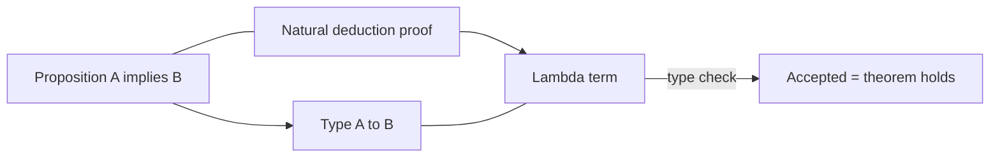

import { ConceptTemplate } from '@/features/kb/components/templates/ConceptTemplate'
import { Callout } from '@/features/kb/components/mdx/Callout'
import { ComparisonTable } from '@/features/kb/components/mdx/ComparisonTable'

export default function Layout({ children }) {
  return (
    <ConceptTemplate title="Curry-Howard Correspondence">
      {children}
    </ConceptTemplate>
  )
}

Haskell Curry and William Howard noticed that the *shape* of a typing derivation is the *shape* of a natural-deduction proof. **A type is a proposition. A program of that type is a proof of that proposition.** If the type checker accepts `f: A -> B`, you have constructed a proof that A implies B — in the logic that matches your type system.

That is why Coq, Agda, Lean, and Idris feel like programming *and* like writing a paper. Compiling *is* checking the proof.

## 1. Deep Dive and Mechanics

The dictionary (intuitionistic fragment):

- Conjunction A and B ↔ pair type `(A, B)`. A proof is a pair of proofs. `fst` / `snd` are the elimination rules.
- Disjunction A or B ↔ sum type `Either A B`. A proof is `Left(proofA)` or `Right(proofB)`.
- Implication A implies B ↔ function type `A -> B`. A proof is a function that turns a proof of A into a proof of B.
- False / empty type ↔ `Void` / `Never`. No closed value. A function `Void -> A` is `absurd` (ex falso).
- True ↔ unit type `()`. One trivial proof.

**Quantifiers** become dependent types. "For all n, P(n)" is a function that, given n, returns a proof of P(n). "There exists n such that P(n)" is a pair `(n, proof)`.

Classical logic's law of excluded middle (A or not A) does *not* automatically hold. A proof would be a program that, for every A, produces either a value of A or a value of `A -> Void`. You cannot write that for arbitrary A. That is why these provers are **constructive** unless you add axioms (Lean's `Classical` namespace).

<Callout icon="tip" title="Extracting programs">
In Coq you can `Extraction` a certified function to OCaml. The proof parts that only exist to convince the checker can be erased. What remains is a program whose type still records the theorem you cared about (for example, "this sort permutes and is ordered").
</Callout>

## 2. Mathematical / Theoretical Foundation

The correspondence extends:

- Simply typed lambda calculus ↔ intuitionistic propositional logic
- System F ↔ second-order logic (polymorphism = forall over propositions)
- Dependent type theory (Martin-Löf) ↔ predicate logic
- Linear types ↔ linear logic (resources used once)

**Proof irrelevance** vs computational content: two proofs of `2 + 2 = 4` may differ as terms but we often treat them as equal. Languages split `Prop` (erased) from `Type` (kept) for that reason.

Normalization of typed terms is consistency of the logic: if every term has a normal form, you cannot prove False (no closed term of empty type). That is why adding unrestricted recursion (`fix : (A -> A) -> A`) *as a closed axiom* makes the logic inconsistent — `fix id` loops and you can "prove" anything by not returning.

<ComparisonTable
  headers={['Logic', 'Type', 'Program']}
  rows={[
    ['Implies', 'A -> B', 'Function'],
    ['And', 'Pair A B', 'Tuple'],
    ['Or', 'Either A B', 'Tagged union'],
    ['For all x, P x', 'Dependent function', 'Generic program'],
    ['Exists x, P x', 'Dependent pair', 'Witness plus proof'],
  ]}
/>

## 3. Real-World Implementation

A baby proof in TypeScript's type system (limited, but the idea):

```typescript
type And<A, B> = [A, B]
type Implies<A, B> = (a: A) => B

const andElimLeft = <A, B>(p: And<A, B>): A => p[0]

// modus ponens is just application
const mp = <A, B>(f: Implies<A, B>, a: A): B => f(a)
```

In Lean you write the same thing with tactics or terms, and the kernel checks a proof object.

## 4. Visualizations



## 5. Interview Prep

**Q: Does a compiling Rust program prove its spec?**
**A:** It proves *memory and type* theorems the borrow checker encodes (no aliasing XOR mutation, etc.). It does not prove "this checkout total is correct" unless you encoded that in types (or used a verifier). Curry–Howard is not magic; it tracks the propositions you wrote as types.

**Q: Why is `any` / `unsafe` a logical hole?**
**A:** You just added an axiom. `unsafe` and `as any` are "assume False implies whatever I want." Use them as trusted, tiny kernels.

**Q: What is propositions as types vs types as sets?**
**A:** PAT is Curry–Howard. Types-as-sets is the older view (a type is a collection of values). Both are used; PAT shines when the type *depends* on values.

## 6. Production Use Cases

- **CompCert, seL4, Bedrock:** machine-checked systems software.
- **Lean mathlib:** human mathematics formalised as programs.
- **Spark/Ada contracts** and **refinement types** (Liquid Haskell): lighter-weight Curry–Howard.
- **API design:** `Result` and `Option` force callers to handle the "proof" of failure.

<Callout icon="warning" title="Inhabited is not true in the real world">
A type being inhabited means there is a *program*. If that program is `while(true)`, you proved nothing useful. Termination and totality matter for the logic reading.
</Callout>
