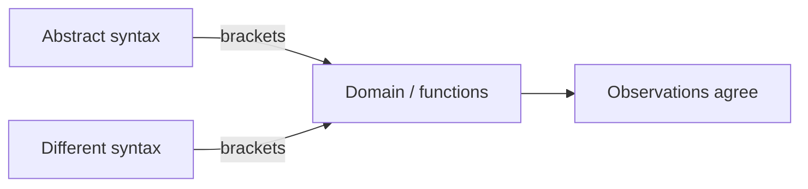

import { ConceptTemplate } from '@/features/kb/components/templates/ConceptTemplate'
import { Callout } from '@/features/kb/components/mdx/Callout'
import { ComparisonTable } from '@/features/kb/components/mdx/ComparisonTable'

export default function Layout({ children }) {
  return (
    <ConceptTemplate title="Denotational Semantics">
      {children}
    </ConceptTemplate>
  )
}

**Operational** semantics says how a machine steps. **Axiomatic** semantics says what is true before and after. **Denotational** semantics says what a phrase *is*: a function, a set, a stream — something you can equate with algebra.

Scott and Strachey built the subject so that `while` and recursion have a meaning even when they do not terminate. Compiler writers use the same idea whenever they say two IR forms are "the same function."

## 1. Deep Dive and Mechanics

You define a map, often written with semantic brackets, from syntax to math:

- The meaning of a numeral `3` is the integer 3.
- The meaning of `e1 + e2` is the sum of the meanings of `e1` and `e2` (plus the usual overflow story if you model a machine word).
- The meaning of a command is a function from stores to stores (or to stores-plus-nontermination).

Compositionality is the law that makes this a *semantics* and not a pile of examples: the meaning of a phrase is determined by the meanings of its immediate children and the constructor. You never peek inside a subphrase except through its denotation. That is why you can replace `2+2` by `4` anywhere — same denotation.

Functions that may loop are not ordinary set-theoretic total functions. Scott **domains** add a bottom element (written bottom or "undefined") and a partial order "is less defined than." A recursive definition `f = F(f)` is the **least fixed point** of the continuous functional F: start at bottom, apply F, take the limit. `while false do ...` denotes the identity on stores. `while true do skip` denotes the constantly-bottom function.

<Callout icon="info" title="Adequacy">
A denotational model is only honest if it matches an operational story: if two programs denote the same function, no observation (termination, printed digits) can tell them apart. Proving adequacy is the hard theorem in a language paper.
</Callout>

## 2. Mathematical / Theoretical Foundation

**Domain theory:** complete partial orders (CPOs), continuous maps, Kleene fixed-point theorem. That is the classic Scott–Strachey kit.

**Game semantics and logical relations** came later for higher-order languages: a term denotes a strategy, or a set of equivalent implementations. **Monadic denotational semantics** (Moggi) puts effects in the codomain: a command denotes `Store -> M(Store)` for a monad M (exceptions, I/O, state). That is why `IO` in Haskell has a clean slogan — denotation is a value in `IO`.

Full abstraction (Plenkin, Plotkin, later Abramsky–Jagadeesan–Malacaria / Hyland–Ong for PCF) asks whether denotational equality coincides with contextual operational equivalence. Naive domains fail for higher-order languages; games fix many cases.

<ComparisonTable
  headers={['Question', 'Denotational answer']}
  rows={[
    ['What is a program?', 'A function / domain element'],
    ['When are P and Q equal?', 'Same denotation'],
    ['What is a loop?', 'Least fixed point of a functional'],
    ['What is an effect?', 'A monad around the result'],
  ]}
/>

## 3. Real-World Implementation

A toy denotation for expressions (no loops) in TypeScript:

```typescript
type Store = Record<string, number>

const denExpr = {
  num: (n: number) => (_s: Store) => n,
  var: (x: string) => (s: Store) => s[x] ?? 0,
  add: (l: (s: Store) => number, r: (s: Store) => number) =>
    (s: Store) => l(s) + r(s),
}

// meaning of  x + 1  in store { x: 41 }  is 42
const meaning = denExpr.add(denExpr.var('x'), denExpr.num(1))
meaning({ x: 41 })
```

A compiler pass that rewrites `x + 0` to `x` is a proof that both denote the same function on stores.

## 4. Visualizations



## 5. Interview Prep

**Q: Why not only operational semantics?**
**A:** Step-by-step equality is painful. Denotations let you calculate (`map f after map g = map (f after g)`) without inventing a machine. Optimisers are denotational arguments in a trench coat.

**Q: What does bottom mean in an interview?**
**A:** Nontermination (or panic, if you model it that way). A function that is undefined on some inputs is a partial function; domains make partiality first-class.

**Q: Small-step vs denotational for concurrency?**
**A:** True concurrency and races are easier to *see* operationally. Denotational models exist (event structures, pomsets) but are heavier. Many papers use both and prove they match.

## 6. Production Use Cases

- **Compiler correctness (CompCert, CakeML):** each pass preserves denotation.
- **SQL and Datalog:** queries denote functions on relations; optimisers rewrite under that equality.
- **Functional IR (GHC Core):** let-floating justified by denotational laws.
- **Hardware description:** circuits denote stream transformers.

<Callout icon="warning" title="Compositionality breaks on macros">
If a construct can inspect the *source text* of its children (`eval` of a quote, C macros), you no longer have a denotation of the children — you have a string. That is a red flag in language design.
</Callout>
