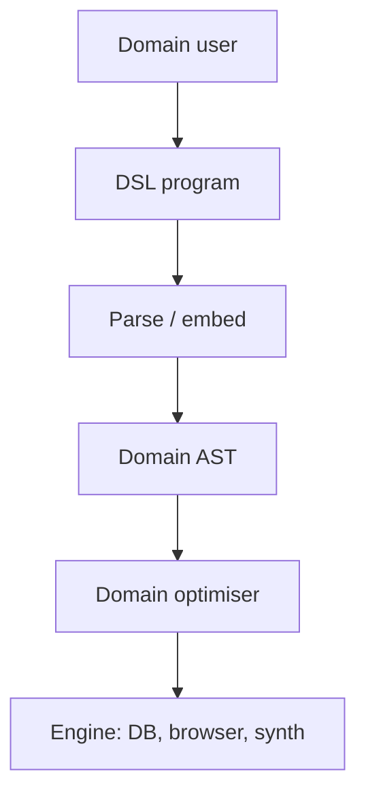

import { ConceptTemplate } from '@/features/kb/components/templates/ConceptTemplate'
import { Callout } from '@/features/kb/components/mdx/Callout'
import { ComparisonTable } from '@/features/kb/components/mdx/ComparisonTable'

export default function Layout({ children }) {
  return (
    <ConceptTemplate title="Domain-Specific Languages">
      {children}
    </ConceptTemplate>
  )
}

Java and Python are **general-purpose**. They can, in theory, implement anything. A **domain-specific language (DSL)** refuses that goal. It has vocabulary for *one* world — relations, stylesheets, build graphs, hardware, insurance products — and it makes illegal states hard to write.

SQL cannot serve HTTP. That is the feature.

## 1. Deep Dive and Mechanics

**External DSLs** have their own lexer, parser, and often their own compiler or interpreter. SQL, HTML, CSS, regex, protobuf, Terraform HCL, make, and VHDL are external. You pay for tooling (highlighters, formatters, error messages) and you gain syntax that is not a hostage of C-like braces.

**Internal (embedded) DSLs** are libraries that abuse the host's syntax until the call chain reads like a sentence. Ruby's RSpec (`expect(user).to be_valid`), Gradle Kotlin DSL, SwiftUI, and many parser combinator libraries are internal. There is no extra parser. IDE support is "whatever the host has." You also inherit the host's footguns.

**Shallow vs deep embedding** (in FP languages): a shallow DSL is just functions that run immediately. A deep DSL builds an AST (`Select(From(...))`) you can interpret, optimize, or compile later. Spark and LINQ are deep-ish: the query object is data until an execution engine sees it.

The design tension is **expressiveness vs invariants**. Narrow the language and accountants can read it, and you cannot leak memory in SQL. When the business asks for a feature outside the model, teams either escape to the host language (`EXEC`, UDFs, raw HTML in a template) or they grow the DSL until it is a bad general-purpose language.

<Callout icon="warning" title="The inner-platform effect">
If your YAML starts sprouting loops, macros, and a type system, you are inventing PHP with indentation. Either jump to a real language or keep the DSL dumb and compose it from the outside.
</Callout>

## 2. Mathematical / Theoretical Foundation

A DSL is a **signature** (operations) plus a **semantics** (what those operations mean in the domain). Algebraic specification and tagless-final encodings are the formal versions: write laws (`where` filters, `select` projects) and any implementation must obey them.

Restricted DSLs are often **not Turing-complete** on purpose (SQL without recursive CTE in old standards, regex, Datalog). That buys termination and optimisation. Adding `eval` or stored procedures punches a hole back to a GPL.

Grammar design (BNF) and type systems for DSLs follow the same theory as GPLs, just with a smaller surface. The win is a custom type checker: "this column is not in scope" beats a generic `TypeError`.

<ComparisonTable
  headers={['Kind', 'Parser', 'Example']}
  rows={[
    ['External', 'Your own', 'SQL, CSS, HCL'],
    ['Internal / fluent', 'Host language', 'RSpec, SwiftUI'],
    ['Deep embedded', 'Host, builds AST', 'LINQ, Spark columns'],
  ]}
/>

## 3. Real-World Implementation

Internal DSL (host = TypeScript):

```typescript
const q = from('orders')
  .where((row) => row.total > 100)
  .select('id', 'total')

// Deep: q is data, not a result set yet
db.run(q)
```

External DSL (SQL) for the same idea:

```sql
SELECT id, total
FROM orders
WHERE total > 100
```

The SQL version can use indexes the TypeScript lambda often cannot see unless you deep-embed and analyse the AST.

## 4. Visualizations



## 5. Interview Prep

**Q: When should we write a new language?**
**A:** When the domain has stable nouns and laws, many non-programmers must read the artifact, and you can name a clear *non-goal* (no sockets, no loops). Otherwise write a library.

**Q: Internal vs external — pick one?**
**A:** Internal ships faster and composes with the host. External wins when syntax and error messages *are* the product (SQL, CSS). Hybrids are common: JSX is an external-looking syntax compiled into host calls.

**Q: Is HTML a programming language?**
**A:** It is an external DSL for trees of UI. It is not Turing-complete by itself. With embedded JavaScript you bolted on a GPL. That bolt-on is the history of the web.

## 6. Production Use Cases

- **Data:** SQL, Spark, PRQL, GraphQL.
- **Infra:** Terraform, Kubernetes YAML, GitHub Actions (the last two often overgrown).
- **UI:** CSS, HTML, Flutter / SwiftUI DSLs.
- **Science and finance:** MATLAB toolboxes, Bloomberg/Excel formulas, hardware Verilog.

<Callout icon="tip" title="Escape hatches need types">
UDFs, `unsafe` blocks, and `innerHTML` are where DSL guarantees die. Document them as trusted kernels, test them twice, and keep them small.
</Callout>
