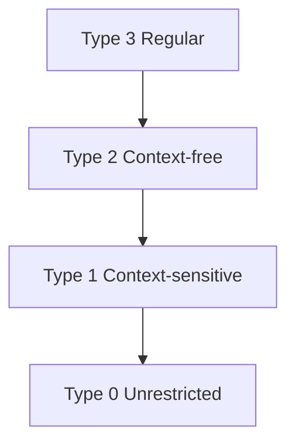

import { ConceptTemplate } from '@/features/kb/components/templates/ConceptTemplate'
import { Callout } from '@/features/kb/components/mdx/Callout'
import { ComparisonTable } from '@/features/kb/components/mdx/ComparisonTable'

export default function Layout({ children }) {
  return (
    <ConceptTemplate title="Formal Grammars">
      {children}
    </ConceptTemplate>
  )
}

A language is a set of strings. That set can be infinite (`1`, `1+1`, `1+1+1`, …). A **formal grammar** is a finite recipe that generates exactly those strings — and, as a parser, rejects the rest with a syntax error.

Noam Chomsky classified grammars by how wild a production is allowed to be. The class decides the **machine** you need and the **algorithms** you can use. This is why "just use regex" is sometimes a theorem, not a taste.

## 1. Deep Dive and Mechanics

A grammar is a 4-tuple: terminals, nonterminals, productions, start symbol. Apply productions to the start symbol until only terminals remain. That derivation is one word in the language.

**Chomsky hierarchy** (type 3 ⊂ type 2 ⊂ type 1 ⊂ type 0):

- **Type 3 — regular.** Productions look like `A -> aB` or `A -> a` (right-linear). Machines: DFA / NFA. Tools: regex, lexers. Cannot count nested pairs.
- **Type 2 — context-free.** `A -> any string of terminals and nonterminals`. Machines: pushdown automata (one stack). Tools: BNF, yacc, recursive descent. Almost all programming-language *syntax*.
- **Type 1 — context-sensitive.** `α A β -> α γ β` (context around A). Machines: linear-bounded Turing machines. Rare as a full syntax; pieces show up in type checking ("this identifier is in scope").
- **Type 0 — unrestricted.** Any rewrite. Machines: Turing machines. Recursively enumerable languages. Parsing is not a solved engineering task; it is general computation.

The famous slogan: **you cannot parse HTML with regex.** Nested elements need a stack. Regex (type 3) has none. HTML/XML as a tree is context-free (with plenty of real-world caveats: tag soup, implied close tags). People "parse" HTML with regex until the first nested comment or unquoted attribute, then they fetch an HTML parser.

<Callout icon="info" title="Syntax is not the whole language">
Context-free grammars do not know that a variable must be declared. That is **static semantics** (symbol tables, types). Do not force the CFG to encode it; you will get a context-sensitive monster. Parse wide, then analyse.
</Callout>

## 2. Mathematical / Theoretical Foundation

**Pumping lemmas** give negative proofs: if a language needs unbounded matching counts in two places (like `a^n b^n c^n`), it is not context-free. `a^n b^n` is the CFG mascot (stack: push a, pop b).

**Ambiguity:** two leftmost derivations for one string. Inherent ambiguity exists (some CFLs have only ambiguous CFGs). Programming languages add precedence and associativity to pick a unique tree.

**Parsing complexity:** general CFG is cubic (Earley, CYK). Deterministic subclasses (LL(k), LALR(1), PEG) are linear and what IDEs actually run.

<ComparisonTable
  headers={['Type', 'Machine', 'Everyday tool']}
  rows={[
    ['3 Regular', 'DFA', 'Regex, lex'],
    ['2 Context-free', 'PDA / stack', 'BNF, ANTLR'],
    ['1 Context-sensitive', 'Bounded TM', 'Some type rules'],
    ['0 Unrestricted', 'Turing machine', 'Full compilers as a whole'],
  ]}
/>

## 3. Real-World Implementation

Regular (lexer):

```regex
[A-Za-z_][A-Za-z0-9_]*
```

Context-free (matched parens) — think of a stack, not a regex:

```ebnf
parens = "" | "(" parens ")" parens ;
```

A DFA cannot remember an arbitrary number of unmatched `(` .

## 4. Visualizations



## 5. Interview Prep

**Q: Is C context-free?**
**A:** The *token* grammar plus expressions is close to CFG. The infamous lexer hack (`typedef` names) and the type system are not. Real C parsers are CFG plus semantic feedback into the lexer.

**Q: PEG vs CFG?**
**A:** Parsing Expression Grammars are deterministic: first alternative that matches wins. No ambiguity, but the language class differs (not exactly the CFLs). tree-sitter and many modern tools use PEG-like ideas.

**Q: Where do Turing machines show up in "parsing"?**
**A:** Macros, templates, and dependent types can make "is this a valid program" undecidable. The *grammar* of tokens may still be CFG; the *language of well-typed programs* is not.

## 6. Production Use Cases

- **Compilers and IDEs:** lexer (regular) + parser (CFG) + type checker (beyond CFG).
- **Network standards:** ABNF for protocol messages, carefully kept regular or CFG.
- **Security:** regex denial-of-service is a type-3 engine meeting pathological NFAs; still not an excuse to parse XML with regex.
- **Natural language:** Chomsky's original motivation; modern NLP mostly left pure CFGs for statistical models, but the hierarchy still classifies *what is even possible*.

<Callout icon="warning" title="Chomsky type is an upper bound">
A language *can* be regular even if you wrote a CFG for it. Dump it to a DFA if you can. Conversely, a sloppy CFG might describe a regular language and still run a slower parser. Measure the language, not the notation you happened to use.
</Callout>
