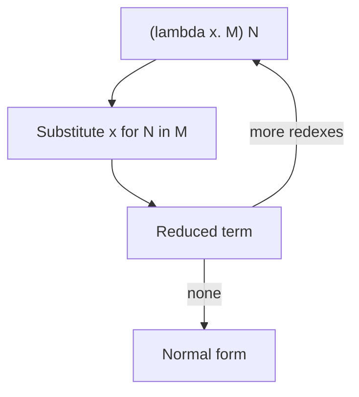

import { ConceptTemplate } from '@/features/kb/components/templates/ConceptTemplate'
import { Callout } from '@/features/kb/components/mdx/Callout'
import { ComparisonTable } from '@/features/kb/components/mdx/ComparisonTable'

export default function Layout({ children }) {
  return (
    <ConceptTemplate title="Lambda Calculus">
      {children}
    </ConceptTemplate>
  )
}

In 1936 Alonzo Church defined computation as **lambda terms**. Alan Turing defined it as a tape machine. They proved the two models have the same power. Your JavaScript arrow functions are a dialect of Church's idea with extra syntax for numbers and objects.

There are no built-in integers, booleans, or loops in the pure calculus. There are only three constructors.

## 1. Deep Dive and Mechanics

**Terms:**

1. **Variable:** `x`
2. **Abstraction:** `λx. M` — a function with parameter `x` and body `M`
3. **Application:** `M N` — apply function M to argument N (left-associative)

**Computation is β-reduction:** `(λx. M) N` becomes `M` with free `x` replaced by `N`. You must **α-convert** (rename binders) first if `N` would capture a name. That is the whole interpreter, and also the whole headache.

**η-reduction:** `λx. M x` becomes `M` when `x` is not free in `M`. That is extensional equality of functions.

**Church encodings** rebuild data as functions:

- True = `λt. λf. t` (pick first)
- False = `λt. λf. f` (pick second)
- Pair = `λa. λb. λk. k a b`
- Zero = `λs. λz. z`, Successor = `λn. λs. λz. s (n s z)` (n is "apply s, n times")

`if` is application: `b t f` runs `t` or `f` because `b` *is* the chooser. Recursion uses a **fixed-point combinator** Y. In an eager language Y diverges; you use a Z combinator or a typed `let rec`.

<Callout icon="info" title="Typed vs untyped">
The untyped calculus can β-reduce forever (`Ω = (λx. x x)(λx. x x)`). Simply typed lambda calculus bans that (and loses Turing completeness). Real languages add recursion and data types back, carefully.
</Callout>

## 2. Mathematical / Theoretical Foundation

**Free vs bound** variables, **capture-avoiding substitution**, **confluence** (Church–Rosser): if two reduction paths terminate, they end at the same normal form. Order still matters for *whether* you terminate (normal order vs applicative order).

**De Bruijn indices** replace names with numbers ("the 2nd enclosing binder") so α-equivalence is literal equality. Compilers and proof assistants use this internally.

Equivalence with Turing machines: both define the **partial recursive functions**. The Halting problem is "does this term have a normal form?"

<ComparisonTable
  headers={['Construct', 'Lambda', 'In a host language']}
  rows={[
    ['Function', 'lambda x. M', 'x => M'],
    ['Call', 'M N', 'M(N)'],
    ['True / False', 'Church booleans', 'booleans + if'],
    ['Loop', 'Y combinator', 'while / rec'],
  ]}
/>

## 3. Real-World Implementation

```javascript
const T = (t) => (f) => t
const F = (t) => (f) => f
const IF = (b) => (t) => (f) => b(t)(f)

IF(T)(1)(0) // 1
IF(F)(1)(0) // 0

// Church numeral 2: apply s twice
const two = (s) => (z) => s(s(z))
two((n) => n + 1)(0) // 2
```

This is not how V8 stores numbers. It is how you prove that "functions suffice."

## 4. Visualizations



## 5. Interview Prep

**Q: What is a closure?**
**A:** An abstraction plus the environment of its free variables. Lambda calculus substitution *is* the math; closures are the implementation that avoids copying M on every β.

**Q: Call-by-name vs call-by-value?**
**A:** Name = reduce the argument only when needed (normal-order-ish). Value = reduce the argument first (applicative). Haskell is lazy (name plus sharing). C and Java are value. They disagree on whether `K I Ω` terminates.

**Q: Why do we still teach this?**
**A:** Every functional IR (GHC Core, JavaScript arrow desugar, capture in Python) is lambda calculus plus constants. If you understand substitution and free variables, you understand those bugs.

## 6. Production Use Cases

- **Language kernels:** Lisp, ML, Haskell, Elixir, the JS function.
- **SSA / CPS compilers:** continuation-passing is lambda with a naming discipline.
- **Proof assistants:** terms *are* proofs (Curry–Howard).
- **Query planners:** some treat predicates as combinators on this model.

<Callout icon="warning" title="Names are not string equality">
`λx. λx. x` is not "the inner x is the outer x." Shadowing is why capture happens. If your macro system substitutes like a search-and-replace, you have reinvented the worst lambda interpreter.
</Callout>
