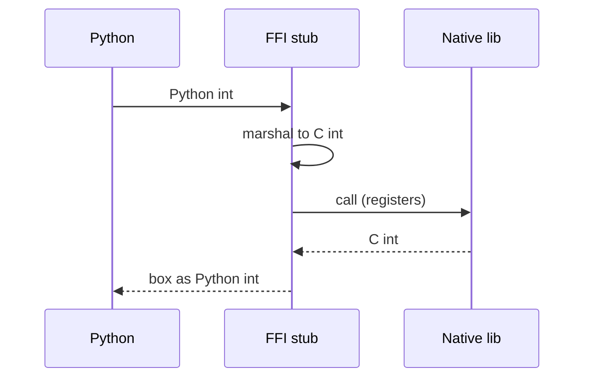

import { ConceptTemplate } from '@/features/kb/components/templates/ConceptTemplate'
import { Callout } from '@/features/kb/components/mdx/Callout'
import { ComparisonTable } from '@/features/kb/components/mdx/ComparisonTable'

export default function Layout({ children }) {
  return (
    <ConceptTemplate title="Language Interoperability (FFI)">
      {children}
    </ConceptTemplate>
  )
}

Python trains models by spending almost no time *in* Python. NumPy, PyTorch, and the OS sit in C, C++, CUDA, and Fortran. The bridge is a **foreign function interface (FFI)**: one language calls a function compiled from another, agrees on memory, and survives the trip back.

Without a shared **ABI**, you cannot pass a Java object into Rust and hope. Layouts, calling conventions, and GC beliefs disagree.

## 1. Deep Dive and Mechanics

The **C ABI** is the lingua franca: how arguments land in registers or stack slots (System V AMD64, Windows x64), how structs are padded, who cleans the stack, what `int` means. Rust `extern "C"`, Go `cgo`, Java JNI / Panama, C# P/Invoke, Python `ctypes` / cffi / extension modules all lower to that story.

**Marshaling** converts values:

- Integers and pointers often pass as-is.
- High-level strings (`PyObject`, Java `String`) become `const char*` plus a length or a copy.
- Objects become opaque handles (`void*`) the native side must not retain past a GC unless you pin or increment a refcount.

**Ownership** is where FFIs leak and double-free. Who `free`s the buffer? Who may store the pointer? JNI's "local vs global refs" exists because the GC moves and collects.

**Safety.** Crossing into C drops borrow checkers and JVM verify. A bad `extern` signature is undefined behaviour with extra steps. Bindgen and `c2rust` help generate the signatures; they cannot generate the lifetime contract.

<Callout icon="warning" title="Chatty FFI">
One call that multiplies a 4096x4096 matrix: overhead is noise. A Python `for` that calls C a million times with one float each: you pay marshal + call for each, and lose to a pure-Python loop or, better, one vectorised call.
</Callout>

## 2. Mathematical / Theoretical Foundation

An ABI is a **representation isomorphism** between two type universes plus a **calling convention** (a protocol for the register machine). Soundness: if both sides honour the same signature, the bits mean the same value.

GC'd and non-GC'd heaps form two **memory models**. FFI must define a barrier: pin, copy, or refcount. Linear types and Rust's `#[repr(C)]` make the representation part of the type system; Java's Panama `MemoryLayout` does it at runtime.

COM, CORBA, and protobuf are FFIs with a *third* language (IDL) so neither side is C. WASM + WASI / Component Model is the newest ABI-for-strangers: languages compile to a specified sandbox instead of native C.

<ComparisonTable
  headers={['Bridge', 'Host', 'Native']}
  rows={[
    ['ctypes / cffi', 'Python', 'C shared lib'],
    ['JNI / Panama', 'JVM', 'C / C++'],
    ['cgo', 'Go', 'C'],
    ['cxx / bindgen', 'Rust', 'C / C++'],
    ['WASM imports', 'Any', 'Sandbox'],
  ]}
/>

## 3. Real-World Implementation

Rust exporting a C function:

```rust
#[no_mangle]
pub extern "C" fn add(a: i32, b: i32) -> i32 {
    a + b
}
```

Python calling it (sketch):

```python
import ctypes
lib = ctypes.CDLL('./libadd.so')
lib.add.argtypes = [ctypes.c_int, ctypes.c_int]
lib.add.restype = ctypes.c_int
lib.add(2, 40)  # 42
```

If you lie in `argtypes`, you will corrupt the stack. The type checker of neither language can save you across the boundary unless you generate both sides from one spec.

## 4. Visualizations



## 5. Interview Prep

**Q: FFI vs microservice RPC?**
**A:** FFI is in-process, nanoseconds to microseconds, shared address space, crash = shared fate. RPC is across machines or processes, serialised messages, isolation. Use FFI for hot math; use RPC for independently deployed teams.

**Q: What is an ABI break?**
**A:** You changed struct field order or size, or the callee now expects a different register. Old binaries still link by *name* and then smash memory. Semver at the C layer is ABI, not just API.

**Q: Why is JNI considered painful?**
**A:** Manual ref management, awkward signatures, exception crossing, and easy use-after-release. Panama / JNA / Graal native image are attempts to shrink that surface.

## 6. Production Use Cases

- **Scientific Python:** BLAS, CUDA, Arrow.
- **OS bindings:** libc, Win32, Android NDK.
- **Game and audio engines:** C# or Lua scripting over a C++ core.
- **Database extensions:** Postgres UDFs, SQLite extensions.

<Callout icon="tip" title="One spec, two stubs">
Write protobuf, Cap'n Proto, or a C header and *generate* both sides. Hand-written FFI on both ends will drift. Treat the boundary as a public API with tests that round-trip values, including empty strings and alignment-sensitive structs.
</Callout>
