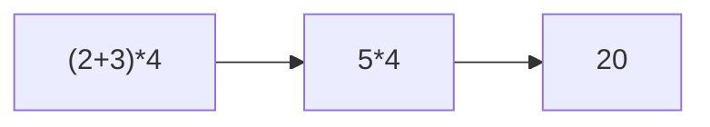

import { ConceptTemplate } from '@/features/kb/components/templates/ConceptTemplate'
import { Callout } from '@/features/kb/components/mdx/Callout'
import { ComparisonTable } from '@/features/kb/components/mdx/ComparisonTable'

export default function Layout({ children }) {
  return (
    <ConceptTemplate title="Operational Semantics">
      {children}
    </ConceptTemplate>
  )
}

**Operational semantics** defines a language by describing a **transition**: from this code and this state, the next code and state are that. Interpreters are operational semantics with a `while` loop around the rulebook. Proofs about races, evaluation order, and "this compiler pass preserves steps" start here.

Gordon Plotkin's **structural operational semantics (SOS)** is the usual style: rules induct on syntax, so a `+` node has rules that first evaluate the left child, then the right, then add.

## 1. Deep Dive and Mechanics

A **configuration** is typically a pair: remaining expression or command, plus a store (and maybe a heap, a thread map, a signal).

A **small-step** relation takes one primitive bite:

- `(2 + 3) * 4` with empty store → `5 * 4`
- then → `20`

You see every intermediate. That is what you want for interleaving threads: the scheduler picks a thread, you take one step, repeat. Data races are two steps that do not commute.

A **big-step** (natural semantics) relation jumps to a final value:

- `(2 + 3) * 4 ⇓ 20`

No intermediates. Nice for "the interpreter returned this." Awkward for nontermination (you simply have no derivation) and for concurrency (no place to interleave).

**Reduction contexts** (Felleisen) are a compact way to say "evaluate the hole": `E[ (λx. M) N ]` → `E[ M[x:=N] ]`. The same β rule works under every evaluation context your strategy allows.

<Callout icon="info" title="Congruence rules">
Small-step systems need rules like "if e steps to e', then e+e2 steps to e'+e2." Forget one, and your `+` is stuck even though the child can run. That bug shows up as a semantics that does not match the interpreter.
</Callout>

## 2. Mathematical / Theoretical Foundation

SOS judgments are relations, not functions: a nondeterministic language has many possible next configurations (thread interleavings, `random`). **Determinism** is a theorem you prove: at most one next step.

**Type safety** is usually operational: progress (a well-typed term is a value or can step) and preservation (stepping keeps the type). Wright and Felleisen popularised this pair.

**Contextual equivalence:** two terms are equal if, plugged into any program context, the machines behave the same (terminate together, print the same). That is the observational gold standard. Denotational models aim to match it (adequacy / full abstraction).

<ComparisonTable
  headers={['Style', 'Shows intermediates', 'Good for']}
  rows={[
    ['Small-step SOS', 'Yes', 'Concurrency, order'],
    ['Big-step', 'No', 'Simple interpreters'],
    ['Abstract machines', 'Yes, explicit stack', 'Compilers, CEK/SECD'],
  ]}
/>

## 3. Real-World Implementation

A small-step add (values are numbers; `isNum` is the value test):

```javascript
function step(e) {
  if (e.tag === 'Add') {
    const { left, right } = e
    if (!isNum(left)) return { tag: 'Add', left: step(left), right }
    if (!isNum(right)) return { tag: 'Add', left, right: step(right) }
    return left.value + right.value
  }
  throw new Error('stuck')
}
```

This *is* the left-to-right, call-by-value rule. Swap the two `isNum` checks and you have changed the language.

## 4. Visualizations



## 5. Interview Prep

**Q: Small-step vs big-step — which do I write on a whiteboard?**
**A:** Big-step for a toy expression language in ten minutes. Small-step as soon as you have `||`, threads, or "show me the next instruction."

**Q: What does stuck mean?**
**A:** No rule applies and you are not a value (`true + 1`). Type safety says well-typed programs do not get stuck (they may still loop).

**Q: How do compilers use this?**
**A:** Define source and target operationally, then prove simulation: each source step is matched by zero or more target steps. CompCert is that proof at industrial scale.

## 6. Production Use Cases

- **Language specs:** ECMAScript and the JVM have operational-ish prose (and, increasingly, formal bits).
- **Model checkers and interpreters:** the executable rules *are* the product.
- **Weak memory models:** operational rewrite of stores and buffers (x86-TSO, Promising).
- **Teaching compilers:** CEK, SECD, and bytecode VMs are SOS with an explicit stack.

<Callout icon="tip" title="Make the spec runnable">
A paper SOS that was never executed will disagree with the reference interpreter. Redex, K, and Ott exist so the rules you publish are the rules you ran on a test suite.
</Callout>
