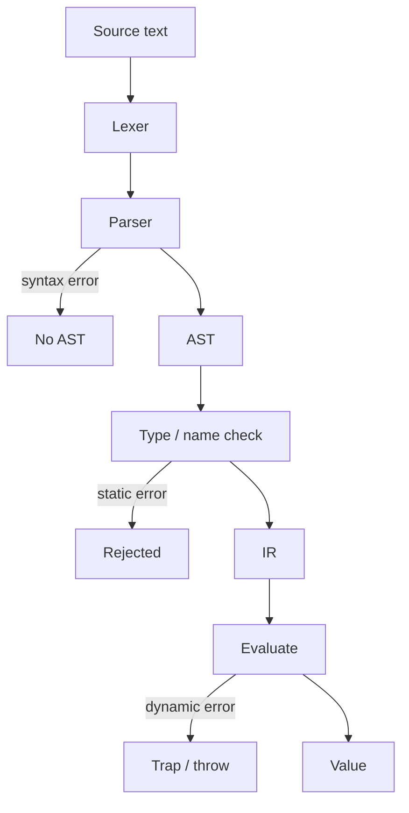

import { ConceptTemplate } from '@/features/kb/components/templates/ConceptTemplate'
import { Callout } from '@/features/kb/components/mdx/Callout'
import { ComparisonTable } from '@/features/kb/components/mdx/ComparisonTable'

export default function Layout({ children }) {
  return (
    <ConceptTemplate title="Syntax vs Semantics">
      {children}
    </ConceptTemplate>
  )
}

"The purple math ate a silent car" is grammatical English and nonsense. Programs split the same way. **Syntax** is which token streams your grammar allows. **Semantics** is what a allowed program *means* — types, evaluation, effects.

A compiler is a pipeline that keeps tightening the set: lexer → parser (syntax) → name resolution and types (static semantics) → codegen and CPU (dynamic semantics).

## 1. Deep Dive and Mechanics

**Syntax** lives in BNF, precedence tables, and the AST. Whether an if-statement needs parentheses and braces is a syntax question. A syntax error is "I cannot even build a tree."

**Static semantics** is everything you can reject without running the program: undeclared names, `string = 5 / 2` if types do not coerce, borrowing rules, "this break is not in a loop." The program may still be *syntactically* perfect.

**Dynamic semantics** is what happens at run time: `5 / 0`, null deref, the value of `x++`, which thread wins a race. Operational and denotational stories live here.

People also say **concrete vs abstract syntax**. Concrete is the spelling (`&&` vs `and`). Abstract is the tree (`LogicalAnd(left, right)`). A language can have two concrete syntaxes (indentation vs braces) and one semantics.

<Callout icon="tip" title="Syntax sugar">
`a + b` and `a.__add__(b)` may share a denotation. Sugar is a syntax-to-syntax rewrite before the real semantics. If the rewrite is not specified, two compilers will disagree on edge cases (overloads, short-circuit).
</Callout>

## 2. Mathematical / Theoretical Foundation

A **formal language** is a set of strings (syntax). A **semantic function** maps those strings (or their ASTs) to meanings in some domain. Two languages can share syntax and differ in semantics (`/` as integer divide vs float). They can share semantics and differ in syntax (C `&&` vs Python `and`).

**Soundness** of a type system is a theorem relating static and dynamic semantics: well-typed programs do not get stuck. Syntax alone cannot state that theorem; you need both layers.

Undefined behaviour in C is a *hole* in the dynamic semantics: the standard refuses to give a meaning. The syntax still accepts the program. That split is why "it compiled" is not "it is defined."

<ComparisonTable
  headers={['Layer', 'Rejects', 'Typical tool']}
  rows={[
    ['Concrete syntax', 'Malformed tokens / grammar', 'Lexer, parser'],
    ['Static semantics', 'Ill-typed, unbound names', 'Type checker'],
    ['Dynamic semantics', 'None at compile time', 'Interpreter, CPU'],
  ]}
/>

## 3. Real-World Implementation

```java
String x = 5 / 0;
```

- Syntax: parseable (decl, `=`, expr).
- Static semantics: Java rejects assigning `int` to `String`. Even if you write `int x = 5 / 0;`, some compilers warn; the class file may still exist.
- Dynamic semantics: integer division by zero throws at run time.

Python `x = 5 / 0` is syntactically fine, statically untyped, dynamically an exception. Same spelling, different layers.

## 4. Visualizations



## 5. Interview Prep

**Q: Is a type error a syntax error?**
**A:** No. The parser succeeded. Interviews sometimes lump all compile errors together; you should not. `if if` is syntax. `int x = "hi"` is static semantics.

**Q: Can two programs have the same syntax tree and different meaning?**
**A:** Not if the semantics is a function of the AST plus a fixed environment. They can differ if meaning depends on *link-time* or *run-time* context (overloads resolved later, monkey-patched methods). Then the "AST" was not the whole program.

**Q: Why do language specs split chapters this way?**
**A:** Parsers and type checkers are different algorithms and different failure modes. Spec readers (and compiler teams) own different chapters.

## 6. Production Use Cases

- **Error UX:** "expected `;`" vs "incompatible types" vs crash dump.
- **Linters vs formatters:** formatters are syntax; many linters are static semantics.
- **Transpilers:** preserve semantics, change syntax (TS → JS).
- **Polyglot:** JVM bytecode is one semantics, many syntaxes (Java, Kotlin, Scala).

<Callout icon="warning" title="Pretty-printers can change meaning">
If your formatter rewrites `a==b` spacing into something that joins tokens differently, or your macro prints code the parser will not read back, you broke the syntax/semantics contract. Round-trip tests exist for this.
</Callout>
