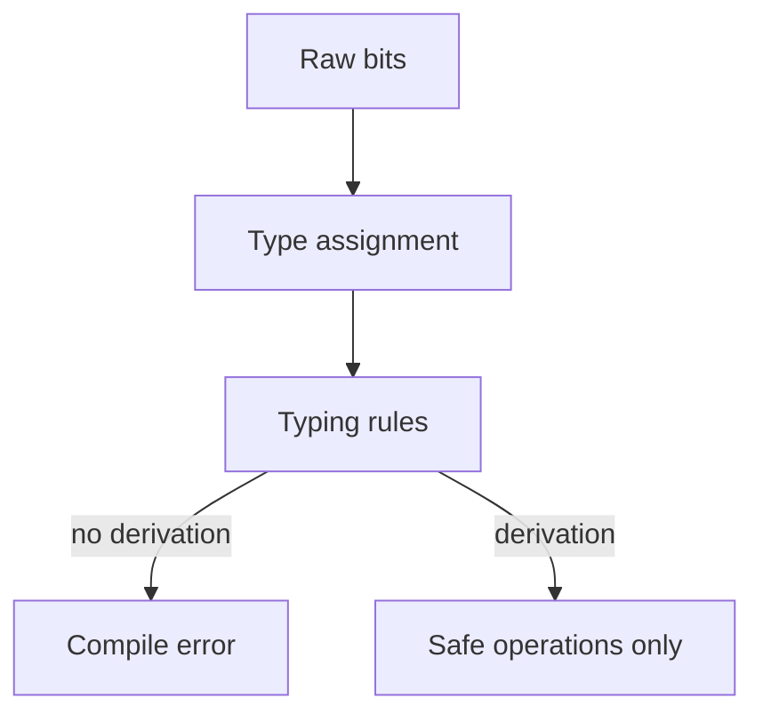

import { ConceptTemplate } from '@/features/kb/components/templates/ConceptTemplate'
import { Callout } from '@/features/kb/components/mdx/Callout'
import { ComparisonTable } from '@/features/kb/components/mdx/ComparisonTable'

export default function Layout({ children }) {
  return (
    <ConceptTemplate title="Type Theory">
      {children}
    </ConceptTemplate>
  )
}

At the metal, memory is bits. The same pattern can be an integer, a pointer, or a character. **Type theory** is the discipline of tagging those bits with a **kind of use**, then proving that programs only use them that way.

Russell invented types to kill set-theory paradoxes. Programming languages borrowed the idea to kill `char / 2` and use-after-free (when the type system is strong enough). Curry–Howard later showed the tags *are* logical propositions.

## 1. Deep Dive and Mechanics

A **type system** is a set of rules that assign types to terms. `3` has type `Int`. If `f` has type `A -> B` and `x` has type `A`, then `f(x)` has type `B`. If no rule applies, the program is ill-typed and the compiler refuses to emit a binary (in a checked language).

**What types prevent.** Hardware will happily "divide" the bits of `'A'` by 2. A sound type system proves that operation is not in the language's defined semantics, so it never reaches the CPU.

**Simple types** (STLC): functions and base types. **Polymorphism** (System F): `id` has type `forall A. A -> A`. **Recursive types:** lists and trees. **Dependent types:** types that mention values (`Vec n`). **Linear / affine types:** values used once (Rust's ownership is a cousin).

**Inference** (Hindley–Milner) fills in the annotations you omitted. When inference fails, you get the famous "could not unify" error — a failed proof, not a failed parse.

<Callout icon="info" title="Static vs dynamic, strong vs weak">
Static vs dynamic is *when* you check (compile time vs run time). Strong vs weak is *how much implicit conversion* you allow. Python is dynamic and relatively strong. JavaScript is dynamic and weak. Rust is static and strong. C is static and weak (unchecked casts, implicit integer ranks).
</Callout>

## 2. Mathematical / Theoretical Foundation

Judgments look like `Γ ⊢ e : τ` — under assumptions Γ, expression e has type τ. **Progress and preservation** connect this to operational semantics.

**Soundness:** if it type-checks, it will not get stuck on a type error (no `true + 1` at run time). **Completeness** (in the type-system sense people use loosely): every program that *would* run safely is accepted. No interesting decidable system is both perfectly sound and perfectly complete for "will not crash." Rust and Java reject programs that a human can see are safe (`unsafe` and casts are the vents). JavaScript accepts programs that will crash.

**Parametricity:** a function of type `forall A. List A -> Int` cannot inspect A; it can only use the list structure. That is a theorem about all inhabitants, not a style guide.

<ComparisonTable
  headers={['System', 'Power', 'Decidable checking']}
  rows={[
    ['Simply typed lambda', 'Low', 'Yes'],
    ['Hindley-Milner', 'Let-polymorphism', 'Yes'],
    ['System F', 'Impredicative forall', 'Yes if annotations exist'],
    ['Dependent types', 'Proofs about values', 'Often needs help / can loop'],
  ]}
/>

## 3. Real-World Implementation

```rust
fn first<T>(xs: &[T]) -> Option<&T> {
    xs.get(0)
}
```

`T` is a parameter (parametric polymorphism). `Option` forces the empty-list case into the type. The CPU never sees a mystery tag at the `first` call sites after monomorphization — the theory ran at compile time.

## 4. Visualizations



## 5. Interview Prep

**Q: What does soundness mean for Java?**
**A:** The bytecode verifier plus the JVM's runtime checks aim for a theorem: you will not treat a `String` pointer as an `int` without a checked cast that may throw. `null` is the famous hole (it inhabits every reference type).

**Q: Why is type inference undecidable in some languages?**
**A:** Add enough features (higher-rank types, dependent types, subtyping + inference) and inhabitation or unification can encode hard problems. Designers restrict the fragment or demand annotations.

**Q: Are types only for errors?**
**A:** They also drive optimisation (unbox `int`), overload resolution, and API design (`Id<User>` vs raw `string`). Erasure (Java) vs reification (C# some cases, Rust monomorph) changes what the runtime still knows.

## 6. Production Use Cases

- **Memory-safe systems languages:** Rust, Ada/SPARK.
- **Enterprise type migration:** TypeScript on JS, MyPy on Python — gradual type theory.
- **Proof assistants:** types *are* the spec.
- **Query and schema languages:** GraphQL and protobuf as type systems for data on the wire.

<Callout icon="warning" title="Casts are axioms">
Every `as` / `reinterpret_cast` / `any` inserts a proof you did not give. A sound system plus a cast is only as sound as your reviews of those casts. Count them; keep them at boundaries.
</Callout>
