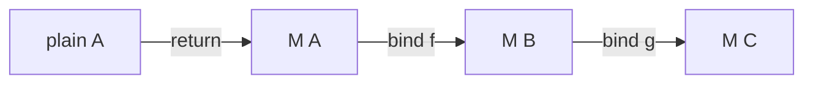

import { ConceptTemplate } from '@/features/kb/components/templates/ConceptTemplate'
import { Callout } from '@/features/kb/components/mdx/Callout'
import { ComparisonTable } from '@/features/kb/components/mdx/ComparisonTable'

export default function Layout({ children }) {
  return (
    <ConceptTemplate title="Monads">
      {children}
    </ConceptTemplate>
  )
}

The joke is: "a monad is a monoid in the category of endofunctors." The engineering fact is simpler. A **monad** is a type constructor M plus two operations that let you **wrap** a value and **sequence** computations that each return an M.

That is how Haskell does I/O without making every function impure. It is also why `Promise.then` and `Option.andThen` feel like the same API.

## 1. Deep Dive and Mechanics

For a type constructor M you need:

- **return / pure / of:** `A -> M A` — put a plain value into the context.
- **bind / flatMap / then:** `M A -> (A -> M B) -> M B` — run a function that itself returns a context, and flatten.

`map` is not enough. `map` would give you `M (M B)`. Bind flattens. That flatten is why you can write `do` notation or `async/await` instead of a pyramid of nested contexts.

**Laws** (you should test them):

- Left identity: `bind(return(x), f)` equals `f(x)`
- Right identity: `bind(m, return)` equals `m`
- Associativity: chaining f then g equals chaining the composite

**What the context means** changes:

- `Maybe` / `Option`: bind stops on empty.
- `Result` / `Either`: bind stops on the first error.
- `List`: bind is "for each, concat" (nondeterminism).
- `Promise`: bind waits, then continues (or rejects).
- `IO` / `Task`: bind *describes* "do this, then that"; the runtime runs the description at the edge of the program.
- `State`: bind threads an implicit state value through.

The function that *builds* an `IO` value can stay pure: it returns a recipe. The impurity happens when `main` is interpreted.

<Callout icon="tip" title="Learn functors first">
If `map` is not obvious, bind will feel like magic. Functor: transform inside one layer. Monad: the next step *chooses* a new layer based on the value (and may abort the rest).
</Callout>

## 2. Mathematical / Theoretical Foundation

An endofunctor M with `return` (unit, η) and `join: M (M A) -> M A` (or bind, they interdefine) that satisfy the monoid-like diagrams — that is the "monoid in the category of endofunctors" line. You do not need the diagrams to use `flatMap`.

Moggi's **computational λ-calculus** showed that many effects are the same sequencing interface with a different M. Wadler popularised it for Haskell. Kleisli arrows (`A -> M B`) compose with bind; that composition *is* the monoid operation on those arrows.

Not every useful `then` is a monad (some Rx operators break associativity). When laws fail, refactoring that "should be legal" changes behaviour.

<ComparisonTable
  headers={['M', 'return x', 'What bind does']}
  rows={[
    ['Option', 'Some(x)', 'Skip f if None'],
    ['Result', 'Ok(x)', 'Skip f if Err'],
    ['Promise', 'resolve(x)', 'Wait, then f'],
    ['List', 'list of x', 'Concat map'],
    ['IO', 'lazy x', 'Append effect'],
  ]}
/>

## 3. Real-World Implementation

```typescript
type Option<T> = { tag: 'some'; value: T } | { tag: 'none' }

const some = <T>(value: T): Option<T> => ({ tag: 'some', value })
const none: Option<never> = { tag: 'none' }

function bind<A, B>(m: Option<A>, f: (a: A) => Option<B>): Option<B> {
  return m.tag === 'none' ? none : f(m.value)
}

const parse = (s: string): Option<number> => {
  const n = Number(s)
  return Number.isNaN(n) ? none : some(n)
}

bind(parse('21'), (n) => some(n * 2)) // some 42
bind(parse('nope'), (n) => some(n * 2)) // none
```

Promises:

```javascript
Promise.resolve(21)
  .then((n) => Promise.resolve(n * 2))
```

Same shape, different context (time instead of failure).

## 4. Visualizations



## 5. Interview Prep

**Q: Are Promises monads?**
**A:** Almost. `then` flattens thenables (good) but also adopts foreign thenables and treats non-promises as values (the assimilation edge cases). For interview purposes: bind-like sequencing of async values. For law-scolds: not a perfect monad.

**Q: Why not just use callbacks?**
**A:** Callbacks do not compose with laws. You cannot refactor `do A then B then C` without changing indentation and error paths. Bind is one function that every context shares.

**Q: Monad vs applicative?**
**A:** Applicative (`apply` / `zip`) runs independent effects and combines results. The next effect cannot depend on the previous *value*. Monad can. `Promise.all` is applicative; `await` in a sequence is monadic.

## 6. Production Use Cases

- **Haskell / FP:** `IO`, `STM`, `ReaderT` stacks in production services.
- **Rust:** `Option` and `Result` plus `?` (bind syntax).
- **JS/TS:** Promises, `async/await`, fp-ts `TaskEither`.
- **LINQ / for-comprehensions:** syntax for bind on queries and collections.

<Callout icon="warning" title="Do not wrap the world in one mystery monad">
A 12-transformer stack is not a design. Pick the effects you have (error, async, env), name them, and keep `IO` at the edge. The point of monads is *controlled* impurity, not a new global.
</Callout>
