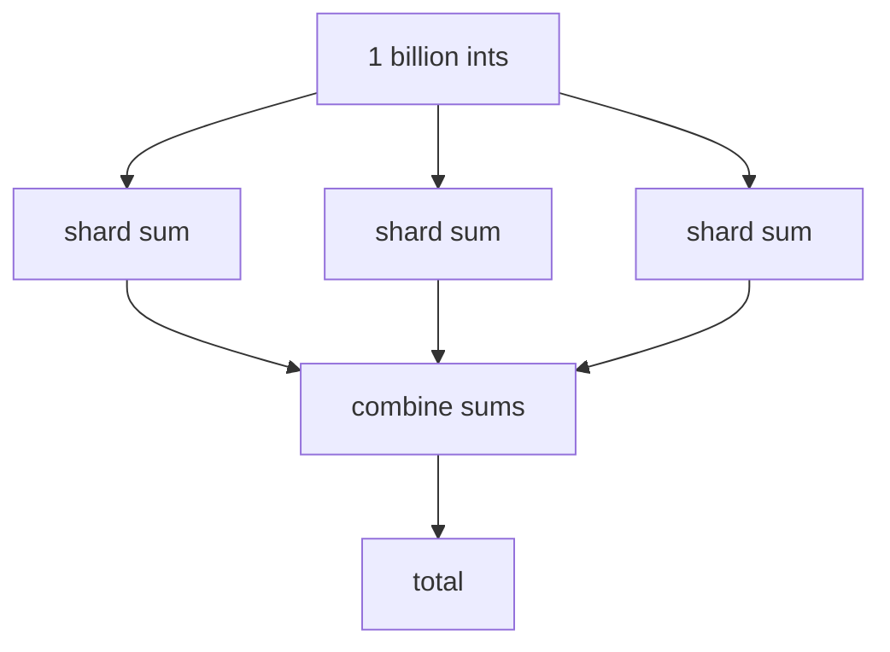

import { ConceptTemplate } from '@/features/kb/components/templates/ConceptTemplate'
import { Callout } from '@/features/kb/components/mdx/Callout'
import { ComparisonTable } from '@/features/kb/components/mdx/ComparisonTable'

export default function Layout({ children }) {
  return (
    <ConceptTemplate title="Monoids">
      {children}
    </ConceptTemplate>
  )
}

A **monoid** is one of the smallest useful algebras: a set, a way to combine two elements, and a do-nothing element. Integer addition with `0`, string concatenation with `""`, list concatenation with `[]`, and `max` on numbers with negative infinity (or the type's minimum) are monoids.

Language designers care because **fold** and **parallel reduce** are safe exactly when the combiner is a monoid (or a commutative monoid, if you also reshuffle).

This page is the "how values combine" half of the category-theory basics. Functors are the "how shapes map" half.

## 1. Deep Dive and Mechanics

A monoid on type M needs:

1. **Operation** `combine(a, b): M` (often written `<>` or `+`).
2. **Associativity:** `combine(combine(a, b), c)` equals `combine(a, combine(b, c))`. Parentheses do not matter.
3. **Identity** `empty`: `combine(empty, a)` and `combine(a, empty)` both equal `a`.

You do **not** need commutativity. String concat is a monoid and `ab` is not `ba`. Integer subtraction is *not* a monoid: it is not associative, and there is no identity that works on both sides.

In category theory a monoid is a category with one object whose morphisms are the elements and composition is `combine`. The slogan "a monad is a monoid in the category of endofunctors" uses that view: `flatMap` is the combine of endofunctors. You can ignore the slogan until monads click.

<Callout icon="warning" title="Almost monoids">
Average is not a monoid on numbers: you cannot merge two averages without the counts. The fix is to store `(sum, count)` and combine those — that pair *is* a monoid. Lots of "we cannot parallelise this" bugs are missing an extra field.
</Callout>

## 2. Mathematical / Theoretical Foundation

Monoids are to semigroups what groups are minus inverses. A semigroup has associative `combine` and no `empty`. Adding `empty` gives you a principled zero for empty folders and empty shards.

A **commutative monoid** also has `combine(a, b) = combine(b, a)`. MapReduce's shuffle can reorder pairs only if you have this. Addition of numbers yes; concatenation of logs no (order is the point).

In programming-language semantics, the monoid of *effects* (writer logs, lists of traces) lets you explain `do` notation as a fold over statements.

<ComparisonTable
  headers={['Type plus op', 'Identity', 'Associative', 'Commutative']}
  rows={[
    ['Int +', '0', 'Yes', 'Yes'],
    ['String concat', 'empty string', 'Yes', 'No'],
    ['List concat', 'empty list', 'Yes', 'No'],
    ['Int -', 'none', 'No', 'No'],
    ['Bool OR', 'false', 'Yes', 'Yes'],
  ]}
/>

## 3. Real-World Implementation

```typescript
type Monoid<T> = {
  empty: T
  combine: (a: T, b: T) => T
}

const sum: Monoid<number> = {
  empty: 0,
  combine: (a, b) => a + b,
}

function fold<T>(m: Monoid<T>, xs: T[]): T {
  return xs.reduce(m.combine, m.empty)
}

fold(sum, [1, 2, 3, 4]) // 10
```

Split the array, fold each shard, then `combine` the shard results. Associativity is the theorem that says the answer does not depend on the cut points.

## 4. Visualizations



## 5. Interview Prep

**Q: Why does MapReduce demand monoids?**
**A:** Mappers emit values that reducers combine. If combine is not associative, the tree of partial reductions is a different function than a left fold, and two clusters disagree.

**Q: Monad vs monoid?**
**A:** Monoid: combine two *values* of M. Monad: sequence two *computations* that each produce a layer (`IO`, `Promise`). Related slogan, different APIs.

**Q: Is `Promise.all` a monoid?**
**A:** Combining two promises of arrays by concat can be a monoid on `Promise of List`. A single `Promise of T` with no idea how to merge two `T`s is not.

## 6. Production Use Cases

- **Spark / Flink / MapReduce:** combiners on the map side.
- **Telemetry:** merge counters and histograms (same `(sum, count)` trick).
- **Text and ropes:** document concat is a monoid; editors use trees of chunks.
- **Free monoids:** lists *are* the free monoid on a set of letters — every word is a fold of singletons.

<Callout icon="tip" title="Write the identity first">
If you cannot name `empty`, you do not have a monoid yet. Empty folder, empty batch, empty log: that value is what makes `fold` total on zero elements.
</Callout>
