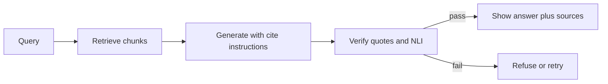

import { ConceptTemplate } from '@/features/kb/components/templates/ConceptTemplate'
import { Callout } from '@/features/kb/components/mdx/Callout'
import { ComparisonTable } from '@/features/kb/components/mdx/ComparisonTable'

export default function Layout({ children }) {
  return (
    <ConceptTemplate title="Citation Grounding">
      {children}
    </ConceptTemplate>
  )
}

RAG reduces hallucinations by stuffing retrieved text into the prompt. It does not *eliminate* them. A model can still invent a clause, misread a table, or cite a document it never used. **Citation grounding** is the requirement that every claim carry a pointer back to a span the retriever actually returned — and that a second check can fail the answer if the pointer is a lie.

Legal, medical, and enterprise assistants that cannot show "where did you read that?" are not shippable.

## 1. Deep Dive and Mechanics

**Prompt-level grounding.** The system message stops being "be helpful." It becomes: answer only from the provided context; if the context is insufficient, say you do not know; after each claim, emit a citation token such as `[1]` that matches a numbered chunk. Constraining the output vocabulary (those brackets) shifts probability mass away from unanchored sentences. It is not a proof. It is a prior.

**Structured citations.** Better than free-form brackets: the model must emit JSON with `claim`, `doc_id`, and `quote` fields. You can then string-match or fuzzy-match the quote against the chunk. If the quote is not a substring (or a near-copy), the claim is ungrounded even if the model named a document.

**Post-generation NLI.** A second model (often a small cross-encoder trained for natural language inference) takes (source span, generated sentence) and scores entailment vs contradiction vs neutral. Contradiction or "neutral but cited" → drop or regenerate. This is how you catch "Doc 2 says 14 days" turned into "two weeks guaranteed refund" when the source said "may."

**Attribution at the tokenizer.** Some stacks highlight which retrieved tokens the generator attended to (or use a dedicated attribution head). Attention is a weak citation — it is not NLI — but it is useful for UI heatmaps.

<Callout icon="warning" title="Cited is not true">
A fluent model will happily cite the wrong paragraph with perfect formatting. Grounding is a verifier loop, not a font choice. Never show a citation you did not check against the payload you actually retrieved.
</Callout>

## 2. Mathematical / Theoretical Foundation

Think of the generator as sampling from `P(answer | query, context)`. Grounding adds a constraint set G: every atomic claim c must be entailed by some context chunk d. The NLI model approximates the entailment relation. Faithfulness metrics (RAGAS, UniEval-style) estimate `P(c | d)` vs `P(c | query)` — if the answer is likely given the query but not given the documents, it is a hallucination.

Citation recall/precision: among claims, how many have a supporting span; among citations, how many actually support. You can unit-test a pipeline on a labeled set without judging "helpfulness."

<ComparisonTable
  headers={['Layer', 'What it enforces', 'Failure mode']}
  rows={[
    ['Prompt rule', 'Model tries to emit citations', 'Invented [3]'],
    ['Quote match', 'Cited text exists in chunk', 'Paraphrase miss or cheat quote'],
    ['NLI / entailment', 'Claim follows from span', 'Subtle overclaim'],
  ]}
/>

## 3. Real-World Implementation

```python
import re

CITE = re.compile(r'\[(\d+)\]')

def check_citations(answer: str, chunks: list[str]) -> list[str]:
    errors = []
    ids = {int(i) for i in CITE.findall(answer)}
    for i in ids:
        if i < 1 or i > len(chunks):
            errors.append(f'unknown citation {i}')
    if not ids and 'do not know' not in answer.lower():
        errors.append('answer has claims but no citations')
    return errors
```

Pair this with an NLI pass on sentence/citation pairs before the UI renders.

## 4. Visualizations



## 5. Interview Prep

**Q: Why not just show the top-k chunks under the answer?**
**A:** Users will assume every sentence is supported by those chunks. Ungrounded sentences next to real PDFs are worse than a bare chatbot — they look official. Per-claim links are the product.

**Q: How do you cite a table or image?**
**A:** Store a stable `chunk_id` that includes page and region. The generator names the id; the UI opens that crop. Do not ask the model to invent page numbers.

**Q: Can you force grounding with constrained decoding?**
**A:** You can restrict tokens so citations must be in `1..k`. You cannot constrain *truth*. Combine grammar-constrained decode with NLI.

## 6. Production Use Cases

- **Support and policy bots:** every sentence links to the handbook version that was indexed.
- **Research assistants:** footnote UX like Perplexity / Bing, plus a backend entailment filter.
- **Regulated industries:** audit log of (query, chunk ids, quotes, NLI scores).

<Callout icon="tip" title="Version the corpus">
A citation to "HR-policy.pdf" is useless if the file was replaced. Store `doc_id + revision + byte range`. Grounding is a data problem as much as a prompt problem.
</Callout>
