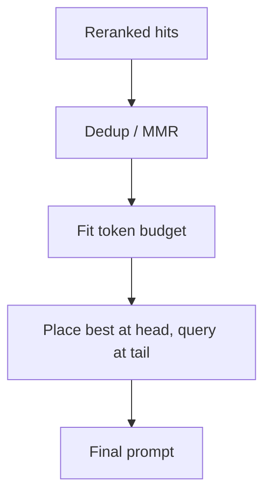

import { ConceptTemplate } from '@/features/kb/components/templates/ConceptTemplate'
import { Callout } from '@/features/kb/components/mdx/Callout'
import { ComparisonTable } from '@/features/kb/components/mdx/ComparisonTable'

export default function Layout({ children }) {
  return (
    <ConceptTemplate title="Context Construction">
      {children}
    </ConceptTemplate>
  )
}

Retrieval returns a bag of chunks. The model receives a **string**. **Context construction** is the job of turning that bag into a prompt the generator can use: titles, order, separators, token budget, and instructions. Most "RAG is dumb" bugs are packing bugs, not embedding bugs.

## 1. Deep Dive and Mechanics

**Lost in the middle.** Long-context studies (Liu et al. and follow-ups) show many models attend strongly to the start and end of the prompt and weakly to the middle. If you dump ten chunks in raw similarity order, the *best* chunk is often first (good) and the rest smear into a valley. A common pack: put the single best chunk first, a short instruction, then the remaining evidence, then the user question again at the end (query-last).

**Budgets.** Every tokenizer has a hard cap. Construction is a knapsack: system prompt + question + citations format + chunks ≤ window − generation reserve. When over budget: drop lowest-reranked chunks, shrink neighbors (sentence-window), or map-reduce summarize cheaply *before* the final call.

**Dedup and diversity.** ANN will return three near-copies of the same paragraph from overlapping chunks. Max-marginal relevance (MMR) or simple shingle Jaccard drops clones so you do not spend 40% of the window on one sentence.

**Structure.** XML-ish fences (`<source id="3">`) or Markdown headers give the model hooks for citations. Include `title`, `url`, `updated_at` in the header so the generator can say "according to the 2024 policy" instead of inventing a year.

**Query-aware packing.** Some pipelines prepend a one-line "use these docs to answer X" and interleave the question after each chunk (lost-in-the-middle mitigation). Others build a small outline with a cheap model, then fill sections.

<Callout icon="warning" title="More context is not more accuracy">
Stuffing 128k tokens of "maybe related" PDF pages recreates the lost-in-the-middle problem at larger scale and hides the one sentence that mattered. Construction should be *selective*, not maximal.
</Callout>

## 2. Mathematical / Theoretical Foundation

Treat construction as selecting an ordered subset S of retrieved items maximizing expected usefulness under a token constraint:

`max score(S | q)` subject to `tokens(S) + overhead ≤ B`

`score` is not just sum of similarities (that prefers near-duplicates). MMR: `λ sim(d, q) − (1-λ) max sim(d, s)` for s already in S. Lost-in-the-middle says the *position* map from rank → attention is U-shaped, so the objective should include a position bonus for head and tail slots.

Summarization as a compressor is a rate-distortion choice: fewer tokens, some fact loss. Measure with faithfulness, not ROUGE against the chunk.

<ComparisonTable
  headers={['Packing choice', 'Helps', 'Hurts']}
  rows={[
    ['Best chunk first plus query last', 'Attention on evidence and question', 'Long leftover middle'],
    ['MMR diversity', 'Coverage of subtopics', 'May drop a second useful clone'],
    ['Map-reduce summary', 'Fits the window', 'Dropped numbers / hedges'],
  ]}
/>

## 3. Real-World Implementation

```python
def pack(chunks: list[dict], question: str, budget: int, encode) -> str:
    parts = []
    used = encode(question) + 64  # reserve for question + instructions
    for i, ch in enumerate(chunks, start=1):
        block = f'[{i}] {ch["title"]}\n{ch["text"]}\n'
        cost = encode(block)
        if used + cost > budget:
            break
        parts.append(block)
        used += cost
    body = '\n'.join(parts)
    return (
        'Answer only from the sources. Cite like [1].\n\n'
        f'{body}\n\nQuestion: {question}\n'
    )
```

Run this *after* rerank, not on raw ANN output.

## 4. Visualizations



## 5. Interview Prep

**Q: Should chunks be similarity-sorted or document-order sorted?**
**A:** For a single topic, similarity (after rerank) is fine. For a procedure ("steps to reset MFA"), restore original document order so step 3 does not appear before step 1. Detect the case from metadata (section numbers) or a classifier.

**Q: What is "context stuffing"?**
**A:** Pasting every search hit without budget or diversity. It raises cost and often lowers accuracy. Construction is an information-retrieval *and* UX layer.

**Q: How do you handle conflicting sources?**
**A:** Do not silently concatenate. Label dates and titles; instruct the model to surface conflicts. Optionally keep only the newest `updated_at` per `doc_id`.

## 6. Production Use Cases

- **Chat with PDF:** page headers + selected pages, not the whole file.
- **Agent tool results:** last tool output at the tail; older tool dumps summarized.
- **Multi-index RAG:** namespace tags (`wiki` vs `tickets`) so the model knows provenance.

<Callout icon="tip" title="Log the packed prompt">
When a user says "it ignored the policy," inspect the *constructed* prompt, not the vector scores. Nine times out of ten the policy was retrieved and then truncated or buried.
</Callout>
