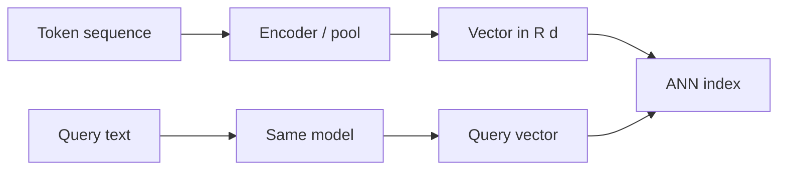

import { ConceptTemplate } from '@/features/kb/components/templates/ConceptTemplate'
import { Callout } from '@/features/kb/components/mdx/Callout'
import { ComparisonTable } from '@/features/kb/components/mdx/ComparisonTable'

export default function Layout({ children }) {
  return (
    <ConceptTemplate title="Vector Embeddings">
      {children}
    </ConceptTemplate>
  )
}

Computers do not "know" that *king* and *queen* are related. They know bits. An **embedding model** maps a token sequence (or an image, or a clip of audio) to a list of floats — a point in a few hundred or a few thousand dimensions — so that **geometry tracks meaning**.

RAG, semantic search, and clustering all assume that function is stable: the same model, the same normalization, the same prefix instructions.

## 1. Deep Dive and Mechanics

Modern text embeddings are transformer encoders (or decoder-hidden states pooled). Training uses contrastive pairs: (query, relevant doc) pulled together, (query, random doc) pushed apart (InfoNCE, multiple negatives). Instruction-tuned models (`e5`, `gte`, `text-embedding-3`) want a prefix like `query:` vs `passage:` so questions and documents live in one space.

**Dimensionality.** 384-D is cheap and good for in-browser search. 768–1024 is a common open-source default. 1536–3072 shows up in hosted APIs. More dimensions can hold more distinctions; they also cost RAM and ANN quality if you do not train the index for that size. Matryoshka embeddings let you truncate a long vector and keep most quality.

**Pooling.** CLS token, mean of last hidden states, or last-token pooling for decoder models. The choice is part of the model card. Mixing them silently breaks recall.

**The famous analogy.** Word2vec popularised `king − man + woman ≈ queen`. Sentence models are not guaranteed to obey linear analogies. What they *are* trained for is **ranking**: `sim(query, relevant) > sim(query, irrelevant)`.

**Domain shift.** An embedding trained on web Q&A will smash together legal "consideration" and everyday "consideration." Fine-tune or pick a domain model. Always embed query and corpus with the **same** model version.

<Callout icon="warning" title="Do not mix spaces">
A vector from model A and a vector from model B are not comparable, even if both have 768 floats. Re-embed the corpus when you change models. Store `model_id` next to every vector.
</Callout>

## 2. Mathematical / Theoretical Foundation

An embedding is a map `f: text → R^d`. Retrieval uses a similarity `s(u, v)`, usually cosine (`u·v / (|u||v|)` ) or inner product after L2-normalizing (then cosine = dot). Training maximises a log-softmax over in-batch negatives: the query should score its positive highest in the batch.

**Curse of dimensionality:** in high-d, distances concentrate. That is why we use trained metrics and ANN, not raw k-d trees. **Anisotropy** (all embeddings in a narrow cone) was a BERT-era issue; contrastive training and normalisation reduce it.

Sparse embeddings (SPLADE, BM25 as an extreme) live in vocabulary-sized spaces with mostly zeros. Dense embeddings are the opposite: every dim is almost always nonzero.

<ComparisonTable
  headers={['Kind', 'Typical d', 'Strength']}
  rows={[
    ['Word2vec / GloVe', '100-300', 'Word analogies, cheap'],
    ['Sentence / E5 / GTE', '384-1024', 'Asymmetric retrieval'],
    ['API embeddings', '1536+', 'Strong general quality'],
    ['SPLADE / sparse', 'vocab size', 'Exact terms + some semantics'],
  ]}
/>

## 3. Real-World Implementation

```python
from openai import OpenAI

client = OpenAI()

def embed(texts: list[str], kind: str) -> list[list[float]]:
    prefix = 'query: ' if kind == 'query' else 'passage: '
    out = client.embeddings.create(
        model='text-embedding-3-small',
        input=[prefix + t for t in texts],
    )
    return [row.embedding for row in out.data]
```

If the model does not use prefixes, do not invent them. Read the card.

## 4. Visualizations



## 5. Interview Prep

**Q: Why not embed a whole book as one vector?**
**A:** Pooling averages topics into a muddy centroid. Retrieval needs *local* meaning. Chunk first (see chunking strategies), then embed.

**Q: Cosine vs L2?**
**A:** For L2-normalised vectors they rank the same (up to a monotone). Unnormalised Euclidean cares about magnitude (length, "confidence," token count leakage). Most NLP stacks normalise and use cosine/IP.

**Q: Cross-encoder vs bi-encoder?**
**A:** Bi-encoder embeds query and doc *separately* (what you store). Cross-encoder reads both at once (rerank). Embeddings are the bi-encoder half.

## 6. Production Use Cases

- **RAG corpora:** chunk → embed → upsert.
- **Dedup and clustering:** near-duplicate tickets, news.
- **Recommendations:** user and item vectors in one space (two-tower models).
- **Moderation / routing:** embed the message, classify by nearest labeled examples.

<Callout icon="tip" title="Pin the snapshot">
Record model name, dimension, normalisation, and instruction template in the collection metadata. Your future self will thank you when recall mysteriously drops after an SDK bump.
</Callout>
