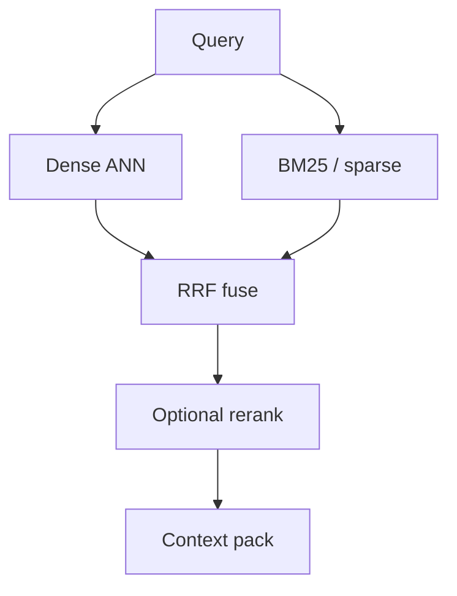

import { ConceptTemplate } from '@/features/kb/components/templates/ConceptTemplate'
import { Callout } from '@/features/kb/components/mdx/Callout'
import { ComparisonTable } from '@/features/kb/components/mdx/ComparisonTable'

export default function Layout({ children }) {
  return (
    <ConceptTemplate title="Hybrid Search">
      {children}
    </ConceptTemplate>
  )
}

Dense retrieval understands that "fast car" and "speeding automobile" are neighbors. It is bad at `ERR_7X9`, SKUs, emails, and rare proper names that never appeared in the embedding training set. **Lexical** retrieval (BM25, keyword inverted indexes) is the opposite: exact tokens win, synonyms lose.

**Hybrid search** runs both, then **fuses** the ranked lists so a hit that is good in either world can surface.

## 1. Deep Dive and Mechanics

**Two engines.** In parallel: (1) embed the query, ANN-search the vector index; (2) tokenize the query, BM25-search the inverted index (Elasticsearch, OpenSearch, Typesense, or a sparse vector like SPLADE). Each returns a ranked list.

**Score scales do not match.** Cosine 0.82 and BM25 14.3 are not numbers you can add. Fusion must be rank-based or calibrated.

**Reciprocal Rank Fusion (RRF).** For each document, sum `1 / (k + rank_i)` over the lists that contain it. `k` is a constant (often 60) that dampens top-heavy lists. No score calibration. Simple and strong as a default.

**Weighted sum after min-max or z-score.** If you trust both scores, normalise each list to `[0, 1]` and compute `α * dense + (1-α) * sparse`. Tune `α` on a labeled set. Dangerous if one engine is empty or saturated.

**Sparse neural.** SPLADE / BGE-m3 produce *learned* sparse vectors (vocabulary weights). You can hybrid "dense + SPLADE" inside one engine (Qdrant, Weaviate, Vespa) without a separate ES cluster.

<Callout icon="tip" title="Always keep an exact path">
Error codes, invoice IDs, and function names should hit a keyword or `match_phrase` clause *in addition* to vectors. Users will type those strings verbatim. Hybrid is how you stop looking incompetent on the one query that matters in a demo.
</Callout>

## 2. Mathematical / Theoretical Foundation

BM25 is a probabilistic IR score: term frequency saturates, long documents are penalised, rare terms (IDF) dominate. Dense scores approximate `P(relevant | q, d)` in embedding space. Fusion is a **rank aggregation** problem (Kemeny, Borda, RRF). RRF is a robust, parameter-light aggregator: a document ranked 2 and 5 beats one ranked 1 and 90 more often than raw-score hacks.

If the two lists are uncorrelated, fusion helps most. If they return the same ten hits, hybrid is wasted compute — measure overlap.

<ComparisonTable
  headers={['Method', 'Needs calibration', 'Typical use']}
  rows={[
    ['RRF', 'No', 'Default production fuse'],
    ['Weighted normalised sum', 'Yes, alpha', 'When you have labels'],
    ['Dense plus SPLADE', 'Partial', 'Single vector engine'],
  ]}
/>

## 3. Real-World Implementation

```python
def rrf(lists: list[list[str]], k: int = 60) -> list[str]:
    scores: dict[str, float] = {}
    for ranked in lists:
        for rank, doc_id in enumerate(ranked, start=1):
            scores[doc_id] = scores.get(doc_id, 0.0) + 1.0 / (k + rank)
    return [d for d, _ in sorted(scores.items(), key=lambda kv: -kv[1])]

fused = rrf([vector_hits, bm25_hits])
```

Then rerank the fused top 50 with a cross-encoder if you have the latency budget.

## 4. Visualizations



## 5. Interview Prep

**Q: Why not only BM25 if users type exact terms?**
**A:** They also type "why is checkout broken" when the doc says "payment authorization timeout." Hybrid covers both demos.

**Q: What is a good `k` in RRF?**
**A:** 60 is the classic Cormack et al. default. Lower `k` trusts top ranks more. Sweep it on your eval set; do not religiously copy 60.

**Q: Does hybrid replace reranking?**
**A:** No. Fusion merges *lists*. A cross-encoder still reads query+doc text and often yields the biggest single nDCG jump.

## 6. Production Use Cases

- **Site search and docs:** Algolia / ES keyword plus vectors.
- **E-commerce:** "crispy snack" (dense) and "Lays 200g" (lexical).
- **Code search:** identifiers via BM25, intent via code embeddings.

<Callout icon="warning" title="Two indexes, two freshness bugs">
If the vector store ingested Tuesday's PDF and BM25 still has Monday's, fusion will happily mix eras. Share a single document table and derive both indexes from it, with the same `revision`.
</Callout>
