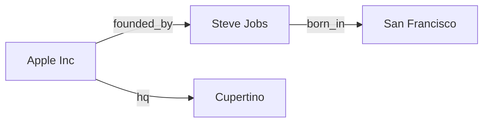

import { ConceptTemplate } from '@/features/kb/components/templates/ConceptTemplate'
import { Callout } from '@/features/kb/components/mdx/Callout'
import { ComparisonTable } from '@/features/kb/components/mdx/ComparisonTable'

export default function Layout({ children }) {
  return (
    <ConceptTemplate title="Knowledge Graphs">
      {children}
    </ConceptTemplate>
  )
}

A table stores rows. A vector store stores points. A **knowledge graph (KG)** stores **facts as edges**: Apple —founded_by→ Steve Jobs. The database can walk that edge without asking whether those words co-occurred in a paragraph.

Google's Knowledge Graph, Wikidata, and product graphs behind "people also bought" are this idea at scale. In RAG, a KG is how you answer multi-hop questions that no single chunk contains.

## 1. Deep Dive and Mechanics

**Triples.** The atomic record is (subject, predicate, object) — RDF's model. Subject and object are **nodes** (entities or literals). The predicate is a typed **edge**. "Apple Inc. / founded_by / Steve Jobs" is one triple. Repeat for headquarters, subsidiaries, product lines.

**Ontologies.** An ontology (OWL, SHACL, or a home-grown schema) says what *may* exist: a `Person` can `found` a `Company`; a `Company` cannot `born_in` a `City`. Constraints keep extractors from inventing garbage edges.

**Query languages.** SPARQL over RDF triple stores; Cypher / Gremlin over property graphs (Neo4j, Neptune, TigerGraph). A query is a subgraph pattern, not a keyword.

**Traversal vs join.** Four hops in SQL is four joins and a planner headache. In a property graph with index-free adjacency, a hop is following a pointer. That is why KGs win at "friends of friends of brands in California."

**Identity.** The hard production problem is **entity resolution**: "IBM", "International Business Machines", and "IBM Corp." must become one node or your walks fragment. Use IDs (LEI, Wikidata Q-ids) when you can.

<Callout icon="info" title="Graph vs Graph RAG">
A knowledge graph is the *data model*. Graph RAG is a *pipeline* that extracts a KG from text and uses traversal (plus vectors) at query time. You can have a curated KG with no LLM, or Graph RAG that builds a messy KG on ingest.
</Callout>

## 2. Mathematical / Theoretical Foundation

A KG is a directed labeled multigraph `G = (V, E, ℓ)` plus optional node/edge properties. Inference rules (RDFS/OWL, Datalog) close the graph: if `A subclass B` and `x type A` then `x type B`. That is **symbolic** deduction — complementary to embedding similarity.

Knowledge graph embeddings (TransE, ComplEx) map nodes and relations to vectors so `h + r ≈ t`. Useful for link prediction; not a replacement for exact Cypher when the edge is already stored.

<ComparisonTable
  headers={['Store', 'Unit', 'Best question']}
  rows={[
    ['Relational', 'Row', 'Aggregates, transactions'],
    ['Vector DB', 'Embedding', 'What is this like?'],
    ['Knowledge graph', 'Typed edge', 'How are these connected?'],
  ]}
/>

## 3. Real-World Implementation

```cypher
MATCH (p:Person)-[:CEO_OF]->(c:Company)-[:TYPE]->(:Sector {name: 'Tech'})
      -[:BORN_IN]->(:Place {name: 'California'})
RETURN p.name, c.name
```

The engine binds patterns; it does not embed the English sentence. An LLM's job, if any, is to *write* this Cypher from a user question — and you should validate the Cypher against a allowlist of labels.

## 4. Visualizations



## 5. Interview Prep

**Q: Why not put triples in Postgres?**
**A:** You can (edge table). You lose convenient variable-length walks and often pay join cost. At modest size Postgres is fine. At high hop counts and dense neighborhoods, a graph store or a specialised engine wins.

**Q: What is an RDF vs property graph?**
**A:** RDF: everything is a triple, global IRIs, SPARQL, easy interchange. Property graph: nodes/edges have arbitrary JSON-like properties, Cypher, ergonomic for apps. Same math, different culture.

**Q: How do KGs stop LLM hallucinations?**
**A:** They do not, unless the *generator is only allowed to verbalise query results*. If you dump a subgraph into a prompt, the model can still embroider. Ground on the result set.

## 6. Production Use Cases

- **Search panels:** entity cards (born, spouse, works).
- **Fraud and AML:** walk shared devices and accounts.
- **Biomedical:** gene–disease–compound graphs.
- **Enterprise org and access:** who owns which system.

<Callout icon="warning" title="Extraction quality is the product">
An LLM-built KG with 30% wrong edges will "reason" confidently to the wrong CEO. Invest in human review for high-degree nodes, not only in prettier Cypher.
</Callout>
