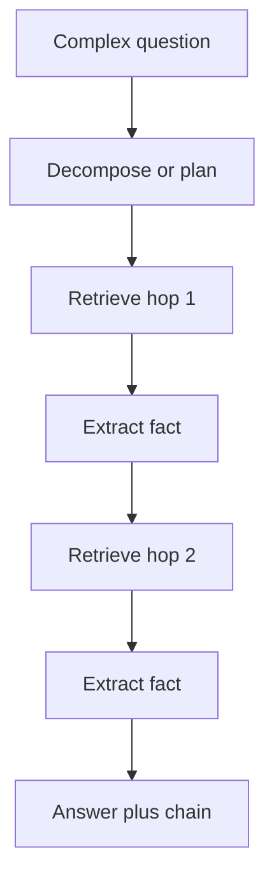

import { ConceptTemplate } from '@/features/kb/components/templates/ConceptTemplate'
import { Callout } from '@/features/kb/components/mdx/Callout'
import { ComparisonTable } from '@/features/kb/components/mdx/ComparisonTable'

export default function Layout({ children }) {
  return (
    <ConceptTemplate title="Multi-Hop Retrieval">
      {children}
    </ConceptTemplate>
  )
}

"Did the author of *1984* live in a country that fought in WWII?" is not one vector. No chunk contains that whole sentence. You need **hops**: *1984* → Orwell → United Kingdom → WWII combatant.

**Multi-hop retrieval** is any architecture that runs retrieval more than once (or walks a structure) so later searches can use facts found earlier.

## 1. Deep Dive and Mechanics

**Why single-pass fails.** Embedding the full question pulls toward chunks that mention both "1984" and "WWII" — conspiracy blogs and trivia mashups — not the two clean facts you needed. Cosine has no notion of "first resolve the author."

**Query decomposition.** An LLM (or a smaller planner) splits the question into an ordered list: (1) author of 1984, (2) country of residence, (3) WWII participation. Each step is a normal RAG call. Bindings (`author = George Orwell`) are written into the next query.

**Iterative / agentic retrieval.** Instead of a fixed list, a loop: retrieve → read → decide "need more" → emit a new query → stop when a sufficiency check passes or a hop budget is exhausted. IRCoT and ReAct-style tools are this loop with extra reasoning traces.

**Graph hops.** If you already extracted a KG, hop 1 is entity linking, hop 2 is following edges (Graph RAG). No second embedding search required for those facts.

**Evidence chains.** Store the hop trace (`q1, docs1, fact1, q2, docs2`) and show it to the user. Multi-hop without a trace is just a longer hallucination.

<Callout icon="warning" title="Hop budget">
Each hop is latency, cost, and a chance to latch onto the wrong entity ("Orwell" the prize, not the novelist). Cap hops (3–5). If the planner cannot decompose cleanly, refuse rather than wander.
</Callout>

## 2. Mathematical / Theoretical Foundation

Multi-hop QA datasets (HotpotQA, 2Wiki, MuSiQue) formalise a question as needing a set of supporting sentences that are *not* independently sufficient. Retrieval becomes a **sequential decision process**: state = (question, memory), action = next query or stop. You can train a policy (RL, DPO on traces) or just prompt.

Error compounding is multiplicative: if hop-1 precision is 0.8 and hop-2 depends on it, end-to-end is at most 0.8 times hop-2 precision. Measure **joint** accuracy, not per-hop in isolation only.

<ComparisonTable
  headers={['Style', 'How hops happen', 'Risk']}
  rows={[
    ['One-shot vector', 'They do not', 'Misses split facts'],
    ['Decompose then retrieve', 'Fixed sub-questions', 'Bad parse of the question'],
    ['Iterative agent', 'Dynamic next query', 'Loops / cost'],
    ['Graph walk', 'Typed edges', 'Missing or wrong edges'],
  ]}
/>

## 3. Real-World Implementation

```python
def multi_hop(question: str, retrieve, generate, hops: int = 3) -> str:
    memory = []
    q = question
    for _ in range(hops):
        docs = retrieve(q)
        step = generate(
            f'Question: {question}\nKnown: {memory}\nDocs: {docs}\n'
            'Return FACT: ... or DONE: final answer'
        )
        if step.startswith('DONE:'):
            return step
        memory.append(step)
        q = generate(f'Next search query given {memory}')
    return generate(f'Final answer from {memory}')
```

Replace the string protocol with tool calls in production.

## 4. Visualizations



## 5. Interview Prep

**Q: Is multi-hop just a longer context window?**
**A:** No. A 1M-token window still has to *find* the two sentences. If you did not retrieve them, they are not in the window. Multi-hop is about *what to fetch next*.

**Q: How do you eval it?**
**A:** Supporting-fact F1 (Hotpot-style) plus final-answer exact match / F1. Also hop-count and cost. LLM-as-judge on the chain: did each hop follow?

**Q: When is Graph RAG better than iterative BM25?**
**A:** When relations are stable and already extracted (org charts, product bills of materials). When the corpus is messy news, iterative text retrieval + HyDE may beat a bad KG.

## 6. Production Use Cases

- **Due diligence:** company → officers → other appointments → sanctions lists.
- **Support:** error code → component → last change ticket → owner.
- **Research:** paper → dataset → later papers that use it.

<Callout icon="tip" title="Cache hop 1">
"Who wrote 1984?" is a lookup. Cache entity cards. Spend hops on the *unstable* facts, not on Wikipedia-complete trivia.
</Callout>
