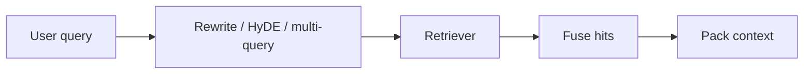

import { ConceptTemplate } from '@/features/kb/components/templates/ConceptTemplate'
import { Callout } from '@/features/kb/components/mdx/Callout'
import { ComparisonTable } from '@/features/kb/components/mdx/ComparisonTable'

export default function Layout({ children }) {
  return (
    <ConceptTemplate title="Query Expansion and Rewriting">
      {children}
    </ConceptTemplate>
  )
}

Users type "app crashing." The runbook says "iOS jetsam" and "Android SIGSEGV." A raw embedding of the user string sits in a different neighborhood than the docs. **Query rewriting** intercepts the string and emits one or more *search* strings the index actually understands.

This is older than RAG (pseudo-relevance feedback, WordNet). LLMs made it cheap and dangerous.

## 1. Deep Dive and Mechanics

**LLM rewrite.** A small model turns the utterance into a well-specified query: add product names from session metadata, expand acronyms, strip chitchat. Multi-query: emit 3 paraphrases, retrieve for each, fuse with RRF. That covers vocabulary you cannot know in advance.

**HyDE (Hypothetical Document Embeddings).** Gao et al.: generate a *fake answer*, embed *that*, search with the fake-answer vector. Questions and passages are often trained in one space but still sit apart; a hypothetical passage is closer to real passages than a 4-word question is. The fake facts can be wrong; you only need the *style and topic* to be right. Always retrieve real chunks afterward.

**Step-back prompting.** Zheng et al.: ask a more abstract question first ("principles of mobile memory limits") then the specific one. Useful when the user is overly specific and the corpus is textbook-like.

**Classic IR.** RM3 / PRF: retrieve with BM25, take top terms from top docs, expand. No LLM. Still a strong baseline on news collections.

**Conversation rewrite.** In multi-turn chat, "what about the timeout?" must become "payment authorization timeout on checkout API" using history. This is anaphora resolution, not poetry.

<Callout icon="warning" title="Rewrites can derail">
If the user said "refund policy Germany 2024" and the rewriter drops the year and country, you will retrieve the US 2019 PDF. Constrain the rewriter: preserve entities, numbers, and IDs. Log both strings.
</Callout>

## 2. Mathematical / Theoretical Foundation

Retrieval maximises `s(f(q), f(d))`. Rewriting replaces `q` with `q'` to increase the chance that the true `d*` ranks high. HyDE approximates `E[f(d) | q]` — the expected passage embedding — with a generated sample. Multi-query is a mixture: retrieve under several `q_i` and aggregate.

There is a bias-variance tradeoff: more expansion raises recall and can drown precision with related-but-wrong topics. Measure both.

<ComparisonTable
  headers={['Technique', 'What you embed / search', 'Watch-out']}
  rows={[
    ['Paraphrase / multi-query', 'Several questions', 'Cost times N'],
    ['HyDE', 'Generated passage', 'Topic drift'],
    ['Step-back', 'Abstract plus specific', 'Too generic hits'],
    ['RM3', 'Original plus PRF terms', 'Feedback noise'],
  ]}
/>

## 3. Real-World Implementation

```python
REWRITE = '''Rewrite the user query for a technical search index.
Keep error codes and product names. Output one line.'''

def search(user_q: str, llm, retrieve):
    q = llm(REWRITE + '\n\n' + user_q)
    return retrieve(q)
```

For HyDE, change the instruction to "Write a short paragraph that would answer this" and `retrieve(embed(paragraph))`.

## 4. Visualizations



## 5. Interview Prep

**Q: HyDE vs just using a better embedding model?**
**A:** Better bi-encoders shrink the question/passage gap. HyDE is a cheap behavioral fix when you cannot retrain. Try both; HyDE costs an extra generation.

**Q: Should rewrite happen before or after hybrid search?**
**A:** Rewrite (or expand) *inputs* to both BM25 and dense. Expanding BM25 with LLM terms is how you get "jetsam" into a keyword query that started as "app crashing."

**Q: How do you stop prompt injection via "rewrite this"?**
**A:** The rewriter sees the user string. Treat its output as *search text only*, never as instructions to the generator. Separate system prompts.

## 6. Production Use Cases

- **Support chat:** attach tenant, product, version, then rewrite.
- **E-commerce:** query understanding (brand, size) before hybrid search.
- **Code search:** expand "that NPE in auth" using the open file path.

<Callout icon="tip" title="A/B the rewriter off">
Keep a flag to search the raw query. If rewrite loses on exact IDs, skip the LLM when the query looks like an identifier or a URL.
</Callout>
