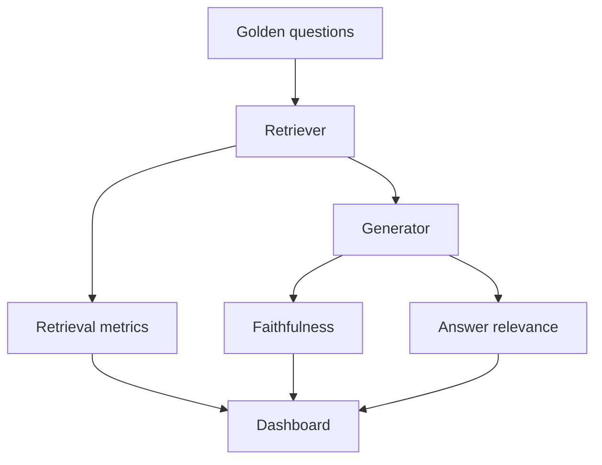

import { ConceptTemplate } from '@/features/kb/components/templates/ConceptTemplate'
import { Callout } from '@/features/kb/components/mdx/Callout'
import { ComparisonTable } from '@/features/kb/components/mdx/ComparisonTable'

export default function Layout({ children }) {
  return (
    <ConceptTemplate title="RAG Evaluation">
      {children}
    </ConceptTemplate>
  )
}

You cannot `assertEqual` a paragraph. You can still **measure** RAG. Split the system: did we fetch the right evidence, did the model stick to it, did the user get a usable answer? Frameworks (Ragas, TruLens, ARES, RAGChecker) automate pieces. None replace a small golden set you actually read.

## 1. Deep Dive and Mechanics

**The triad (common industry language).**

1. **Context relevance / retrieval quality.** Are the packed chunks about the question? Classic IR: recall@k, nDCG@k, MRR if you have labeled relevant doc ids. No labels: LLM-as-judge "is this chunk useful?" is noisy but directional.
2. **Faithfulness / groundedness.** Does each sentence follow from the context? NLI or a judge with the chunks in scope. This is how you catch fluent lies.
3. **Answer relevance.** Does the text address the *question* (it can be faithful to a wrong doc and still fail this)?

**Component vs end-to-end.** Improving embeddings should move recall@k. Improving the prompt should move faithfulness without touching recall. If you only score the final paragraph, you will tune the generator to paper over a broken index.

**LLM-as-judge.** A strong model scores 1–5 given (question, context, answer). Calibrate against humans on 100 items or the judge will prefer verbose, sycophantic answers. Use pairwise comparisons ("A vs B") when you can; they are more stable than absolute Likert.

**Regression suite.** 50–200 production-like questions with cited source ids. Run on every chunker / embedder / prompt change. Fail the build if recall@5 or faithfulness drops more than a threshold.

<Callout icon="warning" title="The judge shares the model's blind spots">
GPT-4 as judge will not reliably catch subtle legal misquotes. For high-risk domains, humans on a sample beat another LLM. Use judges for cheap regression, not for a compliance stamp.
</Callout>

## 2. Mathematical / Theoretical Foundation

Retrieval: binary relevance gives Precision@k, Recall@k; graded relevance gives nDCG. **Hit rate** (any gold doc in top-k) is what RAG cares about — the generator only sees those k.

Faithfulness can be framed as entailment rate: fraction of answer sentences entailed by some chunk. Answer quality is closer to a utility function; there is no unique metric. Correlation with human prefs is the meta-metric.

When you change two things at once you cannot attribute. Factorial experiments or one-knob-at-a-time on the golden set.

<ComparisonTable
  headers={['Metric', 'Needs labels', 'Tells you']}
  rows={[
    ['Recall@k / nDCG', 'Doc ids', 'Retriever health'],
    ['Faithfulness', 'Chunks plus answer', 'Hallucination rate'],
    ['Answer relevance', 'Question plus answer', 'Did we help'],
    ['Latency / cost', 'Logs', 'Can we ship it'],
  ]}
/>

## 3. Real-World Implementation

```python
def recall_at_k(gold_ids: set[str], retrieved_ids: list[str], k: int) -> float:
    top = set(retrieved_ids[:k])
    if not gold_ids:
        return 0.0
    return len(gold_ids & top) / len(gold_ids)

# Average recall_at_k over the golden set after each index rebuild.
```

Pair with a judge prompt that *only* sees the context you packed, not the whole corpus.

## 4. Visualizations



## 5. Interview Prep

**Q: Why is BLEU a bad RAG metric?**
**A:** There is no single reference sentence. Paraphrases of a correct, grounded answer will score low. Use entailment and human/pairwise judges.

**Q: Offline vs online eval?**
**A:** Offline golden set catches regressions before deploy. Online: thumbs, escalate-to-human rate, "citation clicked." Online without offline is how you ship a silent retrieval drop on long-tail queries.

**Q: How many questions is enough?**
**A:** Enough to cover your failure modes (IDs, multi-hop, stale docs, refusals). 30 is a smoke test. 200 with tags is a real suite. 10,000 synthetic questions without review measure the synthetic generator.

## 6. Production Use Cases

- **CI for the index:** rebuild embeddings, run recall@5.
- **Prompt/registry:** compare two system prompts on faithfulness.
- **Vendor bake-off:** same golden set, different embedding APIs.

<Callout icon="tip" title="Tag the failures">
A single average hides "we broke legal and improved FAQ." Slice metrics by corpus, language, and query class.
</Callout>
