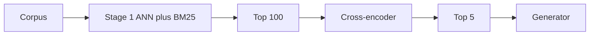

import { ConceptTemplate } from '@/features/kb/components/templates/ConceptTemplate'
import { Callout } from '@/features/kb/components/mdx/Callout'
import { ComparisonTable } from '@/features/kb/components/mdx/ComparisonTable'

export default function Layout({ children }) {
  return (
    <ConceptTemplate title="Reranking">
      {children}
    </ConceptTemplate>
  )
}

A vector index is a **bi-encoder**: query and document were embedded *apart*. That is the only way to search a billion rows in milliseconds. It is also shallow. **Reranking** takes the top 50–200 hits and scores each with a model that sees **query and text at once** — a **cross-encoder** — then keeps the new top 5 for the LLM.

If you can afford only one quality upgrade after hybrid search, this is usually it.

## 1. Deep Dive and Mechanics

**Cross-encoder.** Concatenate `query [SEP] document`, run a transformer, take a relevance logit. Full self-attention compares every query token to every doc token. Latency is linear in (hits × tokens), so you never run it on the whole corpus.

**Late interaction (ColBERT).** Keep token-level embeddings; score with MaxSim between query tokens and doc tokens. Cheaper than a full cross-encoder at query time if you stored the token vectors; still richer than a single pooled vector.

**LLM rerankers.** A large model lists "which of these passages are useful." Flexible, expensive, prompt-injection-prone if docs contain instructions. Use for small k or offline.

**Two-stage (or three-stage) cascade.** Stage 1: BM25 + ANN + RRF → 100 ids. Stage 2: cross-encoder → 10. Stage 3: pack and generate. Each stage trades recall for precision.

**Calibration.** Cross-encoder scores are not probabilities you can compare across queries. Use them only to *order* the list for this query. For thresholding ("drop below 0.2"), fit a per-model threshold on your eval set.

<Callout icon="info" title="Rerank the text you will show">
If you retrieve 200-token children and then swap in 2000-token parents, rerank the *parent* (or rerank children and expand after). Scoring a sentence and stuffing a chapter is how irrelevant chapters sneak in.
</Callout>

## 2. Mathematical / Theoretical Foundation

Bi-encoder approximates `s(q, d) ≈ f(q) · g(d)`. Cross-encoder models `s(q, d) = h([q; d])` with no independent decomposition — strictly more expressive, no indexability. Cascades are a classic IR idea (linear scan cheap features, then expensive features) formalised as risk vs cost.

Listwise losses (LambdaMART, RankNet) train rerankers on ordered labels. Many open rerankers (bge-reranker, Cohere rerank, Jina) are pointwise cross-encoders trained on MS MARCO-style pairs.

<ComparisonTable
  headers={['Stage', 'Model', 'Per query cost']}
  rows={[
    ['Retrieve', 'BM25 / ANN', 'Milliseconds, whole corpus'],
    ['Rerank', 'Cross-encoder', 'Tens of ms times N hits'],
    ['Generate', 'LLM', 'Hundreds of ms, top-k tokens'],
  ]}
/>

## 3. Real-World Implementation

```python
from sentence_transformers import CrossEncoder

reranker = CrossEncoder('BAAI/bge-reranker-base')

def rerank(query: str, docs: list[str], keep: int = 5) -> list[str]:
    pairs = [(query, d) for d in docs]
    scores = reranker.predict(pairs)
    order = sorted(range(len(docs)), key=lambda i: -float(scores[i]))
    return [docs[i] for i in order[:keep]]
```

Batch the pairs. Cap `docs` at 50–100.

## 4. Visualizations



## 5. Interview Prep

**Q: Why not embed with a cross-encoder?**
**A:** You would need to run the heavy model against every document for every query. That is a linear scan of the corpus. Bi-encoders exist so the heavy work on documents happens *once* at ingest.

**Q: Does reranking fix a bad chunker?**
**A:** It can promote the least-bad of a bad list. If the gold span was never retrieved, rerank cannot invent it. Check recall@100 before buying a bigger reranker.

**Q: Pointwise vs listwise?**
**A:** Pointwise scores each pair alone. Listwise looks at the whole candidate set (and can avoid near-duplicates). Most APIs are pointwise plus your own MMR.

## 6. Production Use Cases

- **Docs and GTM search:** Cohere/Jina rerank on the last mile.
- **RAG for support:** 80 BM25+dense hits → 6 reranked → prompt.
- **Recommendations:** two-tower retrieve, cross-encoder or GBDT rerank with business features (price, stock).

<Callout icon="warning" title="Tail latency">
P99 is N times one forward pass unless you batch and truncate docs. Truncate to 512 tokens *consistently* with how the reranker was trained or scores become noise.
</Callout>
