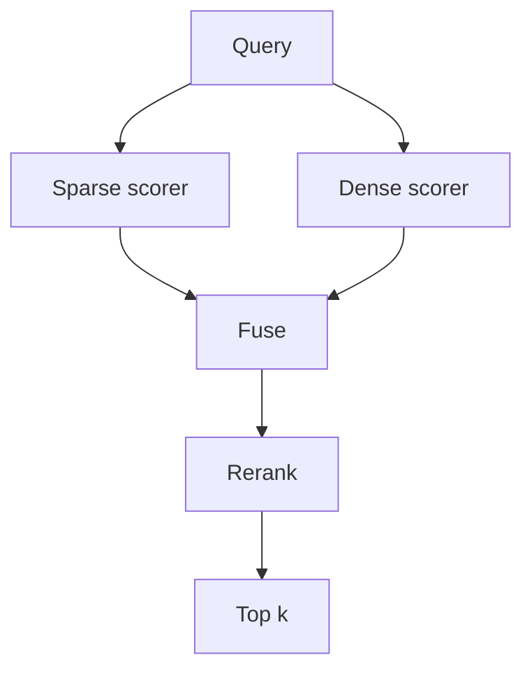

import { ConceptTemplate } from '@/features/kb/components/templates/ConceptTemplate'
import { Callout } from '@/features/kb/components/mdx/Callout'
import { ComparisonTable } from '@/features/kb/components/mdx/ComparisonTable'

export default function Layout({ children }) {
  return (
    <ConceptTemplate title="Retrieval Algorithms">
      {children}
    </ConceptTemplate>
  )
}

**Retrieval** is: given query Q and a corpus D, produce a short ordered list of documents the user (or the LLM) should see next. Everything else in this section — chunking, embeddings, ANN, hybrid, rerank — is machinery for that ranking problem.

Search engines solved it with words. RAG added vectors. Production systems use both.

## 1. Deep Dive and Mechanics

**Sparse / lexical.** Represent a document as a bag of terms. **TF** rewards a term that appears often in *this* doc. **IDF** punishes a term that appears in *every* doc ("the"). **BM25** is the production formula: TF saturates (so a page that says "Kubernetes" 200 times does not win by spam), and document length is normalised. Indexes are inverted: term → posting list of doc ids. Exact tokens and rare IDs shine. Synonyms fail.

**Dense / semantic.** Represent query and doc as embeddings. Score is cosine or inner product. Synonyms and paraphrases shine. Rare tokens fail unless the model memorised them. You cannot invert a dense vector the way you invert "Kubernetes"; you need ANN.

**Learned sparse.** SPLADE puts neural weights on vocabulary dimensions: some semantic generalisation, still an inverted index.

**The cascade.** Retrieve broadly (high recall, cheap) → fuse → rerank (high precision, expensive) → pack. Do not ask one algorithm to be both the billion-scale filter and the linguistic critic.

<Callout icon="info" title="Retrieval is not generation">
If the gold paragraph is not in the list, the LLM cannot faithfully cite it. Tune recall@k before you rewrite the system prompt for the tenth time.
</Callout>

## 2. Mathematical / Theoretical Foundation

Formal IR: a scoring function `s(q, d)` and an evaluation measure (nDCG, MAP, recall@k) against a relevance judgment. Probability ranking principle: rank by `P(relevant | q, d)` if you want expected utility under independent docs.

BM25 derives from a 2-Poisson probabilistic model (simplified). Dense retrieval derives from contrastive learning of `f`. Hybrid is rank aggregation. There is no free lunch: a metric that is perfect on keyword queries will sag on paraphrases.

<ComparisonTable
  headers={['Family', 'Index', 'Fails when']}
  rows={[
    ['BM25 / TF-IDF', 'Inverted postings', 'Synonyms, messy phrasing'],
    ['Dense ANN', 'HNSW / IVF', 'IDs, novel jargon'],
    ['Learned sparse', 'Inverted + weights', 'Need a trained model'],
    ['Cross-encoder', 'None at corpus scale', 'You run it on everything'],
  ]}
/>

## 3. Real-World Implementation

```python
# Sparse sketch: score is precomputed by your search engine
bm25_ids = es.search(q, size=50)

# Dense sketch
q_vec = embed_query(q)
dense_ids = ann.search(q_vec, k=50)

# Then fuse — see Hybrid Search
```

The "algorithm" in production is often 20 lines of glue plus two mature indexes.

## 4. Visualizations



## 5. Interview Prep

**Q: TF-IDF vs BM25?**
**A:** Both are lexical. BM25's term-frequency saturation and length normalisation win on almost every classic IR collection. Nobody should ship raw TF-IDF in 2026 except as a homework baseline.

**Q: Is cosine a retrieval algorithm?**
**A:** It is a *similarity*. The algorithm is "compute that similarity against candidates." Candidates come from brute force or ANN. People say "cosine search" as shorthand.

**Q: Online vs batch retrieval?**
**A:** Interactive RAG is online (p50 in tens of ms). Offline (embed a crawl, build a graph) can use exact k-NN and slower extractors.

## 6. Production Use Cases

- **Web and site search:** still BM25-first at many companies, vectors as a feature.
- **RAG:** retrieval quality *is* answer quality.
- **Ads and recs:** retrieval as candidate generation for a ranker.

<Callout icon="tip" title="Log the candidate lists">
When debugging, save stage-1 ids, fused ids, and reranked ids. "The model is wrong" is often "BM25 never saw the doc and ANN returned a near-miss title."
</Callout>
