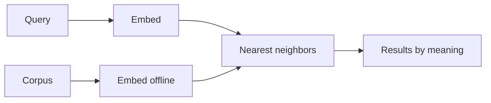

import { ConceptTemplate } from '@/features/kb/components/templates/ConceptTemplate'
import { Callout } from '@/features/kb/components/mdx/Callout'
import { ComparisonTable } from '@/features/kb/components/mdx/ComparisonTable'

export default function Layout({ children }) {
  return (
    <ConceptTemplate title="Semantic Search">
      {children}
    </ConceptTemplate>
  )
}

A SQL `LIKE '%coffee%'` misses `cafe`. A BM25 query for "places to get coffee" misses a page titled only "Espresso bar hours." **Semantic search** embeds the query and the corpus so **intent** sits next to **content** in a vector space, then returns nearest neighbors.

It is the user-facing name for what this KB calls dense retrieval plus a decent UI. It does not replace keyword search; it covers the **vocabulary gap**.

## 1. Deep Dive and Mechanics

**Vocabulary gap.** Authors and askers do not share a lexicon. Support tickets say "it won't let me pay"; the runbook says "checkout authorization declined." Embedding models trained on query–document pairs learn that those strings are neighbors.

**Ingestion.** Every searchable unit (chunk, product, ticket) is passed through `f`, stored with metadata (ACL, locale, type). Filters run in the engine (prefilter / postfilter) so "coffee" in the HR policy does not leak into the public help center.

**Query time.** Embed the query with the *same* `f` (and the `query:` prefix if required). ANN → optional hybrid/rerank → results. Highlighting is harder than with BM25: you may highlight a sentence that never shared a token with the query. Show a short extract the reranker liked.

**Multilingual and multimodal.** Multilingual models put "coffee" and "café" near each other. Image and CLIP-style models let a photo query retrieve SKUs. Same geometry, different encoder.

<Callout icon="warning" title="Semantic is not magic ACL">
Nearest neighbor does not know the user is intern-level. Always filter by permission *inside* the retrieval engine. Filtering after generation is how you leak.
</Callout>

## 2. Mathematical / Theoretical Foundation

Semantic search assumes `s(f(q), f(d))` correlates with human relevance. That correlation is an empirical property of the training set. Out of domain (medical, legal, your internal code names) it decays. Fine-tuning on click data (two-tower, distillation from a cross-encoder) is how large search teams keep the assumption true.

False friends: antonyms and negations ("without peanuts") are historically weak in bi-encoders. Hybrid + rerank + explicit token filters ("peanuts") patch this.

<ComparisonTable
  headers={['User types', 'Keyword finds', 'Semantic finds']}
  rows={[
    ['places to get coffee', 'pages with those words', 'cafe, espresso bar'],
    ['ERR_7X9', 'exact code', 'maybe nothing useful'],
    ['why did checkout fail', 'those words', 'authorization timeout article'],
  ]}
/>

## 3. Real-World Implementation

```python
def semantic_search(query: str, embed, ann, k: int = 8):
    vec = embed([query], kind='query')[0]
    return ann.search(vec, k=k)
```

Add BM25 in parallel if `query` contains digits or quoted phrases.

## 4. Visualizations



## 5. Interview Prep

**Q: Semantic search vs RAG?**
**A:** Semantic search *returns documents* to a human. RAG *stuffs documents into an LLM*. Same retriever. Different consumer. RAG without a citation UI is still using semantic search under the hood.

**Q: Why did we get unrelated results?**
**A:** Hubness (some vectors are everyone's neighbor), a muddy chunk (whole-page embeddings), or a model change that was not re-indexed. Inspect the actual vectors' nearest labeled examples.

**Q: Can I semantic-search SQL rows?**
**A:** Embed a text view of the row (`title + description`). Keep the primary key in metadata. Do not embed raw integers and hope.

## 6. Production Use Cases

- **Help centers and wikis:** the default upgrade from keyword.
- **E-commerce:** "crispy snack" → chips.
- **People search:** "who knows Kubernetes on-call" over bios (watch privacy).

<Callout icon="tip" title="Show why">
Users forgive a keyword miss. They distrust a semantic miss. Display the matched passage and a "search as keywords instead" toggle.
</Callout>
