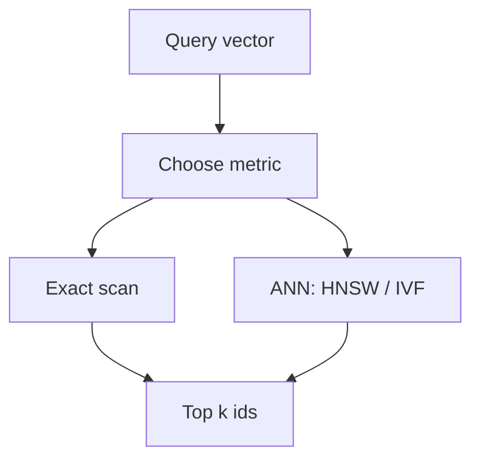

import { ConceptTemplate } from '@/features/kb/components/templates/ConceptTemplate'
import { Callout } from '@/features/kb/components/mdx/Callout'
import { ComparisonTable } from '@/features/kb/components/mdx/ComparisonTable'

export default function Layout({ children }) {
  return (
    <ConceptTemplate title="Vector Search">
      {children}
    </ConceptTemplate>
  )
}

**Vector search** is the query: given vector `q`, return the `k` stored vectors that maximise similarity (or minimise distance). Embeddings supply `q` and the stored points. A **vector database** stores them and implements this query at scale. This page is the query math; the database page is indexes, RAM, and filters.

## 1. Deep Dive and Mechanics

**Metrics.**

- **Cosine similarity:** angle between vectors. Invariant to length. Default for text embeddings that encode meaning in *direction*.
- **Inner product (dot):** `q · d`. If both are L2-normalised, rank-equivalent to cosine and cheaper. Some two-tower models are trained for raw IP (magnitude means "confidence").
- **L2 (Euclidean):** straight-line distance. Common in vision. Sensitive to magnitude.

**Exact k-NN.** Score every point. Correct, `O(n · d)` per query. Fine for 10k rows in RAM. Impossible as a hot path at 100M × 1536-D.

**ANN.** Return *almost* the same k neighbors. HNSW (graph), IVF (cluster then scan), LSH (hash), PQ (compress then scan). You buy milliseconds with a recall target (e.g. 0.95 recall of true top-k). Tune `efSearch`, `nprobe`, etc. on a held-out query set — not by vibes.

**Filters.** "Nearest neighbor among docs the user can see" is a different algorithm than "nearest neighbor then drop." See the vector-database page on prefilter vs postfilter.

<Callout icon="info" title="Normalise on purpose">
If you cosine-search unnormalised vectors, longer chunks can dominate. Most NLP pipelines L2-normalise at upsert and at query. Write that down in the collection config.
</Callout>

## 2. Mathematical / Theoretical Foundation

For unit vectors, `||q - d||^2 = 2 - 2 q·d`, so L2 and cosine induce the same order. ANN algorithms exploit **locality**: nearby points are connected (HNSW) or share a cluster (IVF). The curse of dimensionality says random high-d points look equidistant; *learned* embeddings are not random — they lie on a lower-dimensional manifold, which is why ANN works at all.

Recall vs QPS is a Pareto curve. Publishing "50ms search" without recall@10 is a marketing number.

<ComparisonTable
  headers={['Mode', 'Guarantee', 'When to use']}
  rows={[
    ['Exact scan', 'True top-k', 'Small corpora, eval gold'],
    ['HNSW ANN', 'High recall, RAM-heavy', 'Default online search'],
    ['IVF / PQ', 'Lower RAM, more knobs', 'Huge collections'],
  ]}
/>

## 3. Real-World Implementation

```python
import numpy as np

def top_k_cosine(q: np.ndarray, X: np.ndarray, k: int) -> np.ndarray:
    q = q / (np.linalg.norm(q) + 1e-12)
    Xn = X / (np.linalg.norm(X, axis=1, keepdims=True) + 1e-12)
    scores = Xn @ q
    return np.argpartition(-scores, k)[:k]
```

Replace the scan with `index.search(q, k)` once n no longer fits a lunch break.

## 4. Visualizations



## 5. Interview Prep

**Q: Vector search vs semantic search?**
**A:** Vector search is the geometric query. Semantic search is the product (meaning-based results). You can vector-search image hashes or audio fingerprints with no "semantics" in the NLP sense.

**Q: Why is dot product faster than cosine?**
**A:** Cosine is dot of normalised vectors (or dot plus two norms). If you normalise at write time, query time is one gemm. People still say "cosine" meaning "we normalised."

**Q: What recall should I pick?**
**A:** Measure downstream: RAG faithfulness, click-through. 0.90–0.97 recall of exact top-100 is a common online band. Eval sets should use exact search as the gold neighbor list.

## 6. Production Use Cases

- **RAG retrieve:** `k=20` then rerank.
- **Dedup:** search with threshold, collapse near-duplicates.
- **Recs:** user vector → item vectors.

<Callout icon="tip" title="Keep an exact oracle">
Store a 10k-row slice and brute-force it in CI. If ANN recall on that slice collapses after a library upgrade, you will see it before customers do.
</Callout>
