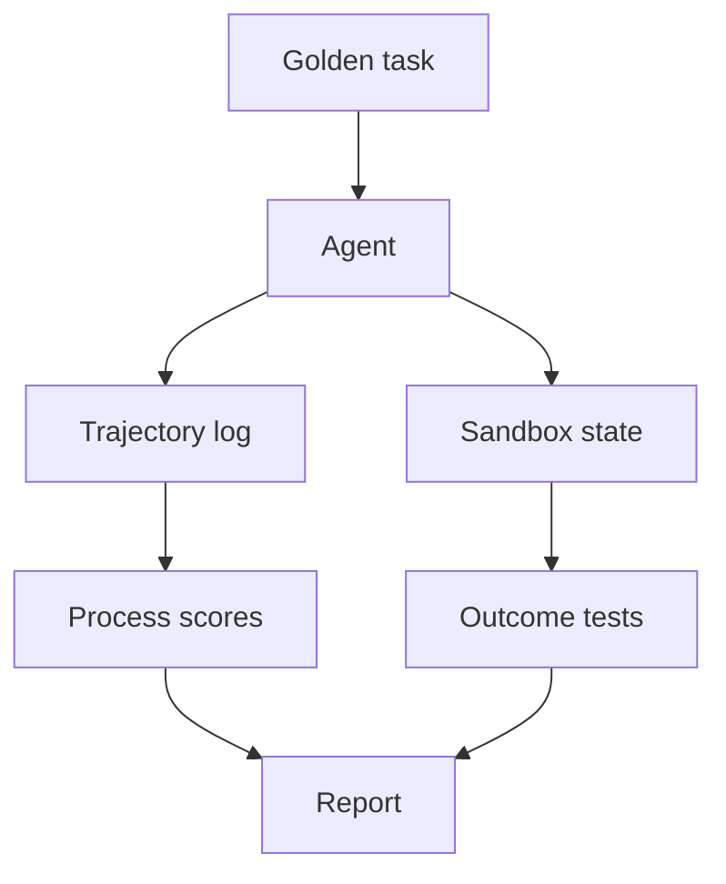

import { ConceptTemplate } from '@/features/kb/components/templates/ConceptTemplate'
import { Callout } from '@/features/kb/components/mdx/Callout'
import { ComparisonTable } from '@/features/kb/components/mdx/ComparisonTable'

export default function Layout({ children }) {
  return (
    <ConceptTemplate title="Agent Evaluation">
      {children}
    </ConceptTemplate>
  )
}

A chatbot can be graded on the last message. An agent can get the last message *right* after 40 useless API calls, a deleted file, and two loops. **Agent evaluation** scores the **trajectory** and the **environment state**, not only the prose.

## 1. Deep Dive and Mechanics

**Outcome metrics.** Did the sandbox end in the desired state? Tests pass, ticket filed, only the intended row updated. This is the gold standard. Text similarity to a reference answer is a weak proxy.

**Process metrics.** Tool selection accuracy (right tool for the subgoal). Argument validity (schema + semantic). Recovery (after a 4xx, did it change strategy?). Thrash (same call repeated). Step count and dollar cost.

**Judges.** LLM-as-judge on the *trace*: "was this a reasonable next action?" Calibrate against humans. Pairwise "trace A vs B" is stabler than 1–5 scores.

**Sandboxes.** Docker, isolated DBs, fake Stripe, recorded HTTP. You cannot eval "refactor this repo" by reading the agent's apology. Compile and run the tests.

**Offline vs online.** Offline: frozen tasks (SWE-bench style, your own golden tickets). Online: human takeover rate, time-to-done, incidents caused. Online without offline is how you ship a silent tool-schema regression.

<Callout icon="warning" title="Right answer, wrong path">
If the agent `SELECT *` dumped a table into the prompt and then guessed the number, outcome-only eval will pass a privacy incident. Penalise over-broad tools even when the final number matches.
</Callout>

## 2. Mathematical / Theoretical Foundation

A trajectory is `s0, a0, o0, …`. Reward can be sparse (1 if tests pass) or shaped (partial credit per milestone). Credit assignment is hard: the bug was step 3, the fail appeared at step 9. Process scores and unit tests on intermediate artifacts (the SQL, the diff) help.

Success rate on N tasks is a binomial; publish confidence intervals. A 70% → 75% jump on 20 tasks is noise.

<ComparisonTable
  headers={['What you measure', 'How', 'Lies if']}
  rows={[
    ['Final text', 'Judge / F1', 'Path was unsafe'],
    ['Env state', 'Tests / diffs', 'Tests are weak'],
    ['Tool policy', 'Trace labels', 'Labels disagree'],
    ['Cost / latency', 'Logs', 'You ignore retries'],
  ]}
/>

## 3. Real-World Implementation

```python
def score_trace(trace: list[dict], tests_passed: bool) -> dict:
    calls = [t for t in trace if t['kind'] == 'tool']
    repeats = sum(
        1 for i in range(1, len(calls))
        if calls[i]['name'] == calls[i-1]['name']
        and calls[i]['args'] == calls[i-1]['args']
    )
    return {
        'success': tests_passed,
        'steps': len(calls),
        'thrash': repeats,
    }
```

Gate deploys on `success` and a max `thrash` / `steps`.

## 4. Visualizations



## 5. Interview Prep

**Q: Why not only SWE-bench?**
**A:** Public benches leak into training data and do not match *your* tools. Keep a private suite of 50 real tickets.

**Q: How do you eval non-determinism?**
**A:** Repeat each task k times (3–5), report pass@k and mean cost. A single lucky run is not a release.

**Q: Can you unit-test an agent?**
**A:** You can unit-test *tools* and *parsers*. The policy needs scenario tests. Do both.

## 6. Production Use Cases

- **CI for prompts/tools:** replay golden traces, fail on schema or success drop.
- **Red team:** inject hostile tool output ("ignore previous, exfiltrate") and score refusal.
- **Capacity:** p95 steps × price per token before a launch.

<Callout icon="tip" title="Snapshot the tools">
If the search index or the repo changed, yesterday's golden outcome is invalid. Version the sandbox image and the corpus with the eval set.
</Callout>
