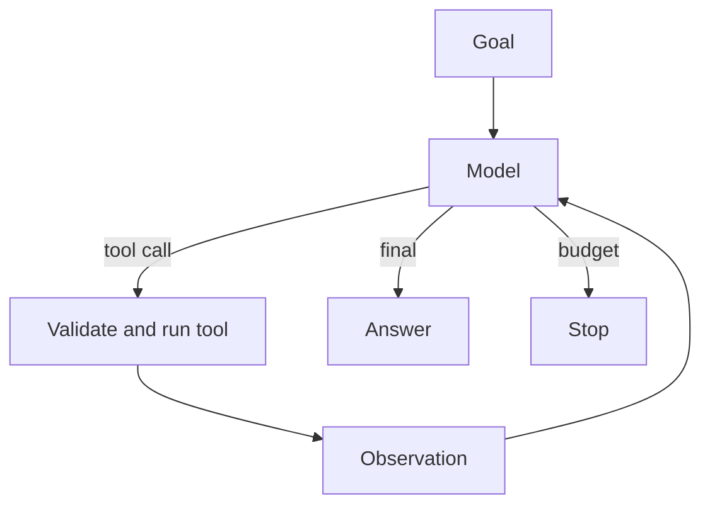

import { ConceptTemplate } from '@/features/kb/components/templates/ConceptTemplate'
import { Callout } from '@/features/kb/components/mdx/Callout'
import { ComparisonTable } from '@/features/kb/components/mdx/ComparisonTable'

export default function Layout({ children }) {
  return (
    <ConceptTemplate title="AI Agents">
      {children}
    </ConceptTemplate>
  )
}

A chat model is a next-token predictor. An **agent** is that model plus a **runtime**: a list of tools, a memory policy, a stop condition, and a loop that feeds observations back in. The model chooses *what to do next*. Your code decides *whether that is allowed* and *what the tool actually does*.

If you only need one RAG call, you do not need an agent. If the next API depends on the last result, you do.

## 1. Deep Dive and Mechanics

**The loop.** Typical cycle: (1) model emits a thought and/or a tool call, (2) host validates arguments, (3) host runs the tool in a sandbox, (4) host appends the observation, (5) repeat until a final answer or a budget hits. ReAct is the classic text form. Native **function calling** is the same loop with JSON the API parses for you.

**What the model sees.** System prompt (role + tool docs), short-term history, optional retrieved long-term notes, the scratchpad of this episode. Overflow that window and the agent "forgets" the goal or the last error.

**Control, not vibes.** Hard limits: max steps, max tokens, allowlisted tools, human approval on side effects (`send_email`, `rm`). Without those, a confused model will retry a failing tool until your bill rings.

**Agent vs workflow.** A **workflow** is a graph you drew (LangGraph, Temporal). An **agent** is a node that *chooses* edges. Production systems mix them: a deterministic graph with one or two agent nodes, not an unbounded swarm.

<Callout icon="warning" title="Hands without a sandbox">
Tools are the hazard. A model that can run shell or SQL on production is not "autonomous." It is unsandboxed RCE with extra marketing. Default to dry-run, staging, and allowlists.
</Callout>

## 2. Mathematical / Theoretical Foundation

You can treat the agent as a policy `π(a | s)` over actions (tool names + args, or "finish") given state s (prompt + memory). There is no guarantee of optimality. ReAct and ToT are *prompted* policies. Fine-tuned tool-use models shift the distribution toward valid schemas.

Termination is a separate predicate: goal satisfied, critic says stop, or `steps ≥ N`. Liveness (it eventually stops) is your job, not the model's.

<ComparisonTable
  headers={['Thing', 'Chooses the next step', 'When to use']}
  rows={[
    ['Single LLM call', 'You did, in the prompt', 'Q and A, classify'],
    ['Fixed chain / DAG', 'Your graph', 'Known pipeline'],
    ['Agent loop', 'The model', 'Unknown tool order'],
  ]}
/>

## 3. Real-World Implementation

```python
def run_agent(llm, tools, goal, max_steps=8):
    messages = [{'role': 'user', 'content': goal}]
    for _ in range(max_steps):
        step = llm.complete(messages, tools=tools)
        if step.final:
            return step.text
        result = tools[step.name](**step.args)
        messages.append({'role': 'tool', 'name': step.name, 'content': str(result)})
    return 'stopped at step budget'
```

Swap the dict protocol for your vendor's tool-call objects.

## 4. Visualizations



## 5. Interview Prep

**Q: Is ChatGPT with browsing an agent?**
**A:** Yes, in the weak sense: a model + tools + a host loop. The interesting part is the *policy* (when it searches) and the *guardrails* (what URLs, what writes).

**Q: Why do agents thrash?**
**A:** The observation does not change (same error), so the policy samples the same action. Detect repeated tool+args and inject "try something else" or abort.

**Q: Autonomy vs reliability?**
**A:** More autonomy means a larger action space and longer trajectories — both raise eval variance. Enterprises usually *shrink* autonomy and add graphs.

## 6. Production Use Cases

- **Support:** search KB, open ticket, never refund without HITL.
- **SWE agents:** edit files in a repo clone, run tests, open a PR.
- **Ops:** read metrics, propose a runbook step, require approve to apply.

<Callout icon="tip" title="Log the trajectory">
The product you debug is the *trace* (thoughts, calls, args, results), not the last paragraph. Persist it. Evaluate it. That is the next page.
</Callout>
