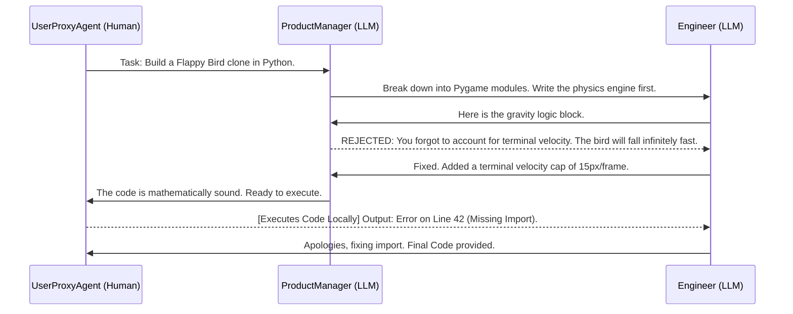

import { ConceptTemplate } from '@/features/kb/components/templates/ConceptTemplate'
import { Callout } from '@/features/kb/components/mdx/Callout'

export default function Layout({ children }) {
  return (
    <ConceptTemplate title="AutoGen (Multi-Agent Systems)">
      {children}
    </ConceptTemplate>
  )
}

If a single LLM Agent (using a standard ReAct loop) gets confused or makes a logical error, it will often mathematically spiral into an unrecoverable hallucination loop. It generates a bad thought, writes bad code, gets a bad error message, and lacks the perspective to step back and re-evaluate. 

**Microsoft AutoGen** mathematically solves this by abandoning the single-agent paradigm entirely. It provides a framework to create **Multi-Agent Systems**—networks of multiple, distinct AI Agents (each with specialized system prompts and tools) that mathematically check each other's work through simulated human conversation.

## 1. Deep Dive & Mechanics

### The Message Passing Protocol
In standard LangChain, execution is procedural: `Chain A -> Chain B`. 
In AutoGen, the fundamental unit of execution is a **Message Passing Protocol**. Agents do not call functions on each other; they *chat* with each other.

You define a `CoderAgent` (prompted exclusively to write Python) and a `ReviewerAgent` (prompted exclusively to find security vulnerabilities).
1. The User gives the Coder a task.
2. The Coder mathematically generates the code and "sends a message" containing the code to the Reviewer.
3. The Reviewer reads the message. If it finds a bug, it replies to the Coder explaining the bug.
4. This multi-turn conversational loop mathematically continues until both Agents reach a consensus or the code successfully compiles.

### The Agent Topology
AutoGen allows you to construct complex mathematical network topologies for your agents:
- **Two-Agent Chat**: A simple back-and-forth between a Coder and a Reviewer.
- **Sequential Chat**: `Agent A` finishes its job, passes the final result to `Agent B`, who passes it to `Agent C`.
- **Group Chat**: The most powerful topology. You drop 5 different agents into a virtual "Chat Room". A specialized hidden `GroupChatManager` LLM mathematically reads the conversation history and dynamically decides *which* agent is most qualified to speak next based on the context.

## 2. Mathematical / Theoretical Foundation

### The Economics of Token Consumption
Multi-agent systems are mathematically devastating to token budgets. 
If 5 agents are in a Group Chat, and Agent A generates a 500-token message, that message is appended to the shared conversation history. When it is Agent B's turn to speak, it must mathematically ingest the entire history. When Agent C speaks, the history is even longer.
The mathematical cost of a Group Chat grows **quadratically** $O(N^2)$ with the number of conversational turns. AutoGen attempts to mitigate this by implementing strict token limits, summarization mechanics, and forcing Agents to drop old messages from their context window.

### Human-in-the-Loop (The UserProxyAgent)
AutoGen mathematically treats Human beings as just another Agent in the network via the `UserProxyAgent`.
During a massive AI-to-AI conversation, the System can mathematically pause execution. For example, if the Coder Agent generates a script that uses the `os.system('rm -rf /')` tool, the `UserProxyAgent` intercepts the execution and prompts the human via the Terminal: *"The Coder wants to delete this directory. Do you approve?"*
This architectural design seamlessly blends autonomous mathematical reasoning with strict, deterministic human oversight, completely solving the "Runaway Agent" danger.

## 3. Real-World Implementation

Here is a production-ready Python script using the `pyautogen` library to instantiate a three-agent system: A User Proxy (You), an AI Coder, and an AI Product Manager.

```python
import autogen

# 1. Define the LLM configuration (can be OpenAI, Azure, or local LLMs)
llm_config = {"model": "gpt-4-turbo", "api_key": "YOUR_API_KEY"}

# 2. Create the Human Proxy Agent
# It is mathematically configured to NEVER ask for human input unless a code block needs to be physically executed.
user_proxy = autogen.UserProxyAgent(
    name="Admin",
    human_input_mode="TERMINATE", # Only ask human when finished
    max_consecutive_auto_reply=10,
    is_termination_msg=lambda x: x.get("content", "").rstrip().endswith("TERMINATE"),
    code_execution_config={"work_dir": "workspace", "use_docker": False}
)

# 3. Create the AI Coder Agent
coder = autogen.AssistantAgent(
    name="Senior_Engineer",
    system_message="You are a senior python engineer. Write clean, robust code to solve the user's problem. When you are 100% finished and the code has been verified by the PM, output the word TERMINATE.",
    llm_config=llm_config
)

# 4. Create the AI Product Manager Agent
pm = autogen.AssistantAgent(
    name="Product_Manager",
    system_message="You are a strict Product Manager. Review the code written by the Senior_Engineer. If it does not mathematically satisfy all edge cases, reject it and tell them what to fix. Do not write code yourself.",
    llm_config=llm_config
)

# 5. Instantiate a Group Chat and trigger the autonomous loop
groupchat = autogen.GroupChat(agents=[user_proxy, coder, pm], messages=[], max_round=12)
manager = autogen.GroupChatManager(groupchat=groupchat, llm_config=llm_config)

# The human kicks off the entire autonomous conversation
user_proxy.initiate_chat(
    manager,
    message="Write a Python script to scrape the S&P 500 stock prices, calculate the 50-day moving average, and plot it."
)
```

## 4. Visualizations



<Callout icon="info" title="The Power of Debate">
  The core philosophy of AutoGen is that LLMs perform significantly better when forced to mathematically defend their choices. By forcing a Coder LLM to debate a Critic LLM, you inherently bypass the "lazy generation" problem. The Critic acts as a localized adversarial network, mathematically forcing the Coder to refine its output before it ever reaches the user.
</Callout>

## 5. Interview Prep

**Q: In AutoGen, what is the role of the `GroupChatManager`?**
**Answer:** The `GroupChatManager` is a hidden Agent injected into Group Chats. Instead of explicitly hardcoding the execution order (A $\rightarrow$ B $\rightarrow$ C), the Manager reads the conversation history after every single message and mathematically determines which Agent should speak next based on their system prompt. If the Coder posts code, the Manager realizes the Critic should speak. If the Critic approves, the Manager realizes the Executor should speak.

**Q: How does AutoGen handle infinite conversational loops?**
**Answer:** Infinite loops are a massive danger in multi-agent systems (e.g., Coder generates bad code $\rightarrow$ Critic rejects it $\rightarrow$ Coder generates the *exact same* bad code $\rightarrow$ Critic rejects it). AutoGen mathematically prevents this using two constraints: `max_consecutive_auto_reply` (a hard limit on how many messages an agent can send without human intervention) and `is_termination_msg` (a regex trigger, usually the word "TERMINATE", that instantly halts the autonomous loop).

**Q: Compare AutoGen to LangChain's standard Agents.**
**Answer:** LangChain is traditionally centered around a single Agent making recursive tool calls in a procedural ReAct loop. It is highly structured but brittle. AutoGen is centered around multiple conversational Agents passing plain-text messages. It is highly unstructured and emergent. (Note: LangChain has recently released **LangGraph** to compete directly with AutoGen's multi-agent capabilities, mathematically modeling multi-agent networks as state machines).

## 6. Production Use Cases

- **Devin / Autonomous SWEs:** The architecture behind fully autonomous Software Engineers (like Devin) relies heavily on AutoGen-style multi-agent frameworks. A single LLM cannot build a React app. But an Architect Agent can design the state, a UI Agent can write the CSS, a Logic Agent can write the Redux store, and a QA Agent can write the Cypress tests, all conversing autonomously until the app is finished.
- **Cybersecurity Red Teaming:** Enterprise security firms use AutoGen to simulate cyber attacks. They instantiate a `HackerAgent` (prompted to penetrate a mock network) and a `DefenderAgent` (prompted to patch vulnerabilities). The two agents mathematically battle each other for thousands of iterations. The humans then review the chat logs to discover novel zero-day attack vectors the Hacker Agent invented during the simulation.