import { ConceptTemplate } from '@/features/kb/components/templates/ConceptTemplate'
import { Callout } from '@/features/kb/components/mdx/Callout'

export default function Layout({ children }) {
  return (
    <ConceptTemplate title="CrewAI (Role-Based Multi-Agent Systems)">
      {children}
    </ConceptTemplate>
  )
}

While Microsoft's AutoGen focuses heavily on free-flowing, unstructured conversations between AI Agents, **CrewAI** approaches the Multi-Agent problem from a strict, corporate software engineering perspective. 

It imposes rigid, deterministic hierarchies and explicit process flows onto the LLMs. Instead of letting Agents chat endlessly in a virtual room until they solve a problem, CrewAI forces them to behave like employees in a corporate pipeline: executing specific tasks, adhering to strict delegation rules, and passing structured outputs down the assembly line.

## 1. Deep Dive & Mechanics

### The Three Primitives: Agents, Tasks, and Crews
CrewAI is built on three fundamental mathematical primitives:

1. **Agents**: LLMs defined by three strict constraints: a **Role** (e.g., "Senior Data Analyst"), a **Goal** (e.g., "Analyze CSVs and uncover hidden market trends"), and a **Backstory**. The Backstory is a critical prompt engineering mechanic that forces the LLM to mathematically anchor its token generation probabilities to a specific persona, drastically reducing hallucinations.
2. **Tasks**: Explicit, mathematically constrained units of work. A Task requires a description, an expected output format (e.g., "A JSON object containing 3 bullet points"), and is strictly assigned to one specific Agent.
3. **Crew**: The overarching manager that binds Agents to Tasks. The Crew orchestrates the execution flow, determining exactly *when* an Agent is allowed to begin its Task.

### Process Architectures
CrewAI mathematically supports two primary execution flows:
- **Sequential Process**: The default. Agent A mathematically *must* finish Task 1 completely before Agent B is allowed to begin Task 2. Agent A's final text output is appended directly to Agent B's prompt as context.
- **Hierarchical Process**: Introduces a powerful **Manager Agent**. The human user gives the Manager a massive goal. The Manager mathematically breaks the goal into sub-tasks and dynamically delegates them to the subordinate Agents based on their defined Roles.

## 2. Mathematical / Theoretical Foundation

### The ReAct (Reasoning + Acting) Paradigm
Under the hood, every CrewAI Agent is fundamentally built on the **ReAct** (Reasoning and Acting) framework, specifically utilizing LangChain's core Agent architecture.
When a CrewAI Agent is assigned a Task, it mathematically executes the following loop:
1. **Thought**: The LLM reasons about the task (*"I need to find the latest AAPL stock price"*).
2. **Action**: The LLM generates a JSON payload requesting to use a specific Tool (e.g., `Search_Web_Tool(query="AAPL stock price")`).
3. **Observation**: The Python execution engine physically runs the tool, hits the API, and feeds the raw text result back to the LLM.
4. **Repeat**: The LLM loops until it mathematically determines it has enough data to fulfill the Task's `expected_output`.

### Minimizing Token Quadratic Scaling
In unstructured Multi-Agent chats (like AutoGen), the context window grows quadratically ($O(N^2)$) as every message is appended to the history. CrewAI mathematically mitigates this by enforcing **Task Isolation**. When Agent B starts Task 2, it does not necessarily need to read the 50-turn ReAct loop Agent A used to finish Task 1. It only reads the final, summarized `expected_output` generated by Agent A, reducing context bloat to $O(N)$.

## 3. Real-World Implementation

Here is a production-ready Python script using CrewAI to create a two-agent system. A Researcher browses the web for the latest AI news, and a Writer formats it into a professional blog post.

```python
from crewai import Agent, Task, Crew, Process
from langchain_community.tools import DuckDuckGoSearchRun
from langchain_openai import ChatOpenAI

search_tool = DuckDuckGoSearchRun()
llm = ChatOpenAI(model="gpt-4-turbo", temperature=0.3)

# 1. Define the Agents (The Employees)
researcher = Agent(
    role='Senior Technology Analyst',
    goal='Uncover the absolute latest breakthroughs in AI Agents.',
    backstory='You are a meticulous researcher at a top tier think-tank. You leave no stone unturned and only extract highly factual data.',
    verbose=True,
    allow_delegation=False,
    tools=[search_tool],
    llm=llm
)

writer = Agent(
    role='Lead Technical Content Strategist',
    goal='Craft compelling, mathematically accurate content on tech advancements.',
    backstory='You are an elite tech blogger. You transform complex research into highly readable, engaging articles.',
    verbose=True,
    allow_delegation=False,
    llm=llm
)

# 2. Define the Tasks (The Work)
task1 = Task(
    description='Search the web for exactly 3 major news events regarding AI Agents from the last 7 days.',
    expected_output='A bulleted list of 3 news events with raw facts and URLs.',
    agent=researcher
)

task2 = Task(
    description='Using the research provided, write an engaging 3-paragraph blog post summarizing the advancements.',
    expected_output='A fully formatted Markdown blog post.',
    agent=writer
)

# 3. Form the Crew and Execute (The Assembly Line)
# Process.sequential guarantees the Researcher finishes before the Writer starts.
tech_crew = Crew(
    agents=[researcher, writer],
    tasks=[task1, task2],
    process=Process.sequential
)

# Kickoff the autonomous execution
result = tech_crew.kickoff()
print("######################")
print(result)
```

## 4. Visualizations

```mermaid
graph TD
    subgraph Hierarchical Process Flow
        A[Human User] -->|Defines Ultimate Goal| B(Manager Agent / LLM)
        
        subgraph Subordinate Agents
            B -->|Delegates Search Task| C[Researcher Agent]
            C -.->|Uses Tool| C1[(Web Search API)]
            C1 -.->|Returns Raw Data| C
            C -->|Returns Summarized Facts| B
            
            B -->|Delegates Writing Task| D[Writer Agent]
            D -->|Returns Draft| B
            
            B -->|Delegates Review Task| E[QA Agent]
            E -->|Rejects Draft| B
            B -->|Forces Re-write| D
        end
        
        B -->|Returns Final Verified Product| A
    end
    
    style B fill:#772953,stroke:#fff,stroke-width:2px
    style C fill:#1e1e1e,stroke:#00a676,stroke-width:2px
    style D fill:#1e1e1e,stroke:#00a676,stroke-width:2px
    style E fill:#1e1e1e,stroke:#ff4d4d,stroke-width:2px
```



<Callout icon="info" title="Delegation Mechanics">
  By default, if you enable `allow_delegation=True` on an Agent, CrewAI automatically injects a hidden tool into that LLM's prompt. The Agent can literally call a tool named `delegate_work`. If the Writer Agent realizes it is missing financial data, it can autonomously halt its own task, use the delegation tool to force the Researcher Agent to go fetch the missing data, wait for the response, and then resume writing.
</Callout>

## 5. Interview Prep

**Q: What is the architectural difference between CrewAI's Sequential Process and Hierarchical Process?**
**Answer:** In the Sequential process, tasks execute in a strict, hardcoded linear array ($Task_0 \rightarrow Task_1 \rightarrow Task_2$). The output of Task N is blindly fed into Task N+1. In the Hierarchical process, a Manager Agent (LLM) is injected at the top. The Manager mathematically evaluates the grand objective, decides *which* agent is best suited for each sub-task, delegates the work dynamically, and reviews the output. If the output is flawed, the Manager can loop back and force an Agent to redo the task, creating a dynamic, non-linear execution graph.

**Q: How does CrewAI handle "Tool" invocation under the hood?**
**Answer:** CrewAI is built on top of LangChain. When you give an Agent a `Tool`, CrewAI mathematically injects the Python function's docstring and signature directly into the LLM's System Prompt (e.g., *"You have access to a tool called `search_web`. To use it, output JSON: `{'name': 'search_web', 'args': {'query': '...'}}`"*). The execution engine parses the LLM's response, physically runs the Python function locally, and appends the result back to the LLM's context window.

**Q: Why might you choose CrewAI over Microsoft AutoGen for a production system?**
**Answer:** AutoGen is highly emergent; agents converse freely, which is excellent for open-ended brainstorming or coding, but it is highly unpredictable and prone to infinite loops. CrewAI is highly deterministic. If you are building an automated pipeline to write a daily newsletter, you do not want emergence; you want a strict assembly line. CrewAI's strict Task objects guarantee that the LLM focuses on one hyper-specific goal and outputs a specific format before yielding execution, making it significantly safer for production enterprise pipelines.

## 6. Production Use Cases

- **Automated QA & Penetration Testing:** Enterprise security teams use CrewAI to build autonomous Red Teams. A Manager Agent oversees the operation. An `Exploit Agent` uses tools to scan ports and write exploit scripts. A `Payload Agent` writes the malicious payloads. A `Reporting Agent` documents the successful breaches. The strict hierarchy ensures the system actually produces a readable PDF report rather than getting stuck in an infinite hacking loop.
- **Financial Research Desks:** Hedge funds deploy CrewAI to automate earnings report analysis. When a 10-K document is published, a `Data Extraction Agent` pulls the raw tables. A `Financial Analyst Agent` calculates the EBITDA and growth metrics. A `Risk Agent` cross-references the CEO's statements with historical promises. Finally, an `Executive Summary Agent` combines the insights into a 1-page memo for the human portfolio manager. The strict sequential execution guarantees the math is finalized before the summary is drafted.