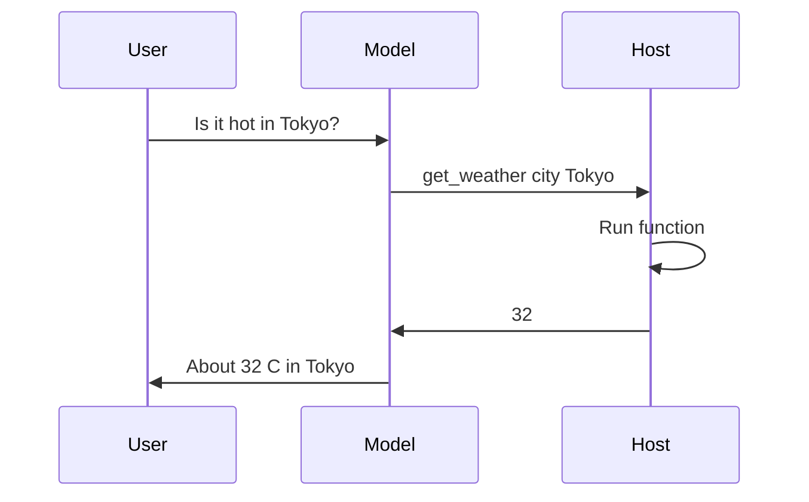

import { ConceptTemplate } from '@/features/kb/components/templates/ConceptTemplate'
import { Callout } from '@/features/kb/components/mdx/Callout'
import { ComparisonTable } from '@/features/kb/components/mdx/ComparisonTable'

export default function Layout({ children }) {
  return (
    <ConceptTemplate title="Function Calling">
      {children}
    </ConceptTemplate>
  )
}

Early agents asked the model to "output JSON" in the chat and then regexed it. That breaks. **Function calling** (tool use) is the vendor protocol: you send **schemas**, the model returns a **typed call** (name + arguments) in a dedicated field, you execute, you send a **tool result** message, the model speaks or calls again.

OpenAI, Anthropic, Google, and most local stacks now have a flavour of this. It is the substrate under ReAct-style products.

## 1. Deep Dive and Mechanics

**Schema.** JSON Schema (or equivalent) for each tool: name, description, parameters. The description *is* the API docs the model reads. Vague descriptions cause wrong tools. Include when *not* to call.

**The model does not run your code.** It stops with a call object. Your process validates types, auth, and policy, then runs `get_weather("Tokyo")`. If you skip validation, you will pass `location: "'; DROP TABLE"`.

**Round trip.** User → model (call) → you (result) → model (answer). Parallel calls (several functions in one turn) need a fan-in. Errors should come back as tool results (`404 not found`), not as a crashed host — the model can recover.

**Constrained decode.** Some runtimes grammar-constrain arguments to the schema. Still check ranges and tenancy. A schema that says `string` will accept a 2MB blob.

<Callout icon="info" title="Parallel vs sequential">
Independent reads can run together. Writes that depend on a prior id must be sequential. If the model emits both at once, *you* serialise or reject the batch.
</Callout>

## 2. Mathematical / Theoretical Foundation

Fine-tuning (or preference training) shifts probability mass from natural language to schema-valid argument strings. The description tokens attend into the argument tokens. That is why a good description beats a clever regex.

Function calling is still sampling: required fields can be omitted. Treat parse failure as a tool error and retry with a short "your last call was invalid" observation.

<ComparisonTable
  headers={['Style', 'Who parses', 'Reliability']}
  rows={[
    ['Prose plus regex', 'You, badly', 'Low'],
    ['Native function call', 'The API', 'High'],
    ['MCP tools', 'Protocol + you', 'High if schema is tight'],
  ]}
/>

## 3. Real-World Implementation

```python
tools = [{
    'type': 'function',
    'function': {
        'name': 'get_weather',
        'description': 'Current temperature in Celsius for a city.',
        'parameters': {
            'type': 'object',
            'properties': {
                'city': {'type': 'string'},
            },
            'required': ['city'],
        },
    },
}]

# 1) model returns tool_calls[0].function.arguments == '{"city":"Tokyo"}'
# 2) temp = get_weather('Tokyo')
# 3) append role=tool content=str(temp) and call the model again
```

## 4. Visualizations



## 5. Interview Prep

**Q: Function calling vs ReAct?**
**A:** ReAct is the *cognitive* pattern (thought, act, observe). Function calling is the *wire* format. You can ReAct with native tools (thoughts in content, acts as tool_calls).

**Q: Why did the model call the tool with yesterday's city?**
**A:** Stale names in the thread. Repeat entities in the tool description ("use the city from the latest user message") or pass structured state yourself.

**Q: Can the model call undeclared functions?**
**A:** A well-built API will not execute them. Still ignore unknown names. Never `eval` a name string.

## 6. Production Use Cases

- **Assistants:** calendar, CRM, search.
- **Agents:** every tool in the loop is a function call.
- **Structured extraction:** a dummy tool whose args *are* the schema you want (function-calling as JSON mode).

<Callout icon="warning" title="Idempotency">
Retries will double-charge if `create_payment` is not idempotent. Put idempotency keys in the schema and in your backend.
</Callout>
