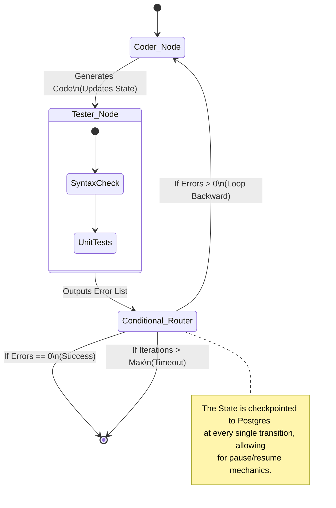

import { ConceptTemplate } from '@/features/kb/components/templates/ConceptTemplate'
import { Callout } from '@/features/kb/components/mdx/Callout'

export default function Layout({ children }) {
  return (
    <ConceptTemplate title="LangGraph (Stateful Agent Orchestration)">
      {children}
    </ConceptTemplate>
  )
}

Standard LangChain pipelines (built with LCEL) are mathematically defined as **Directed Acyclic Graphs (DAGs)**. They execute deterministically from Start to Finish and mathematically cannot contain loops. 

However, autonomous AI Agents *must* loop. The fundamental ReAct pattern requires an Agent to Think, Act, Observe, and then mathematically loop backward to Think again. To solve this, the LangChain team created **LangGraph**, a framework that extends LangChain by treating Agent workflows as **State Machines** capable of complex, cyclical, and stateful execution.

## 1. Deep Dive & Mechanics

### The Core Components
LangGraph abandons the monolithic "AgentExecutor" black box and forces you to mathematically define your Agent as a strict Graph.

1. **State**: The mathematical backbone of the Graph. It is a strictly typed object (usually a Python `TypedDict` or Pydantic model) that is continuously passed between nodes. It holds the entire memory of the workflow (e.g., `current_code`, `list_of_errors`, `conversation_history`).
2. **Nodes**: Standard Python functions. A Node receives the current State, mathematically processes it (usually by calling an LLM or a Tool), and returns a *delta* (an update) that is merged back into the State.
3. **Edges (Conditional Logic)**: The mathematical routing layer. Instead of a hardcoded linear path, Edges contain logic to determine the next Node. For example, *"If the State contains an Error, route to Node A. If the State contains Success, route to Node B."*

### Cyclical Execution and Multi-Agent Topologies
Because LangGraph mathematically supports cycles, you can orchestrate highly complex Multi-Agent systems.
If Node A (a Coder Agent) generates code, the State is passed to Node B (a Tester Agent). The Conditional Edge after Node B contains mathematical routing: *If tests pass, go to Node C (End). If tests fail, loop backward to Node A.* 
This creates a persistent, fault-tolerant mathematical loop that executes autonomously until the goal is met.

## 2. Mathematical / Theoretical Foundation

### State Management and Checkpointing
In standard LangChain, if an Agent crashes halfway through a 10-step reasoning loop, the entire process is destroyed.
LangGraph treats execution mathematically like a distributed database transaction by implementing **Checkpointers** (e.g., SQLite, Postgres).

After *every single Node* finishes executing, LangGraph mathematically pauses and serializes the exact state of the Graph (the `State` object and the current Node position) to a persistent database. 
This provides profound architectural advantages:
- **Fault Tolerance**: If the API times out at Step 8, you can instantly resume the Graph from Step 8.
- **Human-in-the-Loop**: You can mathematically force the Graph to pause at a specific Node. A human can physically inspect the State database, alter the LLM's generated code manually, and then hit "Resume", injecting human determinism directly into the autonomous loop.
- **Time Travel**: Because every state transition is recorded, you can mathematically rewind the Agent to a previous state and "fork" the execution down a different path to see alternative outcomes.

## 3. Real-World Implementation

Here is a production-grade implementation of a cyclical LangGraph architecture modeling a simple Code Generation & Validation loop.

```python
from typing import TypedDict, List
from langgraph.graph import StateGraph, END
from langchain_openai import ChatOpenAI

# 1. Define the Mathematical State
# This object is constantly passed and updated between Nodes
class AgentState(TypedDict):
    task: str
    generated_code: str
    errors: List[str]
    iterations: int

llm = ChatOpenAI(model="gpt-4-turbo")

# 2. Define the Nodes (Python Functions)
def generate_code_node(state: AgentState):
    """Generates code based on the task or fixes previous errors."""
    prompt = f"Write python for: {state['task']}. Fix these errors: {state['errors']}"
    response = llm.invoke(prompt)
    
    # Return the delta to mathematically update the state
    return {
        "generated_code": response.content, 
        "iterations": state["iterations"] + 1
    }

def test_code_node(state: AgentState):
    """A mock Node that attempts to execute the code and catches errors."""
    code = state["generated_code"]
    if "import sys" not in code: # Mock validation logic
        return {"errors": ["Missing sys import!"]}
    return {"errors": []}

# 3. Define the Conditional Edge Logic
def route_based_on_test(state: AgentState):
    """Mathematically determines the next Node."""
    if state["iterations"] > 3: # Prevent infinite mathematical loops
        return END
    if len(state["errors"]) > 0:
        return "coder" # Loop backward to fix the bug
    return END # Success, exit the graph

# 4. Compile the Graph
workflow = StateGraph(AgentState)

workflow.add_node("coder", generate_code_node)
workflow.add_node("tester", test_code_node)

workflow.set_entry_point("coder")
workflow.add_edge("coder", "tester")

# Inject the Conditional Edge to handle the loop
workflow.add_conditional_edges(
    "tester", 
    route_based_on_test,
    {"coder": "coder", END: END}
)

app = workflow.compile()

# 5. Execute the cyclical Graph
final_state = app.invoke({"task": "Write a basic script", "generated_code": "", "errors": [], "iterations": 0})
print("Final Output:", final_state["generated_code"])
```

## 4. Visualizations



<Callout icon="warning" title="The Infinite Loop Danger">
  Because LangGraph allows true mathematical cycles, you must explicitly code safeguards against infinite loops. If the Coder generates a bug, and the Tester reports it, but the Coder doesn't know how to fix it, the two Nodes will infinitely bounce the State back and forth, consuming hundreds of dollars in OpenAI API credits in minutes. Always include an `iteration_count` in your State and enforce a hard mathematical break in your Conditional Edges.
</Callout>

## 5. Interview Prep

**Q: Why was LangGraph created when LangChain already had `AgentExecutor`?**
**Answer:** `AgentExecutor` is a monolithic black box. It handles the ReAct loop internally. If you wanted to customize exactly *how* the Agent loops, or add a second Agent into the loop, it was mathematically impossible without rewriting core LangChain library code. LangGraph exposes the loop itself to the developer as a mathematical Graph, allowing infinite customization of Multi-Agent topologies.

**Q: Explain how State Reducers work in LangGraph.**
**Answer:** By default, when a Node returns a value (e.g., `{"messages": ["Hello"]}`), LangGraph will overwrite the existing `messages` key in the State. In conversational Agents, you don't want to overwrite history; you want to mathematically *append* to it. LangGraph uses the `Annotated` and `operator.add` syntax (Reducers) in the State definition to mathematically instruct the engine to concatenate the arrays rather than overwriting them, preserving the full context window.

**Q: How does LangGraph handle Multi-Agent collaboration compared to AutoGen?**
**Answer:** AutoGen treats Agents as distinct entities talking to each other in a virtual chat room, generating a massive, highly unstructured conversation log. LangGraph treats Multi-Agent systems as a strict State Machine. Agent A and Agent B do not "chat"; they are simply Nodes in a graph that take turns reading and mathematically modifying a shared, highly structured State object (like a JSON payload), leading to significantly more predictable and deterministic execution in enterprise environments.

## 6. Production Use Cases

- **AI Software Engineering (SWE-Agent):** Princeton's SWE-Agent (which achieves state-of-the-art scores on resolving GitHub issues autonomously) is mathematically modeled using graphs similar to LangGraph. The system navigates directories, views files, and runs bash commands. If a bash command fails, the Graph loops back, feeding the exact terminal stderr into the State, allowing the LLM to recursively debug its own code until the GitHub tests pass.
- **Customer Support Triage:** Enterprise support centers use LangGraph to route tickets. A Triage Node reads the incoming email and mathematically updates the State. A Conditional Edge routes the State to either the Billing Node (an LLM with Stripe API tools) or the Technical Node (an LLM with internal Confluence tools). If the Billing Node realizes it needs technical help, it can mathematically route the State sideways to the Technical Node, ensuring the user gets a seamless, multi-disciplinary answer.