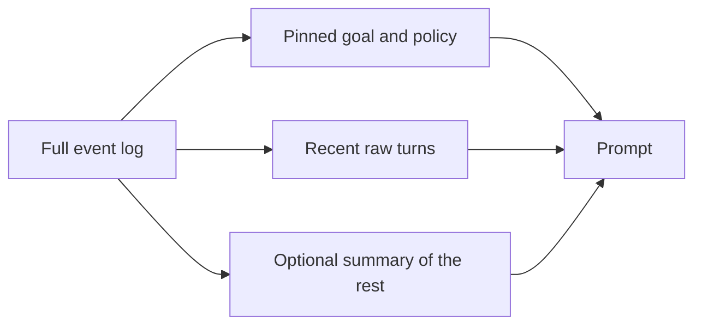

import { ConceptTemplate } from '@/features/kb/components/templates/ConceptTemplate'
import { Callout } from '@/features/kb/components/mdx/Callout'
import { ComparisonTable } from '@/features/kb/components/mdx/ComparisonTable'

export default function Layout({ children }) {
  return (
    <ConceptTemplate title="Short-Term Memory">
      {children}
    </ConceptTemplate>
  )
}

The model has no session. **Short-term memory** is whatever you **resend** on the next call: system prompt, recent turns, tool scratchpad. It dies when the request ends unless you persist it (then it is becoming long-term). The constraint is the **context window** and the **price** of filling it.

Sibling pages: **long-term** (facts across weeks) and **episodic** (whole past runs). This page is *this conversation, right now*.

## 1. Deep Dive and Mechanics

**Raw buffer.** Append every user/assistant/tool message. Trivial. Hits the wall at 8k–200k tokens depending on the model. Also hits **lost-in-the-middle** long before the hard cap.

**Sliding window.** Keep the last N turns or last T tokens. Oldest messages drop. The agent forgets the original goal if that was turn 1 — so *pin* the goal and the system prompt outside the slider.

**Rolling summary.** When the buffer crosses a threshold, a cheap model compresses the oldest slice into a paragraph ("User wants a FastAPI service; we chose Postgres"). Delete the slice, keep the summary + recent raw turns. Distortion is the failure mode (summaries drop numbers).

**Scratchpad vs chat.** Tool observations are huge. Store raw logs in a sidecar; put a 2-line digest in the window. Do not keep four full HTML pages in "short-term memory."

<Callout icon="warning" title="Pin the invariants">
If the slider can drop "never email the customer" or the ticket id, you will violate policy. Separate *policy and IDs* (always present) from *chitchat* (slidable).
</Callout>

## 2. Mathematical / Theoretical Foundation

Short-term memory is a **lossy codec** from event log → token sequence under budget B. Sliding window is a rectangular window. Summarisation is a learned compressor with no bit-rate guarantee. You can measure *reconstruction*: can a judge recover the goal and constraints from the packed prompt? If not, the codec is too lossy.

<ComparisonTable
  headers={['Policy', 'Forgets', 'Cost']}
  rows={[
    ['Full buffer', 'Nothing until overflow', 'Grows without bound'],
    ['Last N turns', 'Early constraints', 'Bounded'],
    ['Summary plus tail', 'Details in the summary', 'Bounded, extra LLM call'],
  ]}
/>

## 3. Real-World Implementation

```python
def pack_short_term(messages, max_tokens, encode, pin):
    tail = []
    used = encode(pin)
    for m in reversed(messages):
        cost = encode(m)
        if used + cost > max_tokens:
            break
        tail.append(m)
        used += cost
    return pin + list(reversed(tail))
```

Run summarisation on the messages that did not fit, and prepend that as a pinned system note.

## 4. Visualizations



## 5. Interview Prep

**Q: Is a 1M context window the end of memory engineering?**
**A:** No. Attention quality and cost still punish dumping a month of Slack. Retrieve, do not staple.

**Q: Buffer memory vs knowledge graph?**
**A:** Buffer is short-term tokens. A KG is long-term structure. Do not store "user is vegan" only in a 20-turn slider.

**Q: Where does the ReAct scratchpad live?**
**A:** Short-term. Trim tool payloads or the next thought drowns.

## 6. Production Use Cases

- **Chat UIs:** last k turns + summary.
- **Agent loops:** last observations + pinned goal.
- **Voice:** tighter windows; summarise aggressively.

<Callout icon="tip" title="Token-account the turn">
Log prompt tokens *by section* (system, pin, summary, tail, tools). When a ticket is expensive, you will see which section ate the budget.
</Callout>
