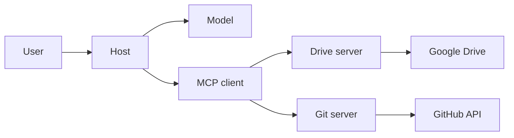

import { ConceptTemplate } from '@/features/kb/components/templates/ConceptTemplate'
import { Callout } from '@/features/kb/components/mdx/Callout'
import { ComparisonTable } from '@/features/kb/components/mdx/ComparisonTable'

export default function Layout({ children }) {
  return (
    <ConceptTemplate title="Model Context Protocol (MCP)">
      {children}
    </ConceptTemplate>
  )
}

Before MCP, every "connect the model to Drive / Slack / Postgres" pair was a one-off SDK. **Model Context Protocol** (Anthropic, now widely adopted) is a **JSON-RPC** contract: a **host** (Claude Desktop, Cursor, your agent runtime) speaks to **servers** that expose **tools**, **resources**, and **prompts**. Swap the model; keep the servers.

## 1. Deep Dive and Mechanics

**Roles.** *Host* owns UX and the model. *Client* (inside the host) maintains a session to a *server*. *Server* wraps one domain (filesystem, GitHub, a DB). Transports: stdio for local processes, HTTP/SSE for remote.

**Tools.** Same idea as function calling: name, description, JSON Schema, invoke. The host advertises server tools to the model and routes the call back.

**Resources.** Readable URIs (`file://`, `postgres://…`) the host can pull into context on demand — not everything is a tool call.

**Prompts.** Named templates the server offers (e.g. "review this PR") so the host can show a slash-command instead of inventing a prompt.

**Auth.** Local stdio servers inherit your user. Remote servers need OAuth and least privilege. A "filesystem MCP" pointed at `/` is a footgun.

<Callout icon="warning" title="MCP is not a security boundary">
A server is as trusted as the process you launched. Review the source, pin versions, and do not "install 40 community servers" on a machine with prod creds.
</Callout>

## 2. Mathematical / Theoretical Foundation

MCP is an **interface definition** plus a session protocol (initialize, list tools, call, notifications). It decouples *capability discovery* from *model vendor*. That is the same move COM/gRPC made for apps: one IDL, many implementations.

Idempotency and schema evolution still sit on you. A server that changes a required field will break every host until they refresh `tools/list`.

<ComparisonTable
  headers={['Layer', 'Job']}
  rows={[
    ['Model API', 'Sample tokens / tool_calls'],
    ['Host', 'Policy, UX, which servers to start'],
    ['MCP', 'Discover and invoke capabilities'],
    ['Server', 'Talk to the real system'],
  ]}
/>

## 3. Real-World Implementation

A server registers a tool; the host does not import your Python.

```python
# Sketch: server advertises tools/list then handles tools/call
# Host maps that onto the model's function-calling schema each turn.
```

In Cursor or Claude Desktop you add a server command in config; the host spawns stdio and lists tools at startup.

## 4. Visualizations



## 5. Interview Prep

**Q: MCP vs OpenAI plugins / custom GPTs?**
**A:** Same dream (external tools). MCP is an open, multi-host protocol, not tied to one chat product. Plugins were a store + a different schema.

**Q: MCP vs LangChain tools?**
**A:** LangChain tools are in-process Python. MCP tools can live in another process or machine and be reused by any MCP host. You can wrap an MCP server as LangChain tools.

**Q: What about sampling?**
**A:** Some MCP flows let a *server* ask the *host* to run a model completion (sampling). That inverts control — treat it as privileged.

## 6. Production Use Cases

- **IDE agents:** repo, terminal, browser servers.
- **Enterprise:** one official MCP server per system of record, centrally approved.
- **Local data:** filesystem and git servers for a single developer laptop.

<Callout icon="tip" title="Version the server">
Log `server name + version + tool hashes` next to each agent trace. When a tool silently changes behaviour, you will know which binary did it.
</Callout>
