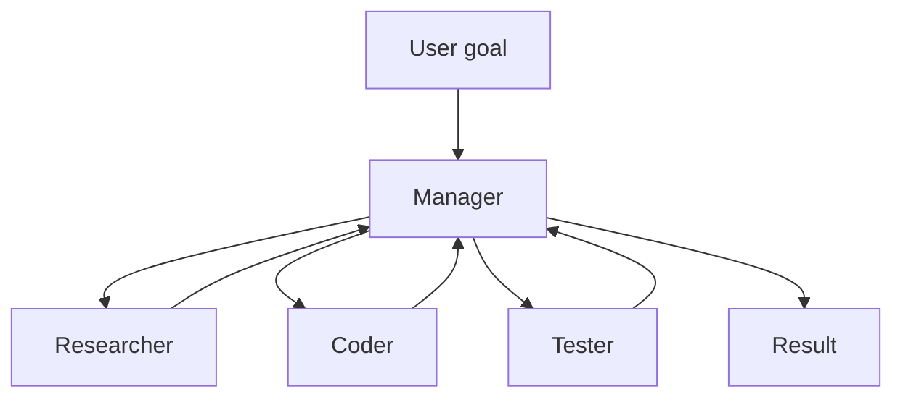

import { ConceptTemplate } from '@/features/kb/components/templates/ConceptTemplate'
import { Callout } from '@/features/kb/components/mdx/Callout'
import { ComparisonTable } from '@/features/kb/components/mdx/ComparisonTable'

export default function Layout({ children }) {
  return (
    <ConceptTemplate title="Multi-Agent Systems">
      {children}
    </ConceptTemplate>
  )
}

One model with one huge prompt will overflow and thrash. A **multi-agent system** is several **roles** (prompts + tools + maybe different models) that **communicate**. AutoGen chats. CrewAI assigns tasks. LangGraph nodes share a typed state. The theory is older than LLMs (DAI, contract nets). The new part is that each agent is a sampled policy, not a finite-state person.

## 1. Deep Dive and Mechanics

**Why specialise.** A tester prompt that only writes tests will not also invent a new product strategy in the same breath. Narrow system prompts cut the action space and the hallucination surface *inside that role*.

**Topologies.**

- **Pipeline / sequential:** A finishes, B sees only A's output. Predictable, cheap context.
- **Hierarchy:** a manager decomposes and delegates (CrewAI hierarchical, SK planner).
- **Group chat / swarm:** anyone may speak; a router picks next. Creative, quadratic tokens, easy loops.
- **Shared state machine:** no "chat," only deltas to a JSON state (LangGraph). Most enterprise-friendly.

**Coordination bugs.** Two agents edit the same file. A manager never stops. A critic rubber-stamps. You need locks, a single writer for each artifact, and a termination predicate.

<Callout icon="warning" title="N agents is not N times smarter">
It is often N times the tokens and N times the chances to misunderstand a handoff. Start with two roles and a structured payload, not a twelve-agent "company."
</Callout>

## 2. Mathematical / Theoretical Foundation

Classical MAS: agents, environment, communication language, utility. LLM-MAS replace utilities with prompts. Token cost of group chat is roughly quadratic in turns if everyone sees the full log. Task isolation (pass only the `expected_output`) is `O(steps)` context.

Consensus is not majority vote of truth — it is majority vote of samples. Use tests as the tie-break.

<ComparisonTable
  headers={['Topology', 'Context growth', 'Control']}
  rows={[
    ['Sequential pipeline', 'Linear in handoffs', 'High'],
    ['Hierarchy', 'Manager plus worker', 'Medium-high'],
    ['Group chat', 'Quadratic in turns', 'Low'],
    ['Shared state graph', 'State-sized', 'High'],
  ]}
/>

## 3. Real-World Implementation

```python
# Sequential handoff: only the artifact moves
research = researcher.run(goal)
post = writer.run(research.summary)
```

Prefer this over a 20-message group chat for a newsletter.

## 4. Visualizations



## 5. Interview Prep

**Q: Multi-agent vs one agent with many tools?**
**A:** One agent is simpler if tools are few. Split roles when prompts conflict (creative writer vs pedantic reviewer) or context must stay small.

**Q: How do you eval a crew?**
**A:** Same as agent eval, plus handoff quality (did B receive a complete artifact?). Blame the interface schema, not "the AI."

**Q: AutoGen vs CrewAI vs LangGraph?**
**A:** Chat vs task assembly line vs explicit graph. Pick based on how much emergence you can tolerate.

## 6. Production Use Cases

- **Content pipelines:** research → draft → edit → SEO.
- **SWE:** implementer + reviewer + CI voice.
- **Simulations:** red vs blue teams with a referee.

<Callout icon="tip" title="Type the handoff">
The message from A to B should be a schema (markdown sections or JSON), not a novel. B's prompt should say "if a field is missing, refuse."
</Callout>
