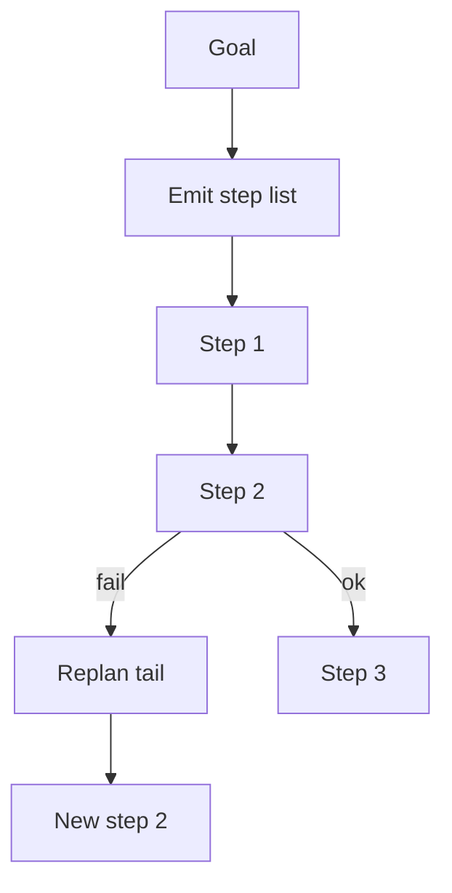

import { ConceptTemplate } from '@/features/kb/components/templates/ConceptTemplate'
import { Callout } from '@/features/kb/components/mdx/Callout'
import { ComparisonTable } from '@/features/kb/components/mdx/ComparisonTable'

export default function Layout({ children }) {
  return (
    <ConceptTemplate title="Agent Planning">
      {children}
    </ConceptTemplate>
  )
}

"Deploy the web server" as a first tool call is how you get a half-configured box. **Planning** is a phase where the model **cannot** touch tools (or can only use read-only ones) and must emit a structured list of steps. Execution is a later phase that walks the list and replans on failure.

## 1. Deep Dive and Mechanics

**Decomposition.** Force a JSON array: install packages, write files, open ports, start the unit. Each item is a smaller goal with an owner (tool or sub-agent). The list becomes attention scaffolding: step 3 is generated in the context of 1 and 2.

**Plan-and-execute.** Write the plan once, then ReAct *inside* each step. If a step fails, mark it failed and either retry, skip, or regenerate the tail of the plan. Hugging Face / LangChain "plan-and-execute" agents are this split.

**Tree of Thoughts (ToT).** Sample several plans, score them (a critic model or rubrics: risk, cost, irreversibility), prune, expand the winner. Expensive. Worth it when the first-action mistake is catastrophic (migrations, prod flags).

**Classical planners.** PDDL and goal-stack planning still exist. LLMs are bad at numeric resource constraints; a symbolic planner plus an LLM that *fills* operator parameters is a serious architecture for robotics and workflows.

<Callout icon="warning" title="Stale plans">
A plan written before you discovered the staging cluster is down will march into a wall. Replan on observation, or use ReAct without a frozen list when the world is unknown.
</Callout>

## 2. Mathematical / Theoretical Foundation

A plan is a path in a state space (or a DAG of tasks with dependencies). LLM planning is *approximate* search: the model samples from `P(steps | goal)` learned from text, not from a complete world model. ToT is explicit tree search with a heuristic scorer. Completeness is not guaranteed; **budgeted** search is.

Dependency graphs (step B needs output of A) are DAGs. Parallelise independent siblings. That is workflow orchestration with a generated graph.

<ComparisonTable
  headers={['Style', 'When', 'Cost']}
  rows={[
    ['ReAct only', 'Unknown, cheap tools', 'Many model calls'],
    ['Plan then execute', 'Known recipe', 'One plan plus steps'],
    ['ToT', 'High cost of first error', 'Many plan samples'],
  ]}
/>

## 3. Real-World Implementation

```python
PLAN_PROMPT = '''Goal: {goal}
Return JSON list of steps with fields id, action, depends_on.
Do not call tools.'''

plan = parse_json(llm(PLAN_PROMPT.format(goal=goal)))
for step in topo_sort(plan):
    result = execute(step)
    if not result.ok:
        plan = replan(goal, plan, step, result)
```

Validate the JSON against a schema; reject steps whose `action` is not in the tool list.

## 4. Visualizations



## 5. Interview Prep

**Q: Is chain-of-thought planning?**
**A:** CoT is unstructured tokens. Planning is a *data structure* you can execute, skip, and test. Prefer the latter in production.

**Q: How do you stop hallucinated steps?**
**A:** Closed action set. Every step must name a real tool or a real sub-agent. "Configure Kubernetes by vibes" is not a step.

**Q: Planning vs multi-agent?**
**A:** A planner can be one model. Multi-agent assigns steps to specialists. You can plan *then* delegate.

## 6. Production Use Cases

- **SWE:** outline files to touch, then edit.
- **Research:** outline sources to gather, then retrieve.
- **Migrations:** ordered DDL with a human gate before apply.

<Callout icon="tip" title="Show the plan">
Users trust agents that display the step list and let them uncheck "restart production." HITL on the plan is cheaper than HITL on every tool.
</Callout>
