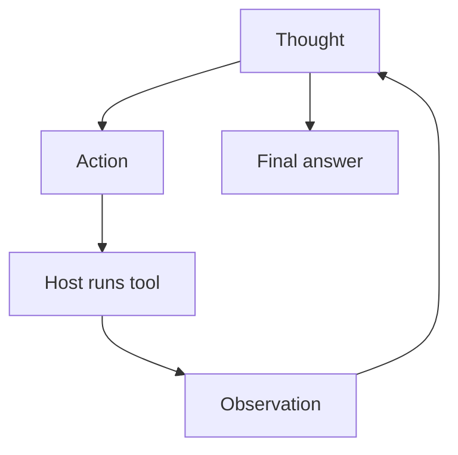

import { ConceptTemplate } from '@/features/kb/components/templates/ConceptTemplate'
import { Callout } from '@/features/kb/components/mdx/Callout'
import { ComparisonTable } from '@/features/kb/components/mdx/ComparisonTable'

export default function Layout({ children }) {
  return (
    <ConceptTemplate title="ReAct Pattern (Reason + Act)">
      {children}
    </ConceptTemplate>
  )
}

**ReAct** (Yao et al., Princeton / Google) is the pattern that turned LLMs into agents in the 2022–2023 papers: the model must emit a **Thought**, then an **Action**, then the host injects an **Observation**, then another Thought. The thought is not decoration. It writes tokens the next action attends to.

Native function calling can hide the "Action:" string; the loop is the same.

## 1. Deep Dive and Mechanics

**The cycle.** Thought: "I need Paris coordinates." Action: `geocode("Paris")`. Pause. Observation: `48.86, 2.35`. Thought: "Now weather at that point." Action: `weather(48.86, 2.35)`. Eventually Thought: "I can answer" and a final string with no action.

**Why thought helps.** Action-only agents skip justification and jump to a plausible-looking tool. Generating the thought fills the context with constraints ("must be Celsius", "user said tomorrow not today") that steer the action tokens.

**Format.** Early ReAct used brittle `Action: Tool[arg]` lines. Today: tool_calls plus optional chain-of-thought in content (or a hidden reasoning channel). Still log the thought for eval.

**Failure modes.** Invented observations (model never stopped for the host). Thought/action mismatch. Infinite "let me try again" thoughts. Cap steps; detect repeated actions.

<Callout icon="info" title="Thoughts leak">
If you stream thoughts to end users, you will leak tool names, internal URLs, and half-wrong plans. Keep thoughts in the trace; show the final answer and citations.
</Callout>

## 2. Mathematical / Theoretical Foundation

ReAct is prompted policy improvement: augment the state with a textual latent (the thought) before selecting an action. It is related to chain-of-thought (reason only) and to MRKL/toolformer (act only). Empirically, interleaving beats either alone on knowledge + API tasks (Hotpot-style + tools).

There is no proof the thought is *true* — it is a scratchpad. Verifiers and traces still matter.

<ComparisonTable
  headers={['Pattern', 'Writes thoughts', 'Calls tools']}
  rows={[
    ['CoT', 'Yes', 'No'],
    ['Tool-only', 'No', 'Yes'],
    ['ReAct', 'Yes', 'Yes'],
    ['Plan-then-act', 'Plan up front', 'Yes, after'],
  ]}
/>

## 3. Real-World Implementation

```text
Thought: Need a numeric temperature, not a guess.
Action: get_weather
Args: city=Paris
Observation: 12 C, light rain
Thought: Enough to answer.
Final: It is about 12 C and rainy in Paris.
```

The host parses Action/Args (or tool_calls), never lets the model write the Observation line itself.

## 4. Visualizations



## 5. Interview Prep

**Q: ReAct vs plan-and-execute?**
**A:** ReAct replans every step (flexible, myopic). Plan-and-execute writes a list first (cheaper, stale if step 1 fails). Hybrids replan on error.

**Q: Do we still need ReAct if we have function calling?**
**A:** You need the *loop*. Function calling is the envelope. Many teams keep a short thought field for debuggability.

**Q: How does this interact with RAG?**
**A:** `search` is just another action. Multi-hop RAG *is* ReAct over a retriever.

## 6. Production Use Cases

- **Almost every tool-using assistant** shipped since 2023.
- **Research agents:** search → read → search.
- **Ops copilots:** inspect metric → open runbook → propose command.

<Callout icon="tip" title="Stop token">
Train or prompt a dedicated `finish` tool instead of hoping the model stops emitting actions. The host should treat `finish` as the only legal way out of the loop.
</Callout>
