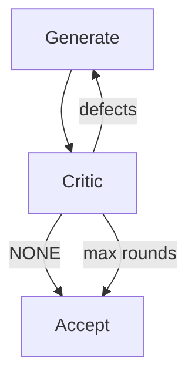

import { ConceptTemplate } from '@/features/kb/components/templates/ConceptTemplate'
import { Callout } from '@/features/kb/components/mdx/Callout'
import { ComparisonTable } from '@/features/kb/components/mdx/ComparisonTable'

export default function Layout({ children }) {
  return (
    <ConceptTemplate title="Agent Reflection">
      {children}
    </ConceptTemplate>
  )
}

First drafts are wrong. **Reflection** (Reflexion, Self-Refine, critic–actor setups) makes that explicit: a **generator** produces work; a **critic** (same weights, different prompt — or a stronger model) lists faults; the generator revises. Repeat until the critic is quiet or the iteration cap hits.

This is not "the model is sentient." It is a second sample from a distribution tilted toward *finding bugs*.

## 1. Deep Dive and Mechanics

**Self-refine.** One model, two prompts. Pass 1: write the function. Pass 2: "list defects." Pass 3: "apply the list." Cheap and effective for style and obvious bugs.

**Reflexion.** Verbal feedback is stored in **episodic memory** so the *next* episode starts with "last time tests failed because of X." Learning across runs without gradient updates.

**Separate critic.** A model that cannot see the user's charm, only the artifact + spec + test log. Reduces the generator cheering for itself.

**Ground the critic.** The best critic is *not* an LLM: compilers, linters, unit tests, NLI against sources. Use the LLM critic for what tests cannot see (unclear API, missing edge case in prose).

<Callout icon="warning" title="Agreeable critics">
If you ask "is this good?" the model says yes. Ask for a *numbered list of defects* and require `NONE` as the only success token. Empty flattery is a failed critic.
</Callout>

## 2. Mathematical / Theoretical Foundation

Reflection is iterative local search: state = current artifact, neighbor = revision given a critique. No guarantee of a global optimum; you can cycle (fix A, break B, fix B, break A). Cap iterations and keep the best scoring artifact (tests + critic score).

Self-consistency (sample many, vote) is a cousin that does not edit — it picks. Reflection *edits*. Combine: generate k, critic-rank, refine the winner.

<ComparisonTable
  headers={['Loop', 'Feedback source', 'Persists across sessions']}
  rows={[
    ['Self-refine', 'Same model', 'No'],
    ['Reflexion', 'LLM plus memory write', 'Yes, if stored'],
    ['Test-driven', 'Compiler / tests', 'Via the repo'],
  ]}
/>

## 3. Real-World Implementation

```python
def refine(llm, spec, draft, rounds=3):
    work = draft
    for _ in range(rounds):
        critique = llm(f'Spec:\n{spec}\n\nWork:\n{work}\n\nList defects or NONE.')
        if critique.strip() == 'NONE':
            return work
        work = llm(f'Revise to fix:\n{critique}\n\nCurrent:\n{work}')
    return work
```

Add `pytest` between rounds when the artifact is code.

## 4. Visualizations



## 5. Interview Prep

**Q: Reflection vs reranking?**
**A:** Rerank picks among candidates. Reflection mutates one candidate. Use rerank when generation is cheap; reflect when one item is expensive (a full PR).

**Q: Why does self-critique miss security bugs?**
**A:** The generator and critic share blind spots. Pair with static analysis and human review for authz.

**Q: Is chain-of-thought already reflection?**
**A:** CoT happens *before* the first answer. Reflection happens *after* an artifact exists. Different timing.

## 6. Production Use Cases

- **Code agents:** generate → test → reflect on stderr.
- **Writing:** outline → draft → editor pass.
- **RAG:** answer → faithfulness critic → regenerate ungrounded sentences.

<Callout icon="tip" title="Budget the loop">
Two refine rounds catch most cheap errors. Five rounds burn tokens and start oscillating. Log which round first passed tests.
</Callout>
