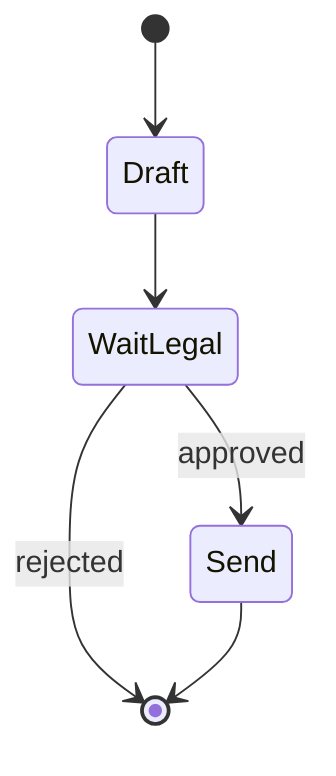

import { ConceptTemplate } from '@/features/kb/components/templates/ConceptTemplate'
import { Callout } from '@/features/kb/components/mdx/Callout'
import { ComparisonTable } from '@/features/kb/components/mdx/ComparisonTable'

export default function Layout({ children }) {
  return (
    <ConceptTemplate title="Workflow Orchestration">
      {children}
    </ConceptTemplate>
  )
}

A `while` loop in a web request is not an orchestration layer. If the process dies after three expensive LLM calls, you pay again. **Workflow orchestration** (Temporal, Airflow, Inngest, LangGraph + checkpointer, Azure Durable Functions) stores **state**, **retries** with policy, and **resumes** at the failed node.

Agents are optional nodes inside that graph. The graph is what you operate in production.

## 1. Deep Dive and Mechanics

**DAG vs cyclic.** ETL is a DAG. Agent loops are cyclic. Airflow-style tools want DAGs; Temporal and LangGraph allow wait / continue-as-new / cycles with guards.

**State and checkpoint.** After each node, persist inputs/outputs. Replay is deterministic for non-LLM nodes; for LLM nodes you *store the completion* so resume does not resample a different plan.

**Timers and HITL.** Sleep until a Slack button. The orchestrator, not your Flask process, owns the park. Human approval is a special event that unblocks the next node.

**Idempotency.** Retries will happen. Tool nodes must tolerate that (keys, upserts).

<Callout icon="info" title="Separate think from commit">
A node that "calls the LLM and also charges the card" is a bad node. Split: draft → approve → charge. Orchestrators make that split cheap.
</Callout>

## 2. Mathematical / Theoretical Foundation

A workflow is a state machine `(S, s0, T)` with durable logging of transitions (event sourcing). Exactly-once *effects* are usually at-least-once plus idempotent handlers. Compensation (sagas) undoes step 3 if step 4 fails — important when you cannot two-phase-commit an LLM and Stripe.

<ComparisonTable
  headers={['Tool', 'Shape', 'Fits']}
  rows={[
    ['Airflow / Prefect', 'DAG batches', 'Nightly ingest plus RAG rebuild'],
    ['Temporal / Inngest', 'Long-running', 'Human wait, retries'],
    ['LangGraph', 'Agent cycles', 'In-app agent state'],
  ]}
/>

## 3. Real-World Implementation

```python
# Pseudocode: durable steps
async def onboard(ctx, user_id):
    draft = await ctx.run('draft', llm_draft, user_id)
    ok = await ctx.wait_for_signal('legal_ok', timeout='7d')
    if not ok:
        return 'rejected'
    await ctx.run('send', send_contract, draft.id)
```

`ctx.run` records the result; a crash after `draft` will not recall the model.

## 4. Visualizations



## 5. Interview Prep

**Q: Why not Kubernetes Jobs plus a database?**
**A:** You will reinvent timers, visibility, and poison-message handling. Use a workflow engine unless the graph is three steps and you enjoy on-call.

**Q: LangGraph vs Temporal?**
**A:** LangGraph is in-process agent state + optional DB checkpointer. Temporal is a cluster for any long-running business process. Large shops use Temporal *around* an agent, not instead of prompts.

**Q: How do you test workflows?**
**A:** Time-skip, inject signals, assert the event log. Do not sleep 7 days in CI.

## 6. Production Use Cases

- **Contract / KYC:** generate → human → send.
- **RAG ingest:** parse → embed → upsert, nightly, with retries.
- **Support escalation:** agent tries → wait for human → close.

<Callout icon="tip" title="Name versions">
`workflow_id + version` so you can migrate in-flight runs instead of leaving them on a deleted graph.
</Callout>
