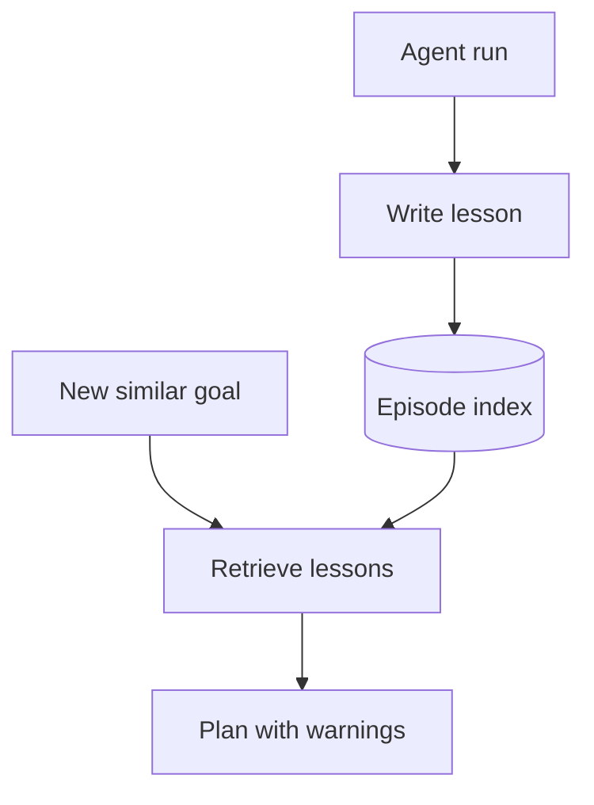

import { ConceptTemplate } from '@/features/kb/components/templates/ConceptTemplate'
import { Callout } from '@/features/kb/components/mdx/Callout'
import { ComparisonTable } from '@/features/kb/components/mdx/ComparisonTable'

export default function Layout({ children }) {
  return (
    <ConceptTemplate title="Episodic Memory">
      {children}
    </ConceptTemplate>
  )
}

Semantic long-term memory stores *facts* ("user is vegan"). **Episodic memory** stores *what happened*: goal, sequence of actions, observations, success or failure. Humans remember the stove. Agents without episodes will rerun the same bad SQL after the context window clears.

Reflexion-style systems write a paragraph of **lesson** after each episode and retrieve it when a new goal is similar.

## 1. Deep Dive and Mechanics

**Record.** At episode end, persist goal, trace id, tools used, outcome, lesson, and an embedding of goal plus lesson. Do not store every token of HTML; store the lesson and pointers to the full trace in object storage.

**Retrieve.** Before planning, search episodes by goal similarity. Inject: "Similar past run failed because migrations were applied twice; use an idempotency key."

**Write the lesson with a critic.** A raw trace is too long to help. A 5-line postmortem is the usable artifact. Generate it from the trace + test output.

**Forgetting.** Failed experiments from a deprecated API should expire. TTL or "superseded by episode X" keeps the store from becoming a museum of bad ideas.

<Callout icon="info" title="Episode is not a chat log">
Short-term memory *is* the live log. An episode is a *closed case file*. If you blur them, you will retrieve last Tuesday's 80-turn argument into today's 4-step task.
</Callout>

## 2. Mathematical / Theoretical Foundation

In cognitive science, episodic vs semantic is Tulving's split. In agents it is **instance memory** vs **semantic memory**. Retrieval is still nearest-neighbor in embedding space, but the *key* is the goal (and maybe repo/environment tags), and the *value* is a trajectory summary.

Credit assignment: the lesson should name the *failing action*, not "be more careful."

<ComparisonTable
  headers={['Memory kind', 'Unit', 'Question it answers']}
  rows={[
    ['Short-term', 'Tokens this session', 'What did we just say?'],
    ['Long-term semantic', 'Fact / preference', 'What is true about the user?'],
    ['Episodic', 'A finished run', 'What happened last time we tried this?'],
  ]}
/>

## 3. Real-World Implementation

```python
def close_episode(goal, trace, ok, index, embed, llm):
    lesson = llm(f'Goal: {goal}\nTrace: {summarise(trace)}\nOutcome: {ok}\nWrite 5 lines of lessons.')
    index.upsert(
        vector=embed(goal + ' ' + lesson),
        payload={'goal': goal, 'ok': ok, 'lesson': lesson},
    )

def prior_lessons(goal, index, embed, k=3):
    return index.search(embed(goal), k=k)
```

## 4. Visualizations



## 5. Interview Prep

**Q: Why not always retrieve all failures?**
**A:** Negative transfer: a failure about *email* should not scare a *SQL* task. Filter by tool tags or repo.

**Q: Episode vs eval golden traces?**
**A:** Goldens are curated and versioned. Episodes are live and noisy. Use goldens for CI; episodes for hints.

**Q: Can episodes replace fine-tuning?**
**A:** They are complementary. Episodes give *instance* hints at inference. Fine-tuning changes the prior. Start with episodes; they are cheaper to revert.

## 6. Production Use Cases

- **SWE agents:** "last time pytest failed on missing `conftest` fixture."
- **Support:** "this error code was a known outage; do not file a new bug."
- **Red team:** store successful attack traces *offline*, not in the production agent's retrieve set.

<Callout icon="tip" title="Index the failure, not the novel">
The embedding should be `goal + error signature`, not the full thought dump. Retrieval quality tracks key design, same as RAG chunking.
</Callout>
