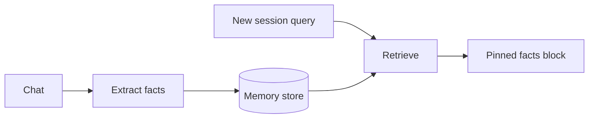

import { ConceptTemplate } from '@/features/kb/components/templates/ConceptTemplate'
import { Callout } from '@/features/kb/components/mdx/Callout'
import { ComparisonTable } from '@/features/kb/components/mdx/ComparisonTable'

export default function Layout({ children }) {
  return (
    <ConceptTemplate title="Long-Term Memory">
      {children}
    </ConceptTemplate>
  )
}

Short-term memory is the current prompt. **Long-term memory** is a **store** you query at the start of a session (and after big events): "user is vegan," "prod cluster is `eu-west-1`," "never use Sentry project X." Implementations: vector DBs, key-value profiles, knowledge graphs. MemGPT-style agents expose **memory tools** so the model writes and GC's its own store.

## 1. Deep Dive and Mechanics

**Write path.** After a turn (or in a background job), extract durable facts. Do not embed the entire chat. Prefer a structured record: subject, predicate, object, source turn, and timestamp. Embed the text for recall.

**Read path.** At turn start, embed the user message, retrieve top-k memories, inject as a "known facts" block. Filter by user_id and ACL.

**Conflicts.** "Lives in New York" then "moved to Chicago." Naive vector search returns both. You need **update/delete** (MemGPT), timestamps + "latest wins," or an entity table with a single `city` column.

**Privacy.** Long-term memory is a PII magnet. Retention, export, and delete-on-request are product features, not extras. Do not store secrets the user pasted once.

<Callout icon="warning" title="Stale memory is a hallucination with a citation">
The agent will say "as you told me last month" while quoting a superseded fact. Show `as_of` dates in the injected block and teach the model to prefer newer rows.
</Callout>

## 2. Mathematical / Theoretical Foundation

Recall is the same as RAG: `s(f(query), f(memory))`. The difference is **ownership** (per user) and **mutability**. Treat memory as a small personal corpus with CRUD, not as an append-only log of every sentence.

Consolidation (sleep-time agents) is map-reduce: cluster near-duplicate memories, merge, drop.

<ComparisonTable
  headers={['Store', 'Good for', 'Conflict story']}
  rows={[
    ['Vector only', 'Fuzzy recall', 'Duplicates live forever'],
    ['Profile KV', 'Stable fields', 'Last write wins'],
    ['Graph', 'Relations', 'Need entity resolution'],
  ]}
/>

## 3. Real-World Implementation

```python
def remember(user_id: str, fact: str, index, embed):
    index.upsert(
        id=hash(user_id + fact),
        vector=embed(fact),
        payload={'user_id': user_id, 'text': fact, 'ts': now()},
    )

def recall(user_id: str, query: str, index, embed, k=5):
    return index.search(embed(query), filter={'user_id': user_id}, k=k)
```

Add an `update_city` tool that deletes the old city row.

## 4. Visualizations



## 5. Interview Prep

**Q: Why not dump all memories every time?**
**A:** Token cost and contradiction soup. Retrieve like RAG.

**Q: Long-term vs RAG over company docs?**
**A:** RAG is shared corpus. Long-term memory is *this user's* state. Different ACL, different write path.

**Q: How does MemGPT differ from a chatbot with a vector store?**
**A:** The model is given tools to page memory in/out like a virtual OS. Policy is explicit, not only "we prepend search hits."

## 6. Production Use Cases

- **Personal assistants:** prefs, devices, family (careful).
- **Account-aware support:** plan tier, last incident id.
- **IDE agents:** repo conventions stored as memories, not re-read from a 400-file dump every turn.

<Callout icon="tip" title="User-visible memory">
Let people see and delete what you stored. Trust and GDPR aside, it is the fastest way to debug "why does it think I use Vim?"
</Callout>
