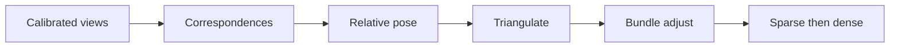

import { ConceptTemplate } from '@/features/kb/components/templates/ConceptTemplate'
import { Callout } from '@/features/kb/components/mdx/Callout'
import { ComparisonTable } from '@/features/kb/components/mdx/ComparisonTable'

export default function Layout({ children }) {
  return (
    <ConceptTemplate title="3D Vision">
      {children}
    </ConceptTemplate>
  )
}

**3D vision** asks for structure, not just labels: where is the surface, how is the camera moving, what would a new viewpoint look like. Classical **multi-view geometry** (Hartley & Zisserman) plus **SLAM**, **stereo**, and now **NeRF / Gaussian splats** and **foundation stereo**. Depth estimation is the dense 2.5D slice; this page is the broader toolkit.

## 1. Deep Dive and Mechanics

**Camera.** Pinhole + distortion. Intrinsics K, extrinsics [R|t]. Calibrate or you will triangulate soup.

**Two views.** Essential / fundamental matrix, 8-point, RANSAC. Triangulate matched features. Bundle adjust.

**Many views.** Incremental SfM (COLMAP): pose cameras, grow a sparse cloud, then MVS for a dense cloud / mesh (OpenMVS, commercial photogrammetry).

**Representations.** Point clouds, voxel grids, meshes, implicit SDFs, radiance fields, 3D Gaussians. The "right" one is the downstream consumer (sim, CAD, view synth).

**Learned.** DUSt3R / MASt3R, monocular 3D detectors (center-based), occupancy networks. They still obey (or approximate) projection.

<Callout icon="info" title="2.5D is not 3D">
A depth map is one viewpoint. Completing the far side of the mug is 3D. Do not promise a mesh from one RGB frame without a prior (or a hallucination).
</Callout>

## 2. Mathematical / Theoretical Foundation

Projection: `λx = K (R X + t)`. Two rays intersect (in noise, they *almost* do — minimise a reprojection error). Bundle adjustment is nonlinear least squares on poses + points. Gauge freedom: the reconstruction is up to a similarity unless you pin scale (stereo baseline, IMU, object size).

<ComparisonTable
  headers={['Method', 'Output', 'Needs']}
  rows={[
    ['SfM plus MVS', 'Cloud / mesh', 'Many overlapping photos'],
    ['Stereo', 'Depth of a pair', 'Calibrated baseline'],
    ['RGB-D SLAM', 'TSDF / mesh', 'Depth sensor'],
    ['NeRF / 3DGS', 'Novel views', 'Many views, compute'],
  ]}
/>

## 3. Real-World Implementation

```bash
# COLMAP sketch
colmap feature_extractor --database_path db.db --image_path images
colmap exhaustive_matcher --database_path db.db
colmap mapper --database_path db.db --image_path images --output_path sparse
```

Then a MVS step for density.

## 4. Visualizations



## 5. Interview Prep

**Q: Essential vs fundamental?**
**A:** Essential uses calibrated cameras (normalised coords). Fundamental is in pixel space: `x2^T F x1 = 0`.

**Q: Why RANSAC everywhere?**
**A:** Feature matches are contaminated. A single outlier wrecks the 8-point estimate.

**Q: NeRF vs mesh?**
**A:** NeRF/3DGS win at pretty novel views. Meshes win at collision and CAD. Converting one to the other is a product, not a flag.

## 6. Production Use Cases

- **Photogrammetry** of sites and products.
- **Robot / AR** maps (with SLAM).
- **Film / VFX** camera tracking.

<Callout icon="tip" title="Overlap and EXIF">
SfM dies on 10 random holiday snaps. You want 60–80% overlap, consistent focal length, and not a 3× digital zoom soup. Brief the capture team before you brief the model.
</Callout>
