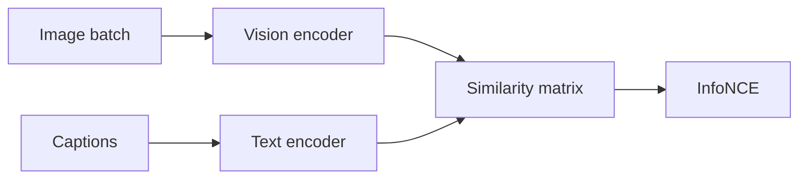

import { ConceptTemplate } from '@/features/kb/components/templates/ConceptTemplate'
import { Callout } from '@/features/kb/components/mdx/Callout'
import { ComparisonTable } from '@/features/kb/components/mdx/ComparisonTable'

export default function Layout({ children }) {
  return (
    <ConceptTemplate title="CLIP">
      {children}
    </ConceptTemplate>
  )
}

**CLIP** (Radford et al., OpenAI, 2021) trains on hundreds of millions of image–caption pairs. At batch time, every image is scored against every caption. The loss pulls the true pairs up and the rest down. After training you can **classify with words** ("a photo of a rusty bolt") and **search images with a sentence** without a labeled softmax.

## 1. Deep Dive and Mechanics

**Two towers.** Image encoder: ResNet or ViT. Text encoder: transformer over BPE. Both emit a vector; cosine similarity is the score. Temperature `τ` is learned.

**Zero-shot classify.** Embed class names as prompts like "a photo of a rusty bolt". The image's nearest prompt wins. Prompt ensembling (many templates) helps. You still lose to a fine-tuned specialist on a narrow domain.

**Open-vocab detect / segment.** Later work (GLIP, OWL-ViT, SAM+CLIP, Grounding DINO) attaches boxes or masks to the same idea. Vanilla CLIP is *global* — one vector per crop, not a detector.

**Failure modes.** Counts, negation ("no helmet"), fine-grained makes/models, and text *in* the image (OCR) are weak unless you add specialists. Internet-pair training also inherits internet bias.

<Callout icon="info" title="SigLIP and OpenCLIP">
SigLIP uses a sigmoid loss instead of a huge softmax. OpenCLIP reproduces CLIP at community scale. In production, pick a named checkpoint and freeze the story in metadata.
</Callout>

## 2. Mathematical / Theoretical Foundation

InfoNCE over the B×B pairwise similarity matrix (images × texts). Symmetric loss: image-to-text and text-to-image. The model learns a **joint embedding** usable as a foundation for retrieval and as a prior for generative models (unCLIP, DALL·E 2 style).

<ComparisonTable
  headers={['Job', 'How you use CLIP']}
  rows={[
    ['Zero-shot classify', 'Nearest class prompt'],
    ['Image search', 'Embed query text, ANN images'],
    ['Text-to-image filter', 'Score generated pics vs prompt'],
    ['Backbone', 'Freeze or fine-tune the vision tower'],
  ]}
/>

## 3. Real-World Implementation

```python
import torch
from PIL import Image

image = preprocess(Image.open('bolt.jpg')).unsqueeze(0)
text = tokenize(['a rusty bolt', 'a new bolt', 'a wooden plank'])
with torch.no_grad():
    zi = model.encode_image(image)
    zt = model.encode_text(text)
    zi = zi / zi.norm(dim=-1, keepdim=True)
    zt = zt / zt.norm(dim=-1, keepdim=True)
    probs = (100 * zi @ zt.T).softmax(dim=-1)
```

## 4. Visualizations



## 5. Interview Prep

**Q: Why not train a softmax on ImageNet-21k only?**
**A:** Closed set. CLIP's text tower is an open interface: new classes are new strings, not new columns in a weight matrix (until you fine-tune).

**Q: CLIP vs supervised ResNet on your factory line?**
**A:** If you have 1M labeled defects, train a specialist. If you have names and a messy archive, CLIP (or fine-tune it) ships first.

**Q: Can CLIP replace OCR?**
**A:** No. It may *react* to prominent words but it does not output a character sequence. Use an OCR model for text extraction.

## 6. Production Use Cases

- **DAM / photo search** by caption.
- **Moderation** ("weapons", "IDs") as a first pass.
- **Dataset cleaning:** drop images whose CLIP score vs the listed caption is tiny.

<Callout icon="tip" title="Crop then embed">
Global CLIP on a 12MP scene averages everything. Detect or tile first if you care about a small object.
</Callout>
