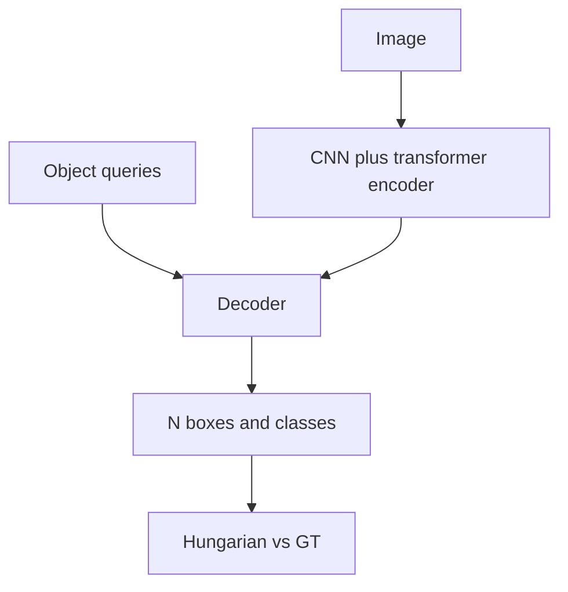

import { ConceptTemplate } from '@/features/kb/components/templates/ConceptTemplate'
import { Callout } from '@/features/kb/components/mdx/Callout'
import { ComparisonTable } from '@/features/kb/components/mdx/ComparisonTable'

export default function Layout({ children }) {
  return (
    <ConceptTemplate title="DETR">
      {children}
    </ConceptTemplate>
  )
}

**DETR** (Carion et al., 2020) treats detection as outputting a **set** of size N (e.g. 100). A CNN backbone + transformer encoder sees the image. A decoder attends from **learned object queries**. Each query predicts a class (or "no object") and a box. Training uses the **Hungarian algorithm** to match predictions to GT one-to-one. At test time, take queries that are not background — **no NMS** in the original design.

## 1. Deep Dive and Mechanics

**Why it felt new.** No anchors, no IoU assigner, no NMS. The matching cost is class probability + box L1/GIoU. Unmatched slots learn to predict ∅.

**Slow converge.** Early DETR needed hundreds of epochs and was weak on small objects (global attention, no FPN). **Deformable DETR**, **DINO**, **DN-DETR**, **RT-DETR** add multi-scale deformable attention, denoising queries, and better assignment. Those are what you actually train.

**Queries.** They are slots, not boxes, at init. Decoder cross-attention specialises them ("I am the left person"). Visualising attention maps is the usual talk slide.

<Callout icon="info" title="NMS-free is a claim, not a law">
Some DETR forks still use NMS in practice. The *training* story is set matching. Read the repo you ship.
</Callout>

## 2. Mathematical / Theoretical Foundation

Bipartite matching: minimise Σ_i L(ŷ_σ(i), y_i) over permutations σ (pad GT with ∅). Hungarian is O(N³) on N queries — fine for N=100–900. The loss on the matched pair is CE + box. This is permutation-invariant set loss (same family as some point-cloud papers).

<ComparisonTable
  headers={['Piece', 'Role']}
  rows={[
    ['Backbone encoder', 'Image tokens'],
    ['Object queries', 'N slots'],
    ['Decoder', 'Refine slots via attention'],
    ['Hungarian', 'Train-time assignment'],
  ]}
/>

## 3. Real-World Implementation

```python
from transformers import DetrForObjectDetection, DetrImageProcessor
# or torchvision.models.detection.detr_resnet50
```

For realtime, look at RT-DETR / RT-DETRv2, not vanilla 2020 DETR.

## 4. Visualizations



## 5. Interview Prep

**Q: Why Hungarian not NMS at train?**
**A:** You need a unique target per prediction for a clean CE. NMS is not differentiable. Matching is the teacher.

**Q: DETR vs Faster R-CNN?**
**A:** DETR: global reasoning, fewer hacks, hungrier training. Faster: mature, FPN small-objects, easier 12-epoch COCO recipes (until DINO-DETR matched them).

**Q: What is a denoising query?**
**A:** DN-DETR feeds noisy GT boxes as extra queries so the decoder learns to refine, stabilising early matching.

## 6. Production Use Cases

- **Offline high-quality detect** (DINO).
- **Realtime** RT-DETR as a YOLO alternative.
- **Open-vocab** Grounding-DINO (text queries).

<Callout icon="tip" title="Start from DINO/RT-DETR weights">
Reproducing vanilla DETR's 500-epoch schedule is a rite of suffering, not a product plan.
</Callout>
