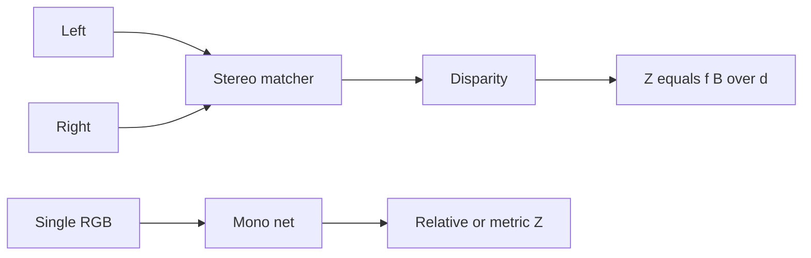

import { ConceptTemplate } from '@/features/kb/components/templates/ConceptTemplate'
import { Callout } from '@/features/kb/components/mdx/Callout'
import { ComparisonTable } from '@/features/kb/components/mdx/ComparisonTable'

export default function Layout({ children }) {
  return (
    <ConceptTemplate title="Depth Estimation">
      {children}
    </ConceptTemplate>
  )
}

**Depth** is a map `Z(u,v)` (metres) or a **disparity** `d` (pixels) related by `Z = fB / d` for a calibrated stereo pair with baseline B and focal length f. **Stereo** measures; **monocular** infers from size, perspective, and data priors. **Multi-view / SfM** sits with 3D vision and SLAM.

## 1. Deep Dive and Mechanics

**Stereo.** Rectify so matches are 1-D along epipolar lines. Cost volume (SAD, census, or a learned correlation) plus a smoother (SGM, RAFT-Stereo, CREStereo). Occlusions and textureless walls are the pain.

**Monocular.** Eigen et al. then MiDaS / DPT / Depth Anything: a net trained on mixed datasets to predict **relative** depth. Metric depth needs extra constraints (camera intrinsics, an object of known size, or a scale head trained on metric data — ZoeDepth, Metric3D).

**RGB-D sensors.** iPhone LiDAR, RealSense, Kinect: active depth you still must fuse and denoise. The "estimation" problem becomes completion and alignment.

**Temporal.** Video depth (consistent) vs single-frame (flicker). SLAM uses depth or stereo as a landmark source.

<Callout icon="warning" title="Monocular scale">
A monocular net can swap a dollhouse and a building if both fill the frame. Do not close a robot loop on MiDaS metres unless you calibrated scale that day.
</Callout>

## 2. Mathematical / Theoretical Foundation

Pinhole: `x = f X / Z`. Stereo disparity is the horizontal pixel shift of a 3D point. Ambiguity: monocular is defined up to scale (and often shift) unless the training loss pins metric. Common losses: L1 on disparity, scale-invariant (Eigen), gradient matching, and multi-view reprojection (self-supervised monodepth).

<ComparisonTable
  headers={['Cue', 'Metric?', 'Weakness']}
  rows={[
    ['Stereo / RGB-D', 'Yes if calibrated', 'Baseline, occlusions'],
    ['Monocular relative', 'No', 'Scale, novel optics'],
    ['Monocular metric', 'If trained / cued', 'Domain shift'],
  ]}
/>

## 3. Real-World Implementation

```python
# Pseudo: MiDaS-style relative depth
pred = depth_net(rgb)  # higher = closer or farther: READ THE CARD
# For stereo: disparity = stereo_net(left, right); Z = f * B / disparity
```

Invert carefully: some models output inverse depth.

## 4. Visualizations



## 5. Interview Prep

**Q: Disparity vs depth?**
**A:** Disparity is image-space match. Depth is metres. Convert with intrinsics and baseline. Errors in `d` explode at large Z (1/d).

**Q: Why is monocular self-sup so popular?**
**A:** You can train on video with warp-and-photometric loss, no LiDAR. It fails on dynamic objects unless masked.

**Q: AbsRel, RMSE, δ1?**
**A:** Standard depth metrics. δ1 is % of pixels with max(pred/gt, gt/pred) < 1.25. Quote the protocol (capped depth).

## 6. Production Use Cases

- **AR** occlusion.
- **Robot obstacle** (prefer stereo/LiDAR).
- **Bokeh / portrait** (relative is enough).
- **Novel view** as a geometry prior.

<Callout icon="tip" title="Align conventions">
Plot a colourbar and a known-height object. If the person is 12 metres tall, your "metric" head is in inverse-depth land or the baseline is wrong.
</Callout>
