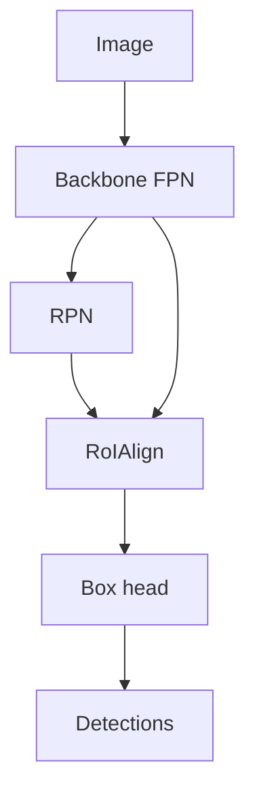

import { ConceptTemplate } from '@/features/kb/components/templates/ConceptTemplate'
import { Callout } from '@/features/kb/components/mdx/Callout'
import { ComparisonTable } from '@/features/kb/components/mdx/ComparisonTable'

export default function Layout({ children }) {
  return (
    <ConceptTemplate title="Faster R-CNN">
      {children}
    </ConceptTemplate>
  )
}

**Faster R-CNN** (Ren et al., 2015) deletes Selective Search. A **Region Proposal Network** slides on the backbone feature map, predicts objectness and box deltas at each anchor, and feeds the top proposals into the Fast R-CNN **RoI head**. One CNN, two heads, still the accuracy default for many offline jobs.

## 1. Deep Dive and Mechanics

**Anchors.** At each location, k boxes of several scales and aspect ratios. RPN says object vs not and regresses to GT. 9 anchors (3 scale × 3 ratio) was the classic; FPN later assigns scales to pyramid levels.

**RoIPool / RoIAlign.** Quantise a proposal onto the feature map and max-pool to a rect (e.g. 7×7). RoIAlign (Mask R-CNN) bilinear-samples to avoid the snap-to-grid error that wrecks masks and tight boxes.

**4-step then joint train.** The paper's alternating training is historical. Modern impls (Detectron2, torchvision) train RPN + head together with a multi-task loss.

**FPN.** Lin et al. attach RPN and heads to P2–P6. This is "Faster R-CNN" as people mean it in 2018+.

<Callout icon="info" title="Still slower than YOLO">
Two stages and a second head cost latency. Use it when mAP and calibration beat 30 FPS. Use YOLO/SSD when the camera cannot wait.
</Callout>

## 2. Mathematical / Theoretical Foundation

Loss = L_rpn_cls + L_rpn_box + L_roi_cls + L_roi_box. Assignment by IoU (positive ≥ 0.7 for RPN, ≥ 0.5 for head, typical). NMS on RPN output (e.g. 1000 → 1000, then 100–300 to the head) is part of the algorithm, not just postprocess.

<ComparisonTable
  headers={['Stage', 'Output']}
  rows={[
    ['Backbone plus FPN', 'Feature maps'],
    ['RPN', 'Objectness and proposal boxes'],
    ['RoI head', 'Class logits and refined boxes'],
  ]}
/>

## 3. Real-World Implementation

```python
from torchvision.models.detection import fasterrcnn_resnet50_fpn_v2
from torchvision.models.detection.faster_rcnn import FastRCNNPredictor

model = fasterrcnn_resnet50_fpn_v2(weights='DEFAULT')
in_f = model.roi_heads.box_predictor.cls_score.in_features
model.roi_heads.box_predictor = FastRCNNPredictor(in_f, num_classes=5)
```

`num_classes` includes background in torchvision's convention — read the docs for your fork.

## 4. Visualizations



## 5. Interview Prep

**Q: Why share the backbone?**
**A:** Proposals and classification need the same edges and textures. Sharing is the speed win vs R-CNN and the reason RPN features are "free."

**Q: Anchor-free Faster?**
**A:** You can replace RPN with a centerness / FCOS-style generator and keep the second stage (cascade variants). The *idea* is still propose → recognise.

**Q: Cascade R-CNN?**
**A:** Stacked heads with rising IoU thresholds. Better boxes, more compute. Popular in competitions.

## 6. Production Use Cases

- **Medical / satellite** offline batch.
- **High-quality labeling** assist.
- **Mask R-CNN** starting point.

<Callout icon="tip" title="Anchor stats on your data">
If all objects are long and thin, default COCO anchors waste slots. Re-cluster boxes (k-means on your GT) or go anchor-free.
</Callout>
